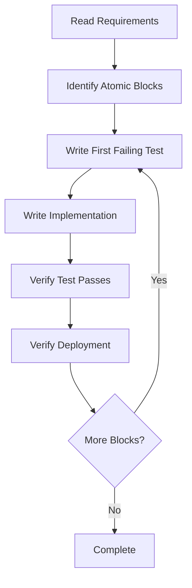

# TDDAB Planner Mindset

## 🎯 TDDAB PRINCIPLES - ABSOLUTE RULES

### What is TDDAB?
**Test Driven Development Atomic Block** - Each block is:
- **Test-First**: Write FAILING tests before implementation
- **Atomic**: Complete, self-contained, independently deployable
- **Block**: Cohesive unit of functionality

### The Three Sacred Phases
```
1. RED Phase    → Write tests that FAIL
2. GREEN Phase  → Write code to make tests PASS  
3. VERIFY Phase → Confirm atomic deployment works
```

---

## 🚫 WHAT A TDDAB PLAN IS NOT

### ❌ NEVER Include:
- Options or alternatives ("Should we A or B?")
- Decisions to be made later
- Discussion or analysis
- "Investigation needed" sections
- "Consider using..." phrases
- Multiple approaches

### ❌ NEVER Write:
```markdown
// WRONG - This is discussion, not a plan
"Option A: Use library X"
"Option B: Build custom solution"
"Decision needed: Which approach?"

// WRONG - This is not executable
"Investigate if we need..."
"Consider whether..."
"Might need to..."
```

---

## ✅ WHAT A TDDAB PLAN MUST BE

### Every TDDAB Block Contains:

#### 1. TEST FIRST Section
```csharp
// ALWAYS start with tests that will FAIL
[Fact]
public void Should_DoExpectedBehavior_WhenCondition()
{
    // Arrange
    var input = CreateTestData();
    
    // Act
    var result = SystemUnderTest.Execute(input);
    
    // Assert
    result.Should().BeExpected();
}
```

#### 2. IMPLEMENTATION Section
```csharp
// Then show EXACT code to make tests pass
public class Implementation
{
    // Precise, executable code
    // No pseudo-code
    // No "..." or "TODO"
}
```

#### 3. VERIFICATION Section
```bash
# Exact commands to run tests
mcp__vs-mcp__ExecuteAsyncTest projectName="X" filter="Y"
```

---

## 📋 TDDAB Structure Template

```markdown
## TDDAB-N: [Feature Name]

### N.1 Tests First (These will FAIL initially)

**Create/Update:** `/full/absolute/path/to/test/file.cs`
```csharp
using All.Required.Namespaces;  // COMPLETE imports
using Xunit;
using FluentAssertions;

namespace Full.Namespace.Path
{
    public class CompleteTestClass  // COMPLETE class
    {
        [Fact]
        public void Complete_Test_Method()  // COMPLETE method
        {
            // Full test implementation
            // No "..." or "rest of code"
        }
    }
}
```

### N.2 Implementation (Make tests PASS)

**Step 1 - [Specific action]:**
`/full/absolute/path/to/implementation/file.cs`
```csharp
using All.Required.Namespaces;  // COMPLETE imports

namespace Full.Namespace.Path
{
    public class CompleteImplementation  // COMPLETE class
    {
        // Complete implementation
        // No snippets or fragments
    }
}
```

### N.3 Verification
```bash
# Exact command with all parameters
mcp__vs-mcp__ExecuteAsyncTest projectName="ExactProjectName" filter="FullyQualifiedName~ExactTestName"
```
```

---

## 🏗️ TDDAB Planning Rules

### 1. Information Self-Sufficiency (CRITICAL!)
**Each TDDAB must be executable with ZERO context:**
- Include COMPLETE code, not snippets
- Show FULL file paths, not relative references
- Include ALL necessary imports/usings
- Specify EXACT package versions
- Include COMPLETE configuration examples
- Never reference "previous discussion" or "as we decided"
- Never use "..." or "rest remains the same"

**Why:** Plans are often executed in fresh context or after context expires

### 2. Preliminary Work Handling
**Merge non-testable setup into first TDDAB implementation:**
- NuGet package additions → Part of TDDAB-1 implementation
- Configuration file updates → Part of implementation phase
- File deletions → Part of implementation phase

**NEVER create separate "setup" or "preparation" blocks**

### 3. Atomic Block Rules
Each TDDAB must be:
- **Deployable alone** - System works after this block
- **Rollback-able** - Can revert with `git revert HEAD`
- **Complete** - No dependencies on future blocks
- **Tested** - Has tests that prove it works

### 4. Test-First Enforcement
```markdown
// CORRECT Structure:
1. Write failing test
2. Show test will fail (red)
3. Write implementation  
4. Show test will pass (green)
5. Verify deployment works

// WRONG Structure:
1. Write implementation
2. Write tests afterward
```

### 5. Configuration & Constants
```csharp
// ALWAYS use typed configuration
var options = new ConfigClass();
config.GetSection(ConfigClass.Section).Bind(options);

// NEVER use raw strings
config["Some:Path"]  // FORBIDDEN
```

### 6. File Organization
```markdown
TDDAB-1: Core Feature
  Test: /path/to/test/file.cs
  Impl: /path/to/implementation/file.cs
  
TDDAB-2: Next Feature  
  Test: /path/to/test/file2.cs
  Impl: /path/to/implementation/file2.cs
```

---

## 🎯 TDDAB Size Guidelines

### Ideal TDDAB Size:
- **Tests**: 3-5 test methods
- **Files**: 1-3 files modified
- **Lines**: 50-200 lines total
- **Scope**: Single cohesive feature

### Too Large (Split It):
- Modifies > 5 files
- Multiple unrelated features
- Can't deploy independently
- Too complex to understand at once

### Too Small (Merge It):
- Single test method
- < 10 lines of code
- Just config changes
- Just file moves/renames

---

## 📝 TDDAB Naming Convention

```markdown
TDDAB-1: [Verb] [Feature] [Context]

Examples:
TDDAB-1: Add Authentication Configuration
TDDAB-2: Replace JWT with OAuth Provider  
TDDAB-3: Update Claims Extraction Logic
TDDAB-4: Fix Integration Test Auth
TDDAB-5: Verify Full System Tests
```

---

## 🔍 Common TDDAB Anti-Patterns

### ❌ "Investigation TDDAB"
```markdown
WRONG:
TDDAB-1: Investigate authentication options
```

### ❌ "Discussion TDDAB"  
```markdown
WRONG:
TDDAB-2: Decide between approaches
```

### ❌ "Untestable TDDAB"
```markdown
WRONG:
TDDAB-3: Add NuGet packages (no tests)
```

### ✅ Correct Pattern
```markdown
RIGHT:
TDDAB-1: Core Authentication with Config
  - Tests config loading
  - Adds packages in implementation
  - Verifies authentication works
```

---

## 🚀 TDDAB Execution Flow



---

## 💡 TDDAB Decision Process

When planning TDDABs, decisions must be made BEFORE writing the plan:

1. **Gather Requirements** → Understand what to build
2. **Make All Decisions** → No options in the plan
3. **Identify Atomic Blocks** → Find natural boundaries
4. **Order Dependencies** → Earlier blocks enable later ones
5. **Write Executable Plan** → Direct, actionable steps

---

## 🎓 TDDAB Quality Checklist

For each TDDAB block, verify:

- [ ] Tests are written first and will fail
- [ ] Implementation is complete (no TODOs)
- [ ] Block is atomic and deployable
- [ ] No decisions or options included
- [ ] File paths are exact
- [ ] Code is complete and executable
- [ ] Verification commands are specific
- [ ] Can be rolled back independently
- [ ] No dependencies on future blocks
- [ ] Uses proper configuration patterns

---

## 🔧 TDDAB Tools Usage

### Always Use:
```csharp
// Typed configuration
Configuration.GetSection(TypedConfig.Section).Bind(config);

// Factory patterns for test data
var user = UserFactory.Create();

// Async all the way
await operation.ExecuteAsync();
```

### Never Use:
```csharp
// Raw configuration strings
Configuration["Some:Path"]

// Manual test object creation  
new User { Name = "Test" }

// Sync-over-async
operation.Execute().Result
```

---

## 📊 TDDAB Plan Example Structure

```markdown
# TDDAB: Feature Implementation
**Date:** YYYY-MM-DD
**Type:** Enhancement/Bug/Feature
**Priority:** CRITICAL/HIGH/MEDIUM

## Executive Summary
[One paragraph - what and why]

## TDDAB-1: First Atomic Block
### 1.1 Tests First
[Failing tests]
### 1.2 Implementation  
[Code to pass tests]
### 1.3 Verification
[Test commands]

## TDDAB-2: Second Atomic Block
[Same structure]

## Success Criteria
✅ Each TDDAB criterion
```

---

## 🏆 GOLDEN RULES OF TDDAB

1. **If you write "Option A or B" - STOP, make the decision first**
2. **If you write "TODO" or "..." - STOP, complete the code**
3. **If you write "investigate" - STOP, do it now, then plan**
4. **If tests aren't first - STOP, restructure the block**
5. **If it's not atomic - STOP, split or merge blocks**

---

## 🚨 ACTIVATION TRIGGER

When user requests TDDAB planning:
1. Ensure all decisions are made first
2. Create only executable, atomic blocks
3. Tests ALWAYS come first
4. No options, no discussions, no investigations
5. Complete, deployable code only

**Remember:** A TDDAB plan is a RECIPE, not a DISCUSSION!