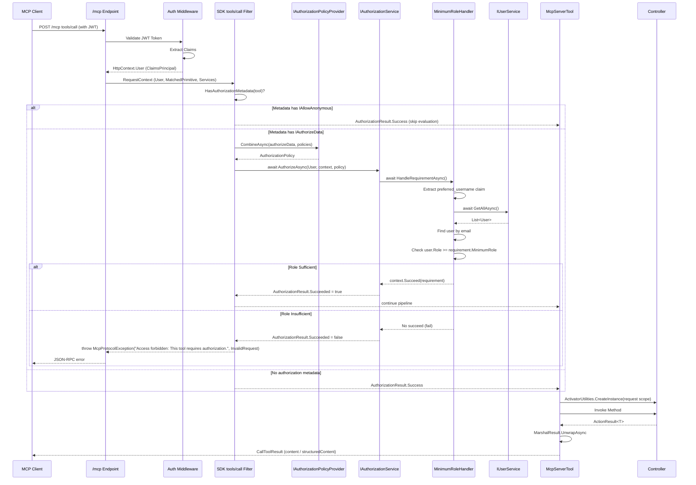
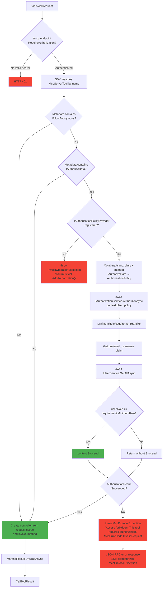
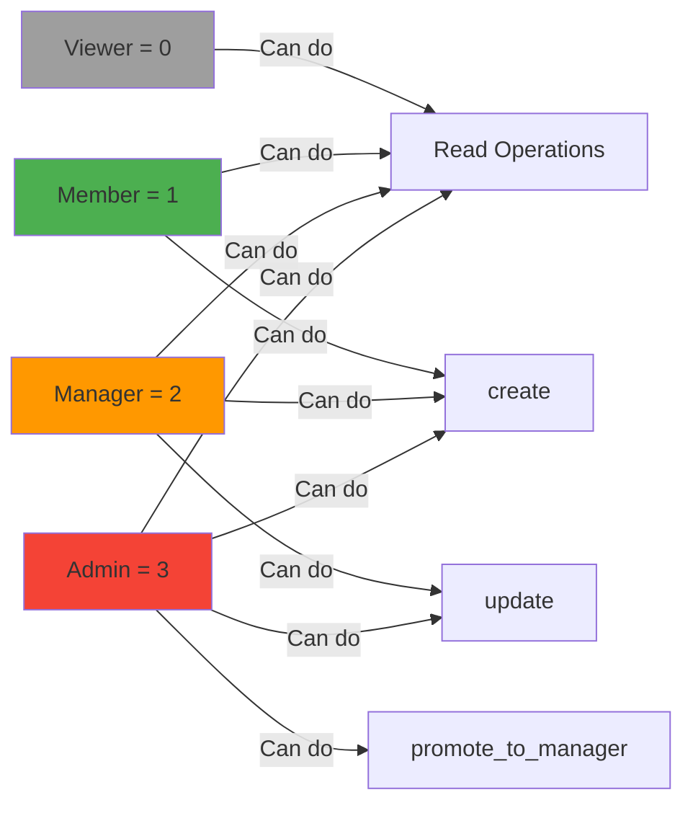

# MCP with ASP.NET Core Authorization - Complete Integration Guide

**Version:** 3.0
**Last Updated:** 2026-09-14
**Library:** Zero.Mcp.Extensions 3.0.0
**MCP SDK Version:** ModelContextProtocol 2.2.0 (`ModelContextProtocol`, `ModelContextProtocol.Core`, `ModelContextProtocol.AspNetCore`)
**Target Framework:** .NET 10.0

---

## Table of Contents

1. [Architecture Overview](#architecture-overview)
2. [How It Works](#how-it-works)
3. [Required NuGet Packages](#required-nuget-packages)
4. [File Structure](#file-structure)
5. [Step-by-Step Integration](#step-by-step-integration)
6. [Authorization Flow](#authorization-flow)
7. [tools/list Filtering and Cache Hints](#toolslist-filtering-and-cache-hints)
8. [Testing](#testing)
9. [Critical Discoveries](#critical-discoveries)
10. [Troubleshooting](#troubleshooting)
11. [What Changed in 3.0.0 / Migration from 2.x](#what-changed-in-300--migration-from-2x)
12. [Summary](#summary)

---

## Architecture Overview

This system exposes **ASP.NET Core Controllers** as **MCP Tools** while keeping the controllers' own authorization rules as the single source of truth for both protocols:

- ✅ JWT Bearer Authentication (Keycloak/any OIDC provider)
- ✅ Policy-based Authorization (`[Authorize(Policy = "...")]`)
- ✅ Role-based Authorization (`[Authorize(Roles = "...")]`, evaluated by the same policy machinery)
- ✅ `[AllowAnonymous]` opt-out on individual tools
- ✅ Per-user `tools/list` filtering (hidden tools are never advertised)
- ✅ Forbidden `tools/call` rejected **before** the controller is instantiated
- ✅ Fully asynchronous evaluation through `IAuthorizationService`
- ✅ Dependency Injection Scoping (one controller instance per call, from the request scope)
- ✅ `ActionResult<T>` unwrapping

The key design point of 3.0.0: **the library contains no authorization logic of its own**. It attaches the controller's attributes to each generated tool as *metadata*, and the MCP C# SDK's `AddAuthorizationFilters()` evaluates that metadata with the host's `IAuthorizationService` and `IAuthorizationPolicyProvider` - exactly the services the ASP.NET Core `AuthorizationMiddleware` uses for HTTP requests.

### High-Level Architecture

```mermaid
graph TB
    subgraph "Client Layer"
        MCP_Client[MCP Client]
        HTTP_Client[HTTP Client]
    end

    subgraph "ASP.NET Core Pipeline"
        Auth[Authentication Middleware]
        AuthZ[Authorization Middleware]
        MCP_Endpoint[/mcp Endpoint<br/>RequireAuthorization]
        HTTP_Endpoint[/api/* Endpoints]
    end

    subgraph "MCP SDK (ModelContextProtocol.AspNetCore)"
        MCP_Server[MCP Server<br/>Streamable HTTP]
        List_Filter[tools/list Authorization Filter]
        Call_Filter[tools/call Authorization Filter]
        Tool_Registry[McpServerTool Collection]
    end

    subgraph "Zero.Mcp.Extensions"
        Scanner[Assembly Scanner]
        Metadata[ToolMetadataBuilder<br/>MethodInfo + class attrs + method attrs]
        Options[ToolCreateOptionsFactory]
        Unwrap[MarshalResult<br/>ActionResult unwrapping]
    end

    subgraph "Controller Layer"
        Controller[UsersController]
        Attributes["[McpServerToolType]<br/>[McpServerTool]<br/>[Authorize] / [AllowAnonymous]"]
    end

    subgraph "Host Authorization (your code)"
        Auth_Service[IAuthorizationService]
        Policy_Provider[IAuthorizationPolicyProvider]
        Req_Handler[MinimumRoleRequirementHandler]
        User_Service[IUserService]
    end

    MCP_Client -->|POST /mcp| MCP_Endpoint
    HTTP_Client -->|GET/POST /api/*| HTTP_Endpoint

    MCP_Endpoint --> Auth
    HTTP_Endpoint --> Auth
    Auth --> AuthZ
    AuthZ --> MCP_Server
    AuthZ --> Controller

    Scanner -->|startup| Metadata
    Metadata --> Options
    Options -->|McpServerToolCreateOptions.Metadata| Tool_Registry

    MCP_Server --> List_Filter
    MCP_Server --> Call_Filter
    List_Filter --> Policy_Provider
    Call_Filter --> Policy_Provider
    List_Filter --> Auth_Service
    Call_Filter --> Auth_Service
    Auth_Service --> Req_Handler
    Req_Handler --> User_Service

    Call_Filter -->|Authorized| Tool_Registry
    Tool_Registry -->|ActivatorUtilities.CreateInstance| Controller
    Controller --> Unwrap

    style List_Filter fill:#ff9800
    style Call_Filter fill:#ff9800
    style Metadata fill:#9c27b0,color:#fff
    style Auth_Service fill:#4caf50
    style Controller fill:#2196f3
```

### Responsibilities

| Layer | Responsibility |
|-------|----------------|
| **Your controllers** | Business logic + `[Authorize]`, `[Authorize(Policy = ...)]`, `[AllowAnonymous]` |
| **Your `AddAuthorization(...)`** | Policies, requirements, handlers - shared by HTTP and MCP |
| **Zero.Mcp.Extensions** | Scans `[McpServerToolType]` classes, builds tool metadata mirroring the SDK layout, derives `McpServerToolCreateOptions`, unwraps `ActionResult<T>`, registers `AddAuthorizationFilters()` when `UseAuthorization` is true, stamps `tools/list` cache hints |
| **MCP SDK 2.2.0** | Streamable HTTP transport, tool invocation, authorization filters for `tools/list` and `tools/call` |
| **ASP.NET Core** | JWT authentication, `IAuthorizationService`, `IAuthorizationPolicyProvider` |

---

## How It Works

### 1. **Dual Protocol Support**

Controllers work simultaneously as:
- **HTTP REST API** endpoints (`/api/users`)
- **MCP Tools** (via `/mcp` endpoint)

### 2. **Authorization Strategy**

#### For HTTP Requests:
```
HTTP Request → Authentication → AuthorizationMiddleware (endpoint metadata) → Controller Method
```

#### For MCP tools/list:
```
tools/list → Authentication → SDK list filter: evaluate each tool's metadata → remove tools that fail → (cache hints) → Response
```

#### For MCP tools/call:
```
tools/call → Authentication → SDK call filter: evaluate the matched tool's metadata → Controller Instantiation → Method Execution → ActionResult unwrapping
```

**Key Point:** both HTTP and MCP evaluate the *same* attributes through the *same* `IAuthorizationService`. The ASP.NET Core `AuthorizationMiddleware` reads them from `Endpoint.Metadata`; the SDK filters read them from `McpServerTool.Metadata`, which the library populates with `[MethodInfo, ...class attributes, ...method attributes]` - the same layout the SDK's own reflection-based `WithToolsFromAssembly` produces.

### 3. **Authorization Flow Sequence**


```mermaid
sequenceDiagram
    participant Client as MCP Client
    participant EP as /mcp Endpoint
    participant Auth as Auth Middleware
    participant Filter as SDK tools/call Filter
    participant PolicyProv as IAuthorizationPolicyProvider
    participant AuthSvc as IAuthorizationService
    participant Handler as MinimumRoleHandler
    participant UserSvc as IUserService
    participant Tool as McpServerTool
    participant Ctrl as Controller

    Client->>EP: POST /mcp tools/call (with JWT)
    EP->>Auth: Validate JWT Token
    Auth->>Auth: Extract Claims
    Auth-->>EP: HttpContext.User (ClaimsPrincipal)

    EP->>Filter: RequestContext (User, MatchedPrimitive, Services)
    Filter->>Filter: HasAuthorizationMetadata(tool)?

    alt Metadata has IAllowAnonymous
        Filter-->>Tool: AuthorizationResult.Success (skip evaluation)
    else Metadata has IAuthorizeData
        Filter->>PolicyProv: CombineAsync(authorizeData, policies)
        PolicyProv-->>Filter: AuthorizationPolicy
        Filter->>AuthSvc: await AuthorizeAsync(User, context, policy)
        AuthSvc->>Handler: await HandleRequirementAsync()
        Handler->>Handler: Extract preferred_username claim
        Handler->>UserSvc: await GetAllAsync()
        UserSvc-->>Handler: List<User>
        Handler->>Handler: Find user by email
        Handler->>Handler: Check user.Role >= requirement.MinimumRole

        alt Role Sufficient
            Handler-->>AuthSvc: context.Succeed(requirement)
            AuthSvc-->>Filter: AuthorizationResult.Succeeded = true
            Filter-->>Tool: continue pipeline
        else Role Insufficient
            Handler-->>AuthSvc: No succeed (fail)
            AuthSvc-->>Filter: AuthorizationResult.Succeeded = false
            Filter-->>EP: throw McpProtocolException("Access forbidden: This tool requires authorization.", InvalidRequest)
            EP-->>Client: JSON-RPC error
        end
    else No authorization metadata
        Filter-->>Tool: AuthorizationResult.Success
    end

    Tool->>Ctrl: ActivatorUtilities.CreateInstance(request scope)
    Tool->>Ctrl: Invoke Method
    Ctrl-->>Tool: ActionResult<T>
    Tool->>Tool: MarshalResult.UnwrapAsync
    Tool-->>Client: CallToolResult (content / structuredContent)
```

Everything in this sequence is `async`/`await` end to end: the SDK filters are asynchronous request handlers, so your `AuthorizationHandler<T>` can do real async I/O (database, HTTP) without any thread blocking.

---

## Required NuGet Packages

### Core Packages

Add these to your `.csproj` (the demo uses Central Package Management, so versions live in `Directory.Packages.props`):

```xml
<ItemGroup>
  <!-- Controllers as MCP tools (pulls in the MCP SDK 2.2.0 transitively) -->
  <PackageReference Include="Zero.Mcp.Extensions" />

  <!-- Authentication -->
  <PackageReference Include="Microsoft.AspNetCore.Authentication.JwtBearer" />

  <!-- Logging (Optional but recommended) -->
  <PackageReference Include="Serilog.AspNetCore" />
  <PackageReference Include="Serilog.Sinks.File" />
</ItemGroup>
```

### Package Versions

| Package | Version |
|---------|---------|
| `Zero.Mcp.Extensions` | 3.0.0 |
| `ModelContextProtocol` / `.Core` / `.AspNetCore` | 2.2.0 (transitive) |
| `Microsoft.AspNetCore.Authentication.JwtBearer` | 10.0.12 |
| Test stack | xunit.v3 4.0.1, AwesomeAssertions 9.6.0, NSubstitute 6.2.0 |

The MCP attributes (`[McpServerToolType]`, `[McpServerTool]`) come from the SDK namespace `ModelContextProtocol.Server`; the library ships no attribute types of its own.

---

## File Structure

```
YourProject/
├── Authorization/                          # Your authorization infrastructure (plain ASP.NET Core)
│   ├── PolicyNames.cs                     # Policy name constants
│   ├── MinimumRoleRequirement.cs          # IAuthorizationRequirement implementation
│   ├── MinimumRoleRequirementHandler.cs   # AuthorizationHandler<T>
│   └── AuthorizationServiceExtensions.cs  # DI registration extension
├── Controllers/
│   └── UsersController.cs                 # [McpServerToolType] + [McpServerTool] + [Authorize]
├── Models/
│   └── User.cs                            # UserRole enum
├── Services/
│   └── IUserService.cs                    # Your business logic
└── Program.cs                             # AddAuthorization + AddZeroMcpExtensions + MapZeroMcp
```

Nothing MCP-specific lives in `Authorization/`. The only MCP-related code in your project is the attributes on the controllers and three lines in `Program.cs`.

Inside the library (for reference, not something you copy):

```
Zero.Mcp.Extensions/
├── McpServerBuilderExtensions.cs   # AddZeroMcpExtensions, scanning, AddAuthorizationFilters(), MapZeroMcp
├── ToolMetadataBuilder.cs          # [MethodInfo, class attrs, method attrs] (auth entries stripped when off)
├── ToolCreateOptionsFactory.cs     # McpServerToolCreateOptions from [McpServerTool] + [Description] + metadata
├── ToolsListCacheHintFilter.cs     # ttlMs / cacheScope on tools/list
├── MarshalResult.cs                # ActionResult<T> unwrapping
├── ToolNameGenerator.cs            # snake_case naming, ControllerPrefix, explicit Name
└── ZeroMcpOptions.cs               # RequireAuthentication, UseAuthorization, ToolsListTimeToLive, SessionMode, ...
```

---

## Step-by-Step Integration

### Step 1: Create Authorization Infrastructure

This is ordinary ASP.NET Core authorization. If your project already has policies and handlers, keep them as they are - the MCP SDK will use them unchanged.

#### File: `Authorization/PolicyNames.cs`

```csharp
namespace YourProject.Authorization;

public static class PolicyNames
{
    public const string RequireMember = "RequireMember";
    public const string RequireManager = "RequireManager";
    public const string RequireAdmin = "RequireAdmin";
}
```

#### File: `Authorization/MinimumRoleRequirement.cs`

```csharp
using Microsoft.AspNetCore.Authorization;
using YourProject.Models;

namespace YourProject.Authorization;

public class MinimumRoleRequirement : IAuthorizationRequirement
{
    public UserRole MinimumRole { get; }

    public MinimumRoleRequirement(UserRole minimumRole)
    {
        MinimumRole = minimumRole;
    }
}
```

#### File: `Authorization/MinimumRoleRequirementHandler.cs`

```csharp
using Microsoft.AspNetCore.Authorization;
using YourProject.Services;

namespace YourProject.Authorization;

public class MinimumRoleRequirementHandler : AuthorizationHandler<MinimumRoleRequirement>
{
    private readonly IUserService _userService;
    private readonly ILogger<MinimumRoleRequirementHandler> _logger;

    public MinimumRoleRequirementHandler(
        IUserService userService,
        ILogger<MinimumRoleRequirementHandler> logger)
    {
        _userService = userService;
        _logger = logger;
    }

    protected override async Task HandleRequirementAsync(
        AuthorizationHandlerContext context,
        MinimumRoleRequirement requirement)
    {
        _logger.LogTrace("HandleRequirementAsync called for requirement: {MinRole}", requirement.MinimumRole);

        // 1. Check authentication
        if (!context.User.Identity?.IsAuthenticated ?? true)
        {
            _logger.LogWarning("User is not authenticated");
            return;
        }

        // 2. Get user identifier from JWT claim
        // IMPORTANT: Use "preferred_username" claim (standard OIDC claim)
        var usernameClaim = context.User.FindFirst("preferred_username")?.Value;
        if (string.IsNullOrEmpty(usernameClaim))
        {
            _logger.LogWarning("No preferred_username claim found in token");
            return;
        }

        // 3. Get user from your service/database - real async I/O is fine here,
        //    the SDK filters await this all the way up the pipeline
        var users = await _userService.GetAllAsync();
        var user = users.FirstOrDefault(u => u.Email == usernameClaim);

        if (user == null)
        {
            _logger.LogWarning("User not found for username: {Username}", usernameClaim);
            return;
        }

        // 4. Check role hierarchy (>= allows role inheritance)
        if (user.Role >= requirement.MinimumRole)
        {
            _logger.LogInformation(
                "User {Email} with role {Role} meets minimum role {MinRole}",
                user.Email, user.Role, requirement.MinimumRole);
            context.Succeed(requirement);  // ✅ Authorization succeeds
        }
        else
        {
            _logger.LogWarning(
                "User {Username} with role {Role} does NOT meet minimum role {MinRole}",
                usernameClaim, user.Role, requirement.MinimumRole);
            // Don't call context.Fail() - just don't succeed
        }
    }
}
```

**CRITICAL NOTES:**
- Uses `preferred_username` JWT claim (standard OIDC)
- Queries user from your service/database (asynchronously)
- Uses `>=` for role hierarchy (Admin >= Manager >= Member >= Viewer)
- Returns early (no `Succeed`) if authorization fails
- The handler has no idea whether it is being called for an HTTP request or an MCP tool - and it does not need to

#### File: `Authorization/AuthorizationServiceExtensions.cs`

```csharp
using Microsoft.AspNetCore.Authorization;
using YourProject.Models;

namespace YourProject.Authorization;

public static class AuthorizationServiceExtensions
{
    public static IServiceCollection AddYourProjectAuthorization(this IServiceCollection services)
    {
        // Register handler as Scoped (depends on Scoped IUserService).
        // The SDK resolves IAuthorizationService from the request's scoped services, so scoped handlers work.
        services.AddScoped<IAuthorizationHandler, MinimumRoleRequirementHandler>();

        // Register policies - the SDK filters resolve these names through IAuthorizationPolicyProvider
        services.AddAuthorizationCore(options =>
        {
            options.AddPolicy(PolicyNames.RequireMember, policy =>
                policy.Requirements.Add(new MinimumRoleRequirement(UserRole.Member)));

            options.AddPolicy(PolicyNames.RequireManager, policy =>
                policy.Requirements.Add(new MinimumRoleRequirement(UserRole.Manager)));

            options.AddPolicy(PolicyNames.RequireAdmin, policy =>
                policy.Requirements.Add(new MinimumRoleRequirement(UserRole.Admin)));
        });

        return services;
    }
}
```

---

### Step 2: Update Model with Role Enum

#### File: `Models/User.cs`

```csharp
namespace YourProject.Models;

public enum UserRole
{
    Viewer = 0,   // Read-only access
    Member = 1,   // Read + Create
    Manager = 2,  // Read + Create + Update
    Admin = 3     // Everything
}

public class User
{
    public int Id { get; set; }
    public string Name { get; set; } = string.Empty;
    public string Email { get; set; } = string.Empty;
    public DateTime CreatedAt { get; set; } = DateTime.UtcNow;
    public UserRole Role { get; set; } = UserRole.Member;
}
```

---

### Step 3: Understand What the Library Registers

You do not write this code - it is inside Zero.Mcp.Extensions - but understanding it explains every behaviour in this guide.

#### `AddZeroMcpExtensions` (McpServerBuilderExtensions.cs)

```csharp
public static IMcpServerBuilder AddZeroMcpExtensions(
    this IServiceCollection services,
    Action<ZeroMcpOptions>? configure = null)
{
    var options = new ZeroMcpOptions();
    configure?.Invoke(options);
    options.ToolAssembly ??= Assembly.GetCallingAssembly();

    services.AddSingleton(options);
    services.AddHttpContextAccessor();
    services.AddScoped<IMcpRequestContext, McpRequestContext>();

    var mcpBuilder = services
        .AddMcpServer()
        .WithHttpTransport(transport => transport.SessionMode = options.SessionMode)
        .WithToolsFromAssemblyUnwrappingActionResult(options);

    // Authorization is delegated to the SDK: [Authorize]/[AllowAnonymous] found in the tool metadata are
    // evaluated through the host's IAuthorizationService for both tools/list and tools/call.
    if (options.UseAuthorization)
    {
        mcpBuilder.AddAuthorizationFilters();   // ModelContextProtocol.AspNetCore extension on IMcpServerBuilder
    }

    // Cache hints are stamped LAST so they wrap the per-user list produced by the authorization filter.
    if (options.ToolsListTimeToLive is not null)
    {
        mcpBuilder.WithRequestFilters(filters => filters.AddListToolsFilter(next =>
            ToolsListCacheHintFilter.Apply(next, options.ToolsListTimeToLive, options.UseAuthorization)));
    }

    return mcpBuilder;
}
```

#### Tool registration (per `[McpServerTool]` method)

```csharp
builder.Services.AddSingleton<McpServerTool>(services =>
{
    var aiFunction = AIFunctionFactory.Create(
        methodCopy,
        args => ActivatorUtilities.CreateInstance(args.Services!, toolType),   // controller per call, request scope
        new AIFunctionFactoryOptions
        {
            Name = toolNameCopy,
            MarshalResult = static async (result, _, _) => await MarshalResult.UnwrapAsync(result).ConfigureAwait(false),
            SerializerOptions = serializerOptions
        });

    return McpServerTool.Create(aiFunction,
        ToolCreateOptionsFactory.Create(methodCopy, services, serializerOptions, options.UseAuthorization));
});
```

#### `ToolMetadataBuilder.Build` - where authorization attributes enter the SDK

```csharp
public static IReadOnlyList<object> Build(MethodInfo method, bool includeAuthorization)
{
    List<object> metadata = [method];
    if (method.DeclaringType is not null)
    {
        metadata.AddRange(method.DeclaringType.GetCustomAttributes(inherit: true));   // class-level [Authorize]
    }

    metadata.AddRange(method.GetCustomAttributes(inherit: true));                      // [Authorize(Policy=...)], [AllowAnonymous]

    if (!includeAuthorization)
    {
        metadata.RemoveAll(static m => m is IAuthorizeData or IAllowAnonymous or AuthorizationPolicy or IAuthorizationRequirementData);
    }

    return metadata;
}
```

`ToolCreateOptionsFactory.Create` puts this list into `McpServerToolCreateOptions.Metadata` (alongside `Description`, `Title`, hints, `OutputSchema` and `Icons` derived from `[McpServerTool]`). `includeAuthorization` is simply `options.UseAuthorization`.

**Why the metadata layout matters:** the SDK's `AuthorizationFilterSetup.HasAuthorizationMetadata` scans `primitive.Metadata` for `IAuthorizeData`, `AuthorizationPolicy`, `IAuthorizationRequirementData` and `IAllowAnonymous`. By mirroring the SDK's own reflection layout `[MethodInfo, class attributes, method attributes]`, tools built from controllers behave identically to tools the SDK would have built itself with `WithToolsFromAssembly`.

---

### Step 4: Update Program.cs

#### File: `Program.cs`

```csharp
using YourProject.Authorization;
using YourProject.Services;
using Microsoft.AspNetCore.Authentication.JwtBearer;
using ModelContextProtocol.AspNetCore;   // HttpServerSessionMode
using Serilog;
using Zero.Mcp.Extensions;

// Configure logging (optional but recommended)
Log.Logger = new LoggerConfiguration()
    .MinimumLevel.Information()
    .WriteTo.File("logs/app-.log", rollingInterval: RollingInterval.Day)
    .CreateLogger();

var builder = WebApplication.CreateBuilder(args);

builder.Host.UseSerilog();

// Demo toggle: Auth:Enabled=false exposes everything without a token
var authEnabled = builder.Configuration.GetValue("Auth:Enabled", true);

// Add services
builder.Services.AddControllers();

if (authEnabled)
{
    // JWT Bearer Authentication
    builder.Services.AddAuthentication(JwtBearerDefaults.AuthenticationScheme)
        .AddJwtBearer(options =>
        {
            options.Authority = builder.Configuration["Keycloak:Authority"];
            options.Audience = builder.Configuration["Keycloak:Audience"];
            options.RequireHttpsMetadata = builder.Configuration.GetValue<bool>("Keycloak:RequireHttpsMetadata");

            options.TokenValidationParameters = new Microsoft.IdentityModel.Tokens.TokenValidationParameters
            {
                ValidateAudience = false,  // Adjust based on your OIDC provider
                ValidateIssuer = true,
                ValidateLifetime = true,
                ValidateIssuerSigningKey = true
            };

            options.Events = new JwtBearerEvents
            {
                OnTokenValidated = context =>
                {
                    context.HttpContext.RequestServices
                        .GetRequiredService<ILogger<Program>>()
                        .LogInformation("Token validated for user: {User}",
                            context.Principal?.Identity?.Name ?? "Unknown");
                    return Task.CompletedTask;
                }
            };
        });

    // CRITICAL: the SDK authorization filters need IAuthorizationPolicyProvider + IAuthorizationService.
    // Without AddAuthorization() the SDK throws "You must call AddAuthorization()..." on the first
    // tools/list or tools/call that touches a tool with authorization metadata.
    builder.Services.AddAuthorization();

    // CRITICAL: Add your authorization policies (used by HTTP and MCP alike)
    builder.Services.AddYourProjectAuthorization();
}
else
{
    builder.Services.AddAuthorization();   // no-op policies; needed so UseAuthorization() middleware can run
    Log.Warning("Authentication is DISABLED - all endpoints are accessible without auth");
}

// Register your services as Scoped (recommended for EF Core compatibility)
builder.Services.AddScoped<IUserService, UserService>();

// CRITICAL: Add MCP Server. AddZeroMcpExtensions returns the SDK IMcpServerBuilder.
builder.Services.AddZeroMcpExtensions(options =>
{
    options.RequireAuthentication = authEnabled;   // MapZeroMcp applies RequireAuthorization() to /mcp
    options.UseAuthorization = authEnabled;        // attach [Authorize]/[AllowAnonymous] metadata + SDK AddAuthorizationFilters()
    options.ToolsListTimeToLive = TimeSpan.FromMinutes(5);   // optional: tools/list ttlMs + cacheScope
    options.SessionMode = HttpServerSessionMode.Stateless;   // default; no Mcp-Session-Id
    options.McpEndpointPath = "/mcp";
    options.ToolAssembly = typeof(YourProject.Controllers.UsersController).Assembly;   // explicit for Docker / trimming
});

var app = builder.Build();

// Configure pipeline
app.UseZeroMcpMarking();  // optional: marks MCP requests so IMcpRequestContext works (BEFORE authentication)
app.UseAuthentication();  // Must be before Authorization
app.UseAuthorization();
app.MapControllers();

// CRITICAL: Map MCP endpoint (RequireAuthorization() applied when RequireAuthentication = true)
app.MapZeroMcp();

app.Run();

public partial class Program { }  // For WebApplicationFactory in tests
```

**CRITICAL REGISTRATIONS:**
1. ✅ `AddAuthentication` → JWT Bearer (populates `HttpContext.User`, which becomes `RequestContext.User` in the SDK filters)
2. ✅ `AddAuthorization()` → registers `IAuthorizationService` / `IAuthorizationPolicyProvider` the SDK filters require
3. ✅ `AddYourProjectAuthorization()` → your policies and handlers
4. ✅ `AddZeroMcpExtensions(UseAuthorization = true)` → tool metadata + SDK `AddAuthorizationFilters()`
5. ✅ `AddScoped<IUserService>` → scoped services (controllers are created from the request scope per call)
6. ✅ `MapZeroMcp()` with `RequireAuthentication = true` → `/mcp` returns **401** without a valid bearer token

There is **no** `IHttpContextAccessor` requirement for authorization any more (the library still registers it for `IMcpRequestContext`): the SDK hands the filters `RequestContext.User` and `RequestContext.Services` directly.

---

### Step 5: Update Controller

#### File: `Controllers/UsersController.cs`

```csharp
using YourProject.Authorization;
using YourProject.Models;
using YourProject.Services;
using Microsoft.AspNetCore.Authorization;
using Microsoft.AspNetCore.Mvc;
using ModelContextProtocol.Server;   // SDK attributes: [McpServerToolType], [McpServerTool]
using System.ComponentModel;

namespace YourProject.Controllers;

[ApiController]
[Route("api/[controller]")]
[Authorize]  // Class-level: every tool requires an authenticated user (unless [AllowAnonymous])
[McpServerToolType]  // Make all [McpServerTool] methods available as MCP tools
public class UsersController : ControllerBase
{
    private readonly IUserService _userService;
    private readonly ILogger<UsersController> _logger;

    public UsersController(IUserService userService, ILogger<UsersController> logger)
    {
        _userService = userService;
        _logger = logger;
    }

    /// <summary>
    /// Available as both HTTP GET and MCP tool "UserGetById" (explicit Name, structured output)
    /// </summary>
    [HttpGet("{id}")]
    [McpServerTool(Name = "UserGetById", UseStructuredContent = true, OutputSchemaType = typeof(User))]
    [Description("Gets a user by their ID")]
    public async Task<ActionResult<User>> GetById(int id)
    {
        _logger.LogInformation("GetById called with id: {Id}", id);

        var user = await _userService.GetByIdAsync(id);
        if (user == null)
        {
            return NotFound(new { error = "User not found", id });
        }

        return Ok(user);
    }

    /// <summary>
    /// Available as both HTTP GET and MCP tool "get_all"
    /// </summary>
    [HttpGet]
    [McpServerTool, Description("Gets all users")]
    public async Task<ActionResult<List<User>>> GetAll()
    {
        var users = await _userService.GetAllAsync();
        return Ok(users);
    }

    /// <summary>
    /// MCP tool "create" - requires Member role (or higher due to role hierarchy)
    /// </summary>
    [HttpPost]
    [McpServerTool, Description("Creates a new user - requires Member role")]
    [Authorize(Policy = PolicyNames.RequireMember)]
    public async Task<ActionResult<User>> Create(
        [Description("User creation data")] CreateUserRequest request)
    {
        var user = await _userService.CreateAsync(request.Name, request.Email);
        return CreatedAtAction(nameof(GetById), new { id = user.Id }, user);
    }

    /// <summary>
    /// MCP tool "update" - requires Manager role (or Admin)
    /// </summary>
    [HttpPut("{id}")]
    [McpServerTool, Description("Updates a user - requires Manager role")]
    [Authorize(Policy = PolicyNames.RequireManager)]
    public async Task<ActionResult<User>> Update(
        int id,
        [Description("User update data")] UpdateUserRequest request)
    {
        var user = await _userService.GetByIdAsync(id);
        if (user == null)
        {
            return NotFound(new { error = "User not found", id });
        }

        user.Name = request.Name;
        user.Email = request.Email;

        return Ok(user);
    }

    /// <summary>
    /// MCP tool "promote_to_manager" - requires Admin role only
    /// </summary>
    [HttpPost("{id}/promote")]
    [McpServerTool, Description("Promotes a user to Manager - requires Admin role")]
    [Authorize(Policy = PolicyNames.RequireAdmin)]
    public async Task<ActionResult<User>> PromoteToManager(int id)
    {
        var user = await _userService.GetByIdAsync(id);
        if (user == null)
        {
            return NotFound(new { error = "User not found", id });
        }

        user.Role = UserRole.Manager;
        return Ok(user);
    }

    /// <summary>
    /// MCP tool "get_public_info" - [AllowAnonymous] overrides the class-level [Authorize]
    /// </summary>
    [HttpGet("public")]
    [McpServerTool, Description("Gets public information without authentication")]
    [AllowAnonymous]
    public ActionResult<object> GetPublicInfo()
    {
        return Ok(new { message = "This is public information", timestamp = DateTime.UtcNow });
    }

    /// <summary>
    /// HTTP-only endpoint (no [McpServerTool])
    /// </summary>
    [HttpDelete("{id}")]
    public Task<IActionResult> Delete(int id)
    {
        return Task.FromResult((IActionResult)NoContent());
    }
}

// Request DTOs
public record CreateUserRequest(string Name, string Email);
public record UpdateUserRequest(string Name, string Email);
```

**CRITICAL ATTRIBUTES:**
- `[McpServerToolType]` → Makes class discoverable (SDK attribute, `ModelContextProtocol.Server`)
- `[McpServerTool]` → Exposes method as MCP tool; `Name`, `Title`, `ReadOnly`/`Destructive`/`Idempotent`/`OpenWorld`, `IconSource`, `UseStructuredContent`, `OutputSchemaType` all flow to the client
- `[Authorize]` on the class → every tool needs an authenticated user
- `[Authorize(Policy = "...")]` on a method → additional policy, combined with the class-level requirement
- `[AllowAnonymous]` on a method → the SDK skips authorization for that tool entirely (it checks for `IAllowAnonymous` anywhere in the metadata)
- `[Description("...")]` → Shows in MCP tool listing

**Demo tool inventory (9 tools):** `UserGetById`, `get_all`, `create`, `update`, `promote_to_manager`, `get_scope_id`, `get_public_info`, `get_mcp_context`, `echo_headers` (the demo controller has a few extra diagnostic tools not shown above).

---

### Step 6: Update appsettings.json

```json
{
  "Auth": {
    "Enabled": true
  },
  "Keycloak": {
    "Authority": "http://127.0.0.1:8080/realms/your-realm",
    "Audience": "your-api-client-id",
    "RequireHttpsMetadata": false
  },
  "Mcp": {
    "SessionMode": "Stateless"
  },
  "Logging": {
    "LogLevel": {
      "Default": "Information",
      "Microsoft.AspNetCore": "Warning"
    }
  }
}
```

With `Auth:Enabled=false` the demo sets both `RequireAuthentication` and `UseAuthorization` to `false`: no authorization metadata is attached, no SDK filters are registered, and all 9 tools are listed and callable without a token.

---

## Authorization Flow

### The SDK Filters in Detail

`AddAuthorizationFilters()` (namespace `ModelContextProtocol.AspNetCore`, extension on `IMcpServerBuilder`) registers `AuthorizationFilterSetup`, which configures `McpServerOptions.Filters`:

| Filter | Registered by | Behaviour |
|--------|---------------|-----------|
| `ListToolsFilters` (authorization) | `AddAuthorizationFilters()` | After the inner handler produces the list, evaluates each tool's metadata for `context.User`; tools whose `AuthorizationResult.Succeeded` is `false` are removed from the result |
| `CallToolFilters` (authorization checkpoint) | `AddAuthorizationFilters()` | Evaluates the matched tool's metadata **before** invoking it; on failure throws `McpProtocolException("Access forbidden: This tool requires authorization.", McpErrorCode.InvalidRequest)` |
| `CallToolWithAlternateFilters[0]` (authorization) | `AddAuthorizationFilters()` (PostConfigure) | Same check inserted first in the alternate-result pipeline so it runs before any Tasks-style background dispatch |
| `ListToolsFilters` (guard) | `WithHttpTransport()` **always** | If the returned list contains a tool with authorization metadata but the authorization filter was never invoked, throws `InvalidOperationException("... Ensure that AddAuthorizationFilters() is called ...")` |
| `CallToolWithAlternateFilters[0]` (guard) | `WithHttpTransport()` **always** (unless `AddAuthorizationFilters()` was called) | Same guard for `tools/call` |

The guards exist so that a tool carrying `[Authorize]` can never be silently served without a check. Zero.Mcp.Extensions stays on the right side of the guards by construction: when `UseAuthorization` is `false` it strips every authorization entry from the metadata (`ToolMetadataBuilder.Build(method, includeAuthorization: false)`), so the guards find nothing to complain about; when it is `true` it calls `AddAuthorizationFilters()`.

The filter-count consequence (verified by unit tests): with authorization on, `CallToolFilters.Count == 1` and `ListToolsFilters.Count == 2` (authorization + guard); with authorization off, `0` and `1` (guard only).

### Metadata Evaluation (SDK `AuthorizationFilterSetup`)

```csharp
// Simplified from ModelContextProtocol.AspNetCore/AuthorizationFilterSetup.cs (SDK 2.2.0)
private async ValueTask<AuthorizationResult> GetAuthorizationResultAsync(
    ClaimsPrincipal? user, IMcpServerPrimitive? primitive, IServiceProvider? requestServices, object context)
{
    if (!HasAuthorizationMetadata(primitive))          // no IAuthorizeData, or IAllowAnonymous present
    {
        return AuthorizationResult.Success();
    }

    if (policyProvider is null)
    {
        throw new InvalidOperationException(
            $"You must call AddAuthorization() because an authorization related attribute was found on {primitive.Id}");
    }

    var policy = await CombineAsync(policyProvider, primitive.Metadata);   // IAuthorizeData + AuthorizationPolicy + IAuthorizationRequirementData
    if (policy is null)
    {
        return AuthorizationResult.Success();
    }

    // Same as ASP.NET Core's AuthorizationMiddleware: IAuthorizationService from scoped request services
    var authService = requestServices.GetRequiredService<IAuthorizationService>();
    return await authService.AuthorizeAsync(user ?? new ClaimsPrincipal(new ClaimsIdentity()), context, policy);
}

internal static bool HasAuthorizationMetadata(IMcpServerPrimitive? primitive)
{
    // IAllowAnonymous anywhere on the class or method → request goes through as normal
    if (primitive is null || primitive.Metadata.Any(static m => m is IAllowAnonymous))
    {
        return false;
    }

    return primitive.Metadata.Any(static m => m is IAuthorizeData or AuthorizationPolicy or IAuthorizationRequirementData);
}
```

Key observations:

1. **`CombineAsync` is a copy of the ASP.NET Core `AuthorizationMiddleware` logic**: all `IAuthorizeData` entries (class-level `[Authorize]` + method-level `[Authorize(Policy = ...)]`) are combined into one `AuthorizationPolicy` via your `IAuthorizationPolicyProvider`. A bare `[Authorize]` contributes the default policy (authenticated user); a named policy contributes its requirements.
2. **`[AllowAnonymous]` wins**: if it is found anywhere in the metadata, the tool is treated as having no authorization metadata at all - the class-level `[Authorize]` is not evaluated.
3. **`context.User` is `HttpContext.User`**: the Keycloak JWT principal produced by the authentication middleware. If `RequireAuthentication` is `false` and no token is sent, the SDK substitutes an empty `ClaimsPrincipal`, so `[Authorize]` tools fail authorization (hidden from the list, forbidden on call) while `[AllowAnonymous]` tools remain available.
4. **`IAuthorizationService` is resolved from the request scope** so scoped handlers (like `MinimumRoleRequirementHandler` depending on a scoped `IUserService`) work exactly as they do for HTTP.

### tools/call Authorization Diagram


```mermaid
flowchart TD
    Start[tools/call request] --> EP{"/mcp endpoint<br/>RequireAuthorization?"}
    EP -->|No valid bearer| E401[HTTP 401]
    EP -->|Authenticated| Match[SDK matches McpServerTool by name]
    Match --> HasMeta{Metadata contains<br/>IAllowAnonymous?}

    HasMeta -->|Yes| Invoke
    HasMeta -->|No| HasAuth{Metadata contains<br/>IAuthorizeData?}

    HasAuth -->|No| Invoke
    HasAuth -->|Yes| Provider{IAuthorizationPolicyProvider<br/>registered?}

    Provider -->|No| ErrAddAuth["throw InvalidOperationException<br/>'You must call AddAuthorization()'"]
    Provider -->|Yes| Combine[CombineAsync: class + method<br/>IAuthorizeData → AuthorizationPolicy]

    Combine --> AuthSvc[await IAuthorizationService.AuthorizeAsync<br/>context.User, policy]
    AuthSvc --> Handler[MinimumRoleRequirementHandler]
    Handler --> GetClaim[Get preferred_username claim]
    GetClaim --> GetUser[await IUserService.GetAllAsync]
    GetUser --> CompareRole{user.Role >=<br/>requirement.MinimumRole?}

    CompareRole -->|Yes| Succeed[context.Succeed]
    CompareRole -->|No| Fail[Return without Succeed]

    Succeed --> Result{AuthorizationResult<br/>Succeeded?}
    Fail --> Result

    Result -->|Yes| Invoke[Create controller from request scope<br/>and invoke method]
    Result -->|No| Forbidden["throw McpProtocolException<br/>'Access forbidden: This tool requires authorization.'<br/>McpErrorCode.InvalidRequest"]

    Forbidden --> JsonRpc[JSON-RPC error response<br/>SDK client throws McpProtocolException]
    Invoke --> Unwrap[MarshalResult.UnwrapAsync]
    Unwrap --> Return[CallToolResult]

    style E401 fill:#f44336
    style ErrAddAuth fill:#f44336
    style Forbidden fill:#f44336
    style JsonRpc fill:#f44336
    style Invoke fill:#4caf50
    style Succeed fill:#4caf50
```

### Combination Rules

| Class | Method | Effective requirement |
|-------|--------|-----------------------|
| `[Authorize]` | *(none)* | Authenticated user (default policy) |
| `[Authorize]` | `[Authorize(Policy = "RequireMember")]` | Authenticated **and** `RequireMember` |
| `[Authorize]` | `[AllowAnonymous]` | None - the SDK skips evaluation entirely |
| *(none)* | `[Authorize(Policy = "RequireAdmin")]` | `RequireAdmin` |
| *(none)* | *(none)* | None (but `/mcp` itself still needs a token when `RequireAuthentication = true`) |

Authorization attributes are collected with `inherit: true`, so attributes on a base controller class also apply.

### Role Hierarchy


```mermaid
graph LR
    Viewer[Viewer = 0] -->|Can do| ReadOps[Read Operations]
    Member[Member = 1] -->|Can do| ReadOps
    Member -->|Can do| MemberOps[create]
    Manager[Manager = 2] -->|Can do| ReadOps
    Manager -->|Can do| MemberOps
    Manager -->|Can do| ManagerOps[update]
    Admin[Admin = 3] -->|Can do| ReadOps
    Admin -->|Can do| MemberOps
    Admin -->|Can do| ManagerOps
    Admin -->|Can do| AdminOps[promote_to_manager]

    style Admin fill:#f44336
    style Manager fill:#ff9800
    style Member fill:#4caf50
    style Viewer fill:#9e9e9e
```

**Role Comparison Logic (your handler, unchanged from any HTTP-only project):**
```csharp
if (user.Role >= requirement.MinimumRole)
{
    // Admin (3) >= Manager (2) ✅
    // Manager (2) >= Member (1) ✅
    // Member (1) >= Member (1) ✅
    // Viewer (0) >= Member (1) ❌
    context.Succeed(requirement);
}
```

---

## tools/list Filtering and Cache Hints

### Per-user tool visibility

The SDK list filter runs the same `GetAuthorizationResultAsync` for every tool in the result and removes the ones that fail. Because the evaluation goes through your policies, the visible list is exactly the set of tools the caller could successfully invoke:

| User Role | Visible / callable tools in the demo | Count |
|-----------|--------------------------------------|-------|
| Viewer | `UserGetById`, `get_all`, `get_scope_id`, `get_public_info`, `get_mcp_context`, `echo_headers` | 6 |
| Member | Above + `create` | 7 |
| Manager | Above + `update` | 8 |
| Admin | All, including `promote_to_manager` | 9 |

The six base tools carry only the class-level `[Authorize]` (or `[AllowAnonymous]`), so any authenticated user sees them. `create`, `update` and `promote_to_manager` add `RequireMember`, `RequireManager` and `RequireAdmin` respectively.

A `tools/call` on a hidden tool does not "leak" the tool's existence in any special way: the call filter evaluates the same policy and returns the generic JSON-RPC error `Access forbidden: This tool requires authorization.`

```bash
# Viewer token → 6 tools
curl -X POST http://localhost:5001/mcp \
  -H "Authorization: Bearer $VIEWER_TOKEN" \
  -H "Content-Type: application/json" \
  -H "Accept: application/json, text/event-stream" \
  -d '{"jsonrpc":"2.0","method":"tools/list","id":1}'
```

### Cache hints (`ttlMs` / `cacheScope`)

MCP clients may cache `tools/list`. Because the list is per user, a shared cache would be a security problem. When `ZeroMcpOptions.ToolsListTimeToLive` is set, the library registers one more `ListToolsFilters` entry **after** the SDK authorization filter (so it wraps the already-filtered list) and stamps:

| `UseAuthorization` | `ttlMs` | `cacheScope` |
|--------------------|---------|--------------|
| `true` | `ToolsListTimeToLive` in ms (e.g. `300000`) | `"private"` - the list varies per user, never share it |
| `false` | `ToolsListTimeToLive` in ms | `"public"` - identical for everyone |
| unset (`null`) | not emitted | not emitted |

```json
{
  "jsonrpc": "2.0",
  "id": 1,
  "result": {
    "tools": [ ... 6 tools for a viewer ... ],
    "ttlMs": 300000,
    "cacheScope": "private"
  }
}
```

```csharp
// ToolsListCacheHintFilter.Stamp (library)
if (ttl is { } timeToLive)
{
    result.TimeToLive = timeToLive;
    result.CacheScope = useAuthorization ? CacheScope.Private : CacheScope.Public;
}
```

---

## Testing

### Test Levels

| Level | Project | What is covered |
|-------|---------|-----------------|
| Unit | `tests/Zero.Mcp.Extensions.Tests` | `ToolMetadataBuilder` (7 tests: layout, class/method attributes, `inherit: true`, stripping when `includeAuthorization = false`), `ToolCreateOptionsFactory` (12 tests: description, title, hints, output schema, icons, metadata passthrough), builder registration (`CallToolFilters == 1` / `ListToolsFilters == 2` with authorization on, `0` / `1` off; no authorization metadata attached when off), `ToolsListCacheHintFilter` |
| Integration | `tests/McpPoc.Api.Tests` | `PolicyAuthorizationTests` (allow/forbid per role, `[AllowAnonymous]` override), `ToolVisibilityTests` (exact per-role `tools/list`), `AuthenticationTests` (401 without token), `HttpAuthorizationTests` (same rules over HTTP), plus discovery, invocation, DI scoping, transport mode |

The integration tests obtain real Keycloak tokens (password grant) for four users: `viewer`, `alice@example.com` (Member), `bob@example.com` (Manager), `carol@example.com` (Admin).

### Integration Test Setup

```csharp
using ModelContextProtocol;            // McpProtocolException
using ModelContextProtocol.Protocol;   // TextContentBlock

[Collection("McpApi")]
public sealed class PolicyAuthorizationTests : IAsyncLifetime
{
    private readonly McpApiFixture _fixture;
    private McpClientHelper _viewerClient = null!;
    private McpClientHelper _memberClient = null!;
    private McpClientHelper _managerClient = null!;
    private McpClientHelper _adminClient = null!;

    public PolicyAuthorizationTests(McpApiFixture fixture)
    {
        _fixture = fixture;
    }

    public async ValueTask InitializeAsync()
    {
        _fixture.ResetUserStore();   // seed state for test isolation

        var viewerHttp = await _fixture.GetAuthenticatedClientAsync("viewer", "viewer123");
        _viewerClient = new McpClientHelper(viewerHttp);

        var memberHttp = await _fixture.GetAuthenticatedClientAsync("alice@example.com", "alice123");
        _memberClient = new McpClientHelper(memberHttp);

        var managerHttp = await _fixture.GetAuthenticatedClientAsync("bob@example.com", "bob123");
        _managerClient = new McpClientHelper(managerHttp);

        var adminHttp = await _fixture.GetAuthenticatedClientAsync("carol@example.com", "carol123");
        _adminClient = new McpClientHelper(adminHttp);
    }

    public async ValueTask DisposeAsync()
    {
        await _viewerClient.DisposeAsync();
        await _memberClient.DisposeAsync();
        await _managerClient.DisposeAsync();
        await _adminClient.DisposeAsync();
    }

    [Fact]
    public async Task Should_AllowCreate_WhenUserIsMember()
    {
        // CRITICAL: MCP SDK expects nested parameters
        var args = new Dictionary<string, object?>
        {
            ["request"] = new Dictionary<string, object?>
            {
                ["name"] = "Test User",
                ["email"] = "test@example.com"
            }
        };

        var result = await _memberClient.CallToolAsync("create", args);

        result.Should().NotBeNull();
        // CRITICAL: IsError is null for success, not false
        result.IsError.Should().NotBe(true, "Member should be able to create users");
        result.Content.Should().NotBeEmpty();
    }

    [Fact]
    public async Task Should_BlockUpdate_WhenUserIsMember()
    {
        var args = new Dictionary<string, object?>
        {
            ["id"] = 1,
            ["request"] = new Dictionary<string, object?>
            {
                ["name"] = "Updated Name",
                ["email"] = "updated@example.com"
            }
        };

        // The SDK authorization filter rejects the call in the request pipeline (JSON-RPC error),
        // which the SDK client surfaces as a thrown McpProtocolException instead of a CallToolResult.
        Func<Task> act = () => _memberClient.CallToolAsync("update", args);

        await act.Should().ThrowAsync<McpProtocolException>("Member should NOT be able to update users")
            .WithMessage("*Access forbidden*");
    }

    [Fact]
    public async Task Should_AllowPublicInfo_WhenUserIsViewer()
    {
        // [AllowAnonymous] tool on an [Authorize] controller: every authenticated role may call it
        var result = await _viewerClient.CallToolAsync("get_public_info");

        result.IsError.Should().NotBe(true, "[AllowAnonymous] overrides the class-level [Authorize]");
        result.Content.Should().NotBeEmpty();
    }

    [Fact]
    public async Task Should_AllowRead_WhenUserIsViewer()
    {
        var result = await _viewerClient.CallToolAsync("UserGetById", new Dictionary<string, object?> { ["id"] = 1 });

        result.IsError.Should().NotBe(true, "Viewer should be able to read users via MCP");
    }
}
```

### Tool Visibility Tests

```csharp
[Collection("McpApi")]
public sealed class ToolVisibilityTests : IAsyncLifetime
{
    // Base tools visible to all authenticated users (class-level [Authorize] or [AllowAnonymous] only)
    private static readonly string[] BaseTools =
    [
        "UserGetById", "get_all", "get_scope_id", "get_public_info", "get_mcp_context", "echo_headers"
    ];

    [Fact]
    public async Task Viewer_Should_SeeOnly_BaseTools()
    {
        var tools = await _viewerClient.ListToolsAsync();
        tools.Select(t => t.Name).Should().BeEquivalentTo(BaseTools);
    }

    [Fact]
    public async Task Member_Should_See_BaseAndCreateTools()
    {
        var tools = await _memberClient.ListToolsAsync();
        string[] expected = [.. BaseTools, "create"];
        tools.Select(t => t.Name).Should().BeEquivalentTo(expected);
    }

    [Fact]
    public async Task Manager_Should_See_BaseCreateUpdateTools()
    {
        var tools = await _managerClient.ListToolsAsync();
        string[] expected = [.. BaseTools, "create", "update"];
        tools.Select(t => t.Name).Should().BeEquivalentTo(expected);
    }

    [Fact]
    public async Task Admin_Should_See_AllTools()
    {
        var tools = await _adminClient.ListToolsAsync();
        string[] expected = [.. BaseTools, "create", "update", "promote_to_manager"];
        tools.Select(t => t.Name).Should().BeEquivalentTo(expected);
    }
}
```

### Unit Test for Filter Registration (library)

```csharp
[Theory]
[InlineData(true, 1, 2)]
[InlineData(false, 0, 1)]
public void Should_RegisterSdkAuthorizationFilters_WhenUseAuthorizationIsTrue(
    bool useAuthorization, int expectedCallToolFilters, int expectedListToolsFilters)
{
    var services = new ServiceCollection();
    services.AddLogging();
    services.AddAuthorization();

    services.AddZeroMcpExtensions(options =>
    {
        options.ToolAssembly = typeof(SdkScanFixture).Assembly;
        options.UseAuthorization = useAuthorization;
    });
    var provider = services.BuildServiceProvider();

    // SDK 2.2.0: AddAuthorizationFilters() adds one ordinary call-tool checkpoint and one list filter;
    // WithHttpTransport always installs one list guard, so list count is 2 / 1 and call count is 1 / 0.
    var mcpOptions = provider.GetRequiredService<IOptions<McpServerOptions>>().Value;
    mcpOptions.Filters.Request.CallToolFilters.Should().HaveCount(expectedCallToolFilters);
    mcpOptions.Filters.Request.ListToolsFilters.Should().HaveCount(expectedListToolsFilters);
}
```

---

## Critical Discoveries

### 1. MCP Parameter Binding

**Issue:** MCP SDK expects nested DTO parameters.

**Controller Method:**
```csharp
public async Task<ActionResult<User>> Create(CreateUserRequest request)
```

**MCP Tool JSON Schema:**
```json
{
  "type": "object",
  "properties": {
    "request": {
      "type": "object",
      "properties": {
        "name": { "type": "string" },
        "email": { "type": "string" }
      }
    }
  }
}
```

**Test Must Use:**
```csharp
var args = new Dictionary<string, object?>
{
    ["request"] = new Dictionary<string, object?>  // Nested!
    {
        ["name"] = "Test User",
        ["email"] = "test@example.com"
    }
};
```

### 2. Forbidden Calls Are JSON-RPC Errors, Not `IsError` Results

**Issue:** The SDK authorization filter throws `McpProtocolException` with `McpErrorCode.InvalidRequest` inside the request pipeline. The server serializes it as a JSON-RPC **error** (not a `CallToolResult`), and the SDK client re-throws it as `McpProtocolException`. There is no `CallToolResult` with `IsError = true` for authorization failures.

**Wrong:**
```csharp
var result = await client.CallToolAsync("update", args);
result.IsError.Should().Be(true);   // ❌ never reached - CallToolAsync throws
```

**Correct:**
```csharp
Func<Task> act = () => client.CallToolAsync("update", args);
await act.Should().ThrowAsync<McpProtocolException>().WithMessage("*Access forbidden*");   // ✅
```

`IsError = true` is still what you get for *tool execution* failures (for example a controller returning `NotFound()`, which `MarshalResult` turns into an `InvalidOperationException`).

### 3. IsError Null Check

**Issue:** MCP SDK returns `IsError = null` for success, not `false`.

**Wrong:**
```csharp
result.IsError.Should().BeFalse();  // ❌ Fails when IsError is null
```

**Correct:**
```csharp
result.IsError.Should().NotBe(true);  // ✅ Works with null
```

### 4. Client Credentials vs Password Flow

**Issue:** Client credentials flow has no user context (`preferred_username` maps to no application user).

**Wrong:**
```csharp
var client = await _fixture.GetAuthenticatedClientAsync();  // ❌ No user
```

**Correct:**
```csharp
var client = await _fixture.GetAuthenticatedClientAsync("alice@example.com", "alice123");  // ✅
```

### 5. Scoped vs Singleton Services

**Issue:** Singleton services cause test isolation problems.

**Wrong:**
```csharp
builder.Services.AddSingleton<IUserService, UserService>();  // ❌ Shared state
```

**Correct:**
```csharp
builder.Services.AddScoped<IUserService, UserService>();  // ✅ Per-request
```

This works because the SDK resolves `IAuthorizationService` from `RequestContext.Services` (the request scope) and the library creates each controller with `ActivatorUtilities.CreateInstance(args.Services!, toolType)` from the same scope. The demo's `get_scope_id` tool exists precisely to prove that every call gets a fresh scope.

### 6. The Metadata Layout Must Mirror the SDK

**Issue:** `McpServerTool.Create(AIFunction, McpServerToolCreateOptions)` does not read attributes from the method - only the reflection-based `McpServerTool.Create(MethodInfo, ...)` / `WithToolsFromAssembly` path does. Since the library needs the `AIFunction` overload for the custom `MarshalResult`, it must supply the metadata itself.

**Solution:** `ToolMetadataBuilder.Build` produces `[MethodInfo, ...declaring-class attributes, ...method attributes]` with `inherit: true`, and `ToolCreateOptionsFactory` assigns it to `McpServerToolCreateOptions.Metadata`. The SDK's `HasAuthorizationMetadata` then sees exactly what it would see for a natively registered tool, including the class-level `[Authorize]` and a method-level `[AllowAnonymous]`.

### 7. The SDK Guards Make Misconfiguration Loud

**Issue:** `WithHttpTransport()` always registers guard filters. If a tool's metadata contains `IAuthorizeData` but `AddAuthorizationFilters()` was never called, the first `tools/list` or `tools/call` touching that tool throws `InvalidOperationException` instead of silently serving it.

**Solution:** `UseAuthorization` controls both halves atomically: `includeAuthorization = options.UseAuthorization` when building metadata **and** the `AddAuthorizationFilters()` call. You can never end up with metadata and no filters (guard exception) or filters and no metadata (everything allowed).

### 8. `AddAuthorization()` Is Mandatory When Authorization Is On

**Issue:** The SDK resolves `IAuthorizationPolicyProvider` optionally. When a tool carries authorization metadata and the provider is missing, the SDK throws `You must call AddAuthorization() because an authorization related attribute was found on <tool>`.

**Solution:** Always call `builder.Services.AddAuthorization(...)` (the demo does it in both the auth-enabled and auth-disabled branches; `AddAuthorizationCore` inside your policy extension is fine too, as long as every policy name used on your controllers is registered).

### 9. Async End to End

**Issue (historical):** earlier designs had to evaluate authorization inside a synchronous factory.

**Now:** the SDK filters are `async` request handlers and `await authService.AuthorizeAsync(...)` directly. Your `AuthorizationHandler<T>` can await database or HTTP calls with no thread-pool blocking and no risk of deadlocks. There is no synchronous wait anywhere in the authorization path.

### 10. ActionResult Unwrapping

**Issue:** MCP SDK doesn't unwrap `ActionResult<T>` automatically.

**Solution:** Custom `MarshalResult` on `AIFunctionFactoryOptions`:
```csharp
MarshalResult = static async (result, _, _) => await MarshalResult.UnwrapAsync(result).ConfigureAwait(false)
```
`Ok(value)` / `CreatedAtAction(...)` yield the value; `Ok(null)` yields `null`; error results such as `NotFound()` / `BadRequest()` throw `InvalidOperationException`, which the SDK reports as a tool error (`IsError = true`).

### 11. Structured Content Needs Both Flags

**Issue:** The SDK only emits `outputSchema` in `tools/list` when the tool has `UseStructuredContent = true`.

**Solution:** set both on the attribute: `[McpServerTool(Name = "UserGetById", UseStructuredContent = true, OutputSchemaType = typeof(User))]`.

---

## Troubleshooting

### Issue: `/mcp` returns 401

**Symptom:** Every request, including `initialize`, fails with HTTP 401.

**Solution:** `RequireAuthentication = true` applies `RequireAuthorization()` to the MCP endpoint. Send a valid bearer token (`Authorization: Bearer ...`), or set `RequireAuthentication = false` if the endpoint should be reachable anonymously (per-tool `[Authorize]` checks still apply while `UseAuthorization` is `true`).

### Issue: `tools/call` fails with "Access forbidden: This tool requires authorization."

**Symptom:** The SDK client throws `McpProtocolException`; raw JSON-RPC shows an `error` object with code `-32600` (`InvalidRequest`).

**Solution:** The caller does not satisfy the combined `[Authorize]` requirements of that tool. Check:
1. The token belongs to a user your handler can resolve (`preferred_username` → application user)
2. The user's role satisfies the policy (`RequireMember` / `RequireManager` / `RequireAdmin`)
3. The tool is present in that user's `tools/list` - if it is not, the call will always be forbidden

### Issue: "You must call AddAuthorization() because an authorization related attribute was found on ..."

**Symptom:** `InvalidOperationException` from the SDK on the first `tools/list` or `tools/call`.

**Solution:**
```csharp
builder.Services.AddAuthorization();          // registers IAuthorizationPolicyProvider + IAuthorizationService
builder.Services.AddYourProjectAuthorization();
```

### Issue: "Authorization filter was not invoked for tools/call operation, but authorization metadata was found on the tool"

**Symptom:** `InvalidOperationException` from the SDK guard.

**Solution:** This means tools carry `[Authorize]` metadata but `AddAuthorizationFilters()` was not registered. With Zero.Mcp.Extensions this cannot happen through `AddZeroMcpExtensions` alone; it happens if you also register tools through the SDK's own `WithToolsFromAssembly` / `WithTools<T>` on the returned builder while `UseAuthorization = false`. Either set `UseAuthorization = true` or call `AddAuthorizationFilters()` yourself on the returned `IMcpServerBuilder`.

### Issue: "The AuthorizationPolicy named: 'RequireMember' was not found."

**Symptom:** `InvalidOperationException` from `IAuthorizationPolicyProvider` during `tools/list`.

**Solution:** Every policy name used in `[Authorize(Policy = ...)]` on a tool must be registered with `AddAuthorization(options => options.AddPolicy(...))`. The list filter evaluates all tools, so a single unregistered policy breaks `tools/list` for everyone.

### Issue: "No preferred_username claim found"

**Symptom:** Authorization handler can't find user; policy-protected tools are hidden for every user.

**Solutions:**
1. Check JWT token contains `preferred_username` claim
2. Use different claim (e.g., `sub`, `email`)
3. Update handler:
```csharp
var usernameClaim = context.User.FindFirst("sub")?.Value;
```

### Issue: "User not found in UserService"

**Symptom:** Authorization handler logs warning.

**Solutions:**
1. Ensure user exists in database
2. Check claim value matches database field
3. Add extensive logging in handler

### Issue: Tests fail with parameter binding errors

**Symptom:** `The arguments dictionary is missing a value for the required parameter 'request'`

**Solution:** Use nested parameter structure:
```csharp
var args = new Dictionary<string, object?>
{
    ["request"] = new Dictionary<string, object?>
    {
        ["name"] = "value",
        ["email"] = "value"
    }
};
```

### Issue: "IsError assertion fails"

**Symptom:** `Expected IsError to be False but found <null>`

**Solution:** Use `.NotBe(true)` instead of `.BeFalse()`:
```csharp
result.IsError.Should().NotBe(true);  // ✅ Works with null
```

### Issue: Test expected `IsError = true` but `CallToolAsync` threw

**Symptom:** `McpProtocolException: Access forbidden: This tool requires authorization.` escapes the test.

**Solution:** Assert the exception:
```csharp
Func<Task> act = () => client.CallToolAsync("promote_to_manager", args);
await act.Should().ThrowAsync<McpProtocolException>().WithMessage("*Access forbidden*");
```

### Issue: Authorization works for HTTP but not MCP

**Symptom:** HTTP returns 403, MCP executes successfully or lists every tool.

**Solution:**
1. Ensure `UseAuthorization = true` in `AddZeroMcpExtensions` (the demo binds it to `Auth:Enabled`)
2. Ensure the attributes are on the same class/method that carries `[McpServerTool]` (the metadata is built from `method.DeclaringType` and `method`)
3. Ensure `[McpServerToolType]` / `[McpServerTool]` come from `ModelContextProtocol.Server`

### Issue: `[AllowAnonymous]` tool is still hidden

**Symptom:** A tool marked `[AllowAnonymous]` does not appear in `tools/list`.

**Solution:** The SDK honours `IAllowAnonymous` anywhere in the tool's metadata, so this only happens if the attribute is not on the tool method (or its class). Note the endpoint-level `RequireAuthentication` still requires a token to reach `/mcp` at all.

### Issue: Role hierarchy not working

**Symptom:** Manager can't perform Member operations.

**Solution:** Use `>=` comparison in your requirement handler:
```csharp
if (user.Role >= requirement.MinimumRole)  // ✅
// NOT: if (user.Role == requirement.MinimumRole)  // ❌
```

### Issue: Clients cache a stale or foreign tool list

**Symptom:** A client shows tools the current user cannot call.

**Solution:** Set `ToolsListTimeToLive` so `tools/list` carries `cacheScope: "private"` (automatic when `UseAuthorization = true`), and keep the TTL short enough for your role-change latency.

---

## What Changed in 3.0.0 / Migration from 2.x

Version 2.x of Zero.Mcp.Extensions (on MCP SDK 0.6.0-preview) implemented its own authorization layer because the SDK had none. SDK 2.2.0 ships `AddAuthorizationFilters()`, so 3.0.0 deletes that layer and delegates everything to the SDK. This section is the only place in this guide that references the removed 2.x types.

### Removed in 3.0.0

| 2.x component | Purpose in 2.x | 3.0.0 replacement |
|---------------|----------------|-------------------|
| `IAuthForMcpSupplier` / `KeycloakAuthSupplier` | Library-specific abstraction over authentication/authorization | None - the host's `IAuthorizationService` is used directly by the SDK |
| `McpAuthorizationPreFilter` | Checked `[Authorize]` inside the synchronous controller factory using `.GetAwaiter().GetResult()` (sync-over-async) | SDK `AuthorizationFilterSetup` call filter, fully asynchronous |
| `IUserRoleResolver` / `UserRoleResolver` | Resolved the caller's numeric role for list filtering | None - policies are evaluated per tool through `IAuthorizationPolicyProvider` |
| `ToolAuthorizationMetadata`, `IToolAuthorizationStore` / `ToolAuthorizationStore` | Library-side store mapping tool name → minimum role | `McpServerTool.Metadata` built by `ToolMetadataBuilder` |
| `ToolListFilter` | Filtered `tools/list` by comparing the user's numeric role against each tool's minimum role | SDK list filter evaluating the real policies |
| `ZeroMcpOptions.FilterToolsByPermissions` | Separate toggle for list filtering | Removed - filtering is always on when `UseAuthorization` is `true` |
| Library-owned `McpServerToolTypeAttribute` / `McpServerToolAttribute` | Attribute types shipped by the library | SDK attributes in `ModelContextProtocol.Server` |

### Behavioural differences

| Aspect | 2.x | 3.0.0 |
|--------|-----|-------|
| Forbidden `tools/call` | `CallToolResult` with `IsError = true` | JSON-RPC error; SDK client throws `McpProtocolException("Access forbidden: This tool requires authorization.")` |
| Visibility model | Numeric minimum-role per tool (resolver + store) | Real policy evaluation per tool, per user |
| Authorization evaluation | Synchronous wait inside the controller factory | `await IAuthorizationService.AuthorizeAsync` inside SDK filters |
| `[AllowAnonymous]` | Library-specific handling | SDK: `IAllowAnonymous` anywhere in the metadata skips evaluation |
| Session | Stateful (`Mcp-Session-Id`) | Stateless by default; `SessionMode` for stateful |
| Cache hints | none | `ToolsListTimeToLive` → `ttlMs` + `cacheScope` |

### Migration steps

1. Replace `using Zero.Mcp.Extensions;` for the attributes with `using ModelContextProtocol.Server;` - the library no longer ships its own `McpServerToolType` / `McpServerTool` attributes.
2. Delete your `IAuthForMcpSupplier` / `IUserRoleResolver` implementations and their DI registrations; make sure `builder.Services.AddAuthorization(...)` registers every policy name used on your controllers.
3. Remove `options.FilterToolsByPermissions` - `tools/list` is always filtered per user when `UseAuthorization` is `true`.
4. Optional: `options.ToolsListTimeToLive` (cache hints), `options.SessionMode` (default `Stateless`), `UseStructuredContent` + `OutputSchemaType` on tools.
5. Tests: replace `result.IsError.Should().Be(true)` for forbidden calls with `await act.Should().ThrowAsync<McpProtocolException>().WithMessage("*Access forbidden*")`.
6. If you referenced the demo tool `get_by_id`, it is now `UserGetById` (explicit `Name` on the attribute).

See also `CHANGELOG.md` and the "Migration from 2.x" sections of the root and library READMEs.

---

## Summary

This integration provides:

✅ **Dual Protocol**: Controllers work as both HTTP API and MCP tools
✅ **One Authorization Model**: `[Authorize]`, policies and `[AllowAnonymous]` on the controller govern HTTP and MCP alike
✅ **SDK-Native Enforcement**: MCP SDK 2.2.0 `AddAuthorizationFilters()` evaluates tool metadata through your `IAuthorizationService`
✅ **Per-User tools/list**: hidden tools are not advertised; `cacheScope: "private"` keeps clients from sharing the list
✅ **Forbidden Calls Rejected Early**: JSON-RPC error before the controller is even instantiated
✅ **Async End to End**: no synchronous waits in the authorization path
✅ **DI Scoping**: controllers and authorization handlers resolved from the request scope
✅ **ActionResult Support**: Automatic unwrapping of `ActionResult<T>`, structured content with output schema on opt-in
✅ **Test Coverage**: unit tests on metadata/options/filter registration plus integration tests per role against real Keycloak tokens

**Key Files to Add to Any Project:**
1. `Authorization/` folder (your ordinary ASP.NET Core policies and handlers - 4 files)
2. `Program.cs`: `AddAuthorization(...)`, `AddZeroMcpExtensions(...)`, `MapZeroMcp()`
3. `Controllers/`: add `[McpServerToolType]` / `[McpServerTool]` from `ModelContextProtocol.Server`
4. `Models/`: role enum (if you use role-hierarchy policies)

No library-specific authorization abstraction to implement, no MCP-specific role store to maintain.

**Total Integration Time:** ~1 hour for a project that already has ASP.NET Core authorization in place

---

**Document Version:** 3.0
**Last Verified:** 2026-09-14 (Zero.Mcp.Extensions 3.0.0, ModelContextProtocol 2.2.0, .NET 10)
**Production Ready:** ✅ Yes
