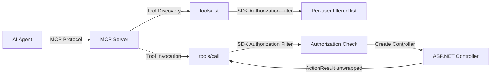
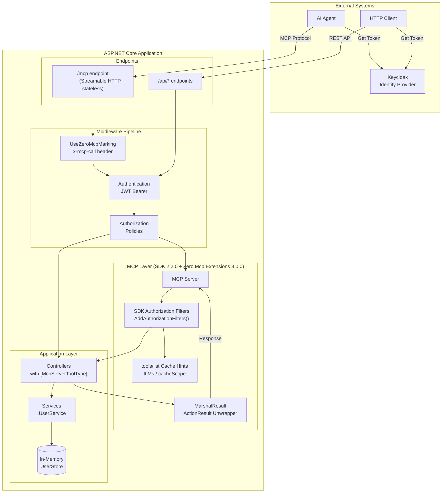
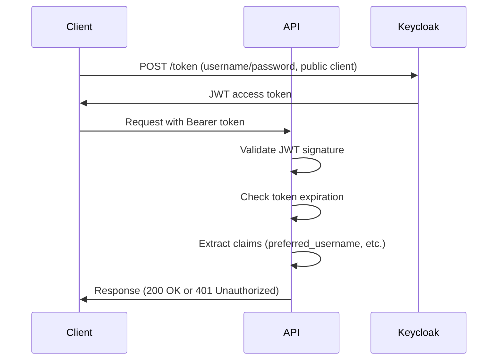
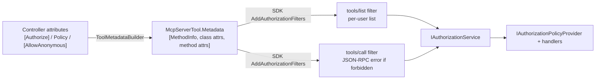
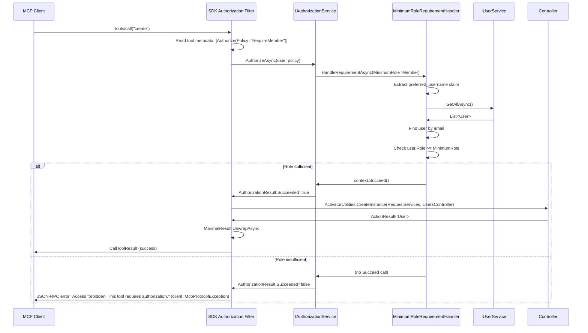
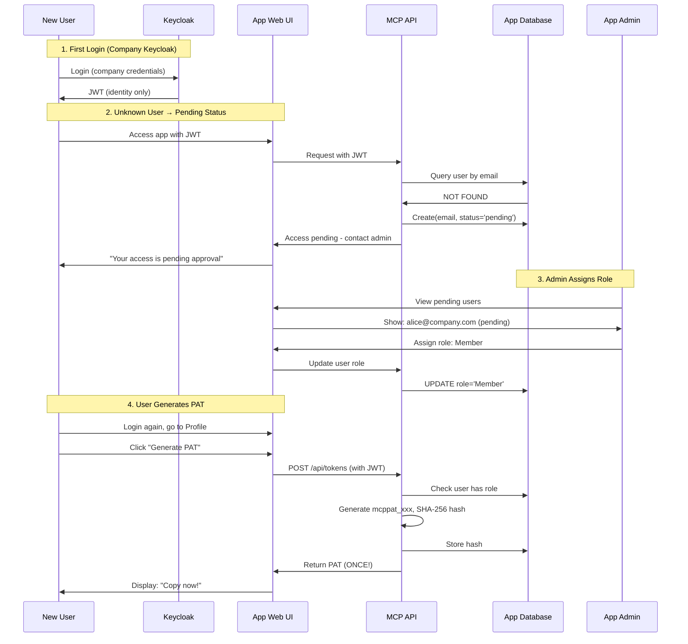
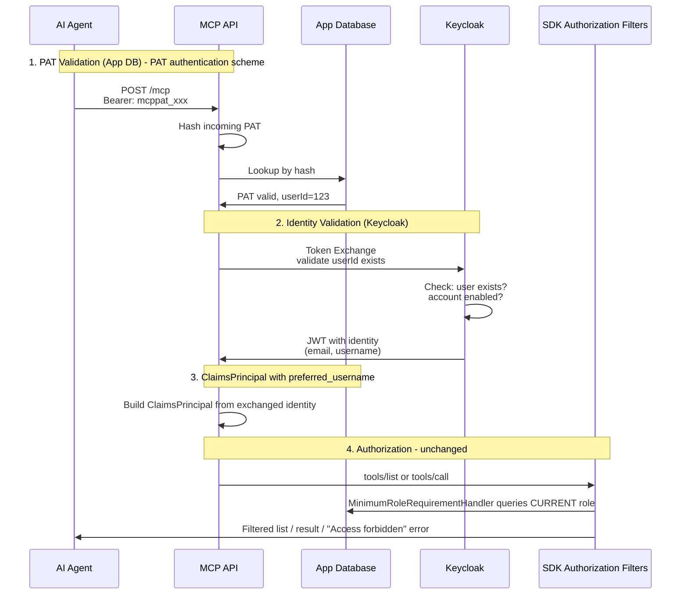
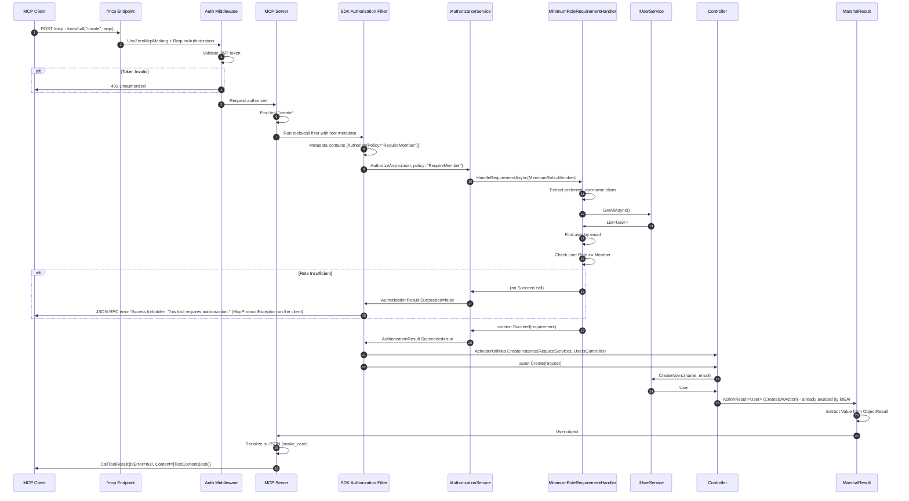
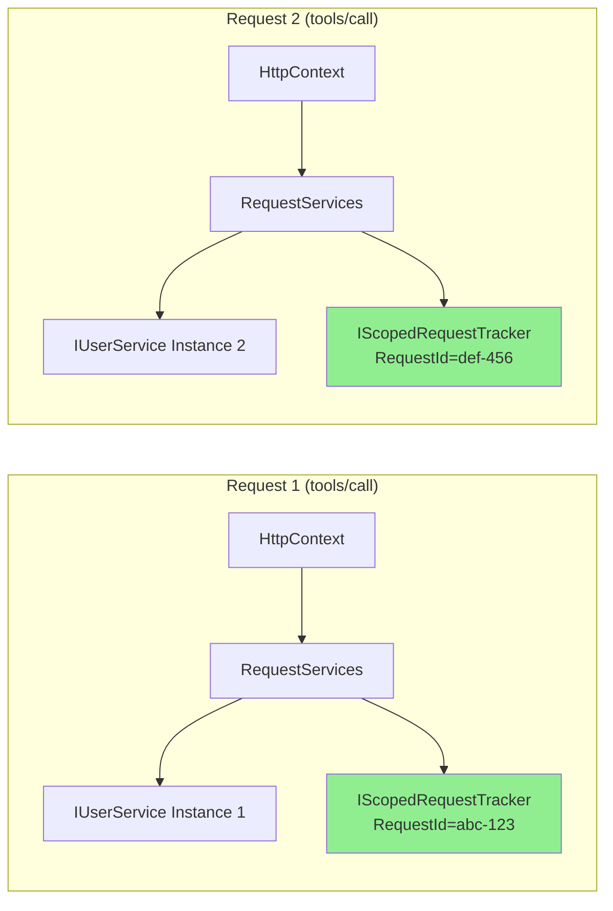

# Complete MCP Integration with .NET API Guide

**Version:** 2.0
**Last Updated:** 2026-09-14
**Project:** McpPoc.Api (demo) + Zero.Mcp.Extensions 3.0.0 (library)
**Stack:** .NET 10 · ASP.NET Core 10.0.12 · MCP C# SDK (ModelContextProtocol) 2.2.0

## Table of Contents

1. [Introduction](#introduction)
2. [What is MCP?](#what-is-mcp)
3. [System Architecture](#system-architecture)
4. [Prerequisites](#prerequisites)
5. [Infrastructure Setup](#infrastructure-setup)
6. [MCP Integration Steps](#mcp-integration-steps)
7. [Controller Integration Patterns](#controller-integration-patterns)
8. [Authentication & Authorization](#authentication--authorization)
9. [Personal Access Token (PAT) Authentication](#personal-access-token-pat-authentication)
10. [Testing Infrastructure](#testing-infrastructure)
11. [Request Flow & Execution](#request-flow--execution)
12. [Dependency Injection & Scoping](#dependency-injection--scoping)
13. [Complete Code Reference](#complete-code-reference)
14. [Common Patterns & Examples](#common-patterns--examples)
15. [Troubleshooting](#troubleshooting)
16. [Critical Discoveries](#critical-discoveries)

---

## Introduction

This guide provides **complete, production-ready documentation** for integrating the Model Context Protocol (MCP) with ASP.NET Core APIs using the **Zero.Mcp.Extensions 3.0.0** library on top of the **official MCP C# SDK 2.2.0**. It shows how to **seamlessly expose existing controllers as MCP tools** while maintaining full HTTP API compatibility.

### What This Guide Covers

- ✅ **Complete MCP integration** from scratch (Streamable HTTP, stateless by default)
- ✅ **Dual protocol support** - HTTP REST API and MCP tools simultaneously
- ✅ **Full authentication** with JWT Bearer (Keycloak)
- ✅ **Personal Access Token (PAT)** design for AI agents
- ✅ **SDK-native authorization** - `[Authorize]`, policies and `[AllowAnonymous]` enforced by the SDK authorization filters
- ✅ **Per-user `tools/list`** filtering and JSON-RPC rejection of forbidden `tools/call`
- ✅ **Testing infrastructure** for both protocols (xunit.v3 on Microsoft.Testing.Platform)
- ✅ **DI scoping** verification for EF Core compatibility
- ✅ **Production patterns** and best practices
- ✅ **All code from real, working implementation** - no guessing

### Project Status

- **Library:** Zero.Mcp.Extensions **3.0.0** (breaking release, see [CHANGELOG.md](../CHANGELOG.md))
- **SDK:** ModelContextProtocol / ModelContextProtocol.Core / ModelContextProtocol.AspNetCore **2.2.0**
- **Tests:** **99 unit tests** (`tests/Zero.Mcp.Extensions.Tests`) + **59 E2E tests** (`tests/McpPoc.Api.Tests`), all passing
- **Strict analyzer gate:** the whole solution builds with `TreatWarningsAsErrors=true` and zero warnings
- **Production-ready** authorization and authentication
- **Proven patterns** for seamless API integration

> **Migrating from 2.x?** The library no longer ships its own attributes or its own authorization layer. See [Migration from 2.x](../README.md#migration-from-2x) in the README; the rest of this guide documents the 3.0.0 design only.

---

## What is MCP?

**Model Context Protocol (MCP)** is an open protocol for exposing tools and resources to AI models. Think of it as OpenAPI/Swagger for AI agents. The official C# implementation is the `ModelContextProtocol` NuGet package family (maintained in the `modelcontextprotocol/csharp-sdk` repository together with Microsoft).

### Key Concepts


```mermaid
graph LR
    A[AI Agent] -->|MCP Protocol| B[MCP Server]
    B -->|Tool Discovery| C[tools/list]
    B -->|Tool Invocation| D[tools/call]
    C -->|SDK Authorization Filter| E[Per-user filtered list]
    D -->|SDK Authorization Filter| F[Authorization Check]
    F -->|Create Controller| G[ASP.NET Controller]
    G -->|ActionResult unwrapped| D
```

#### MCP Components

1. **MCP Server** - Exposes tools via the Streamable HTTP transport
2. **MCP Tools** - Individual operations (GET user, CREATE user, etc.)
3. **MCP Protocol** - JSON-RPC 2.0 based communication (protocol revision 2026-07-28 in SDK 2.2.0)
4. **Tool Schema** - JSON Schema describing parameters (`inputSchema`) and, for structured tools, results (`outputSchema`)

#### Why Use MCP with APIs?

- **AI-Native Interface** - AI agents can discover and invoke your API operations
- **Zero Duplication** - Same controllers work for both HTTP and MCP
- **Type Safety** - Automatic JSON Schema generation from C# types
- **Authorization Ready** - The controllers' own `[Authorize]` rules are evaluated by the SDK through the ASP.NET Core `IAuthorizationService`

---

## System Architecture

### High-Level Architecture


```mermaid
graph TB
    subgraph External["External Systems"]
        AI[AI Agent]
        HTTP[HTTP Client]
        KC["Keycloak
        Identity Provider"]
    end

    subgraph App["ASP.NET Core Application"]
        subgraph Endpoints
            MCP["/mcp endpoint
            (Streamable HTTP, stateless)"]
            API["/api/* endpoints"]
        end

        subgraph Pipeline["Middleware Pipeline"]
            MARK["UseZeroMcpMarking
            x-mcp-call header"]
            AUTH["Authentication
            JWT Bearer"]
            AUTHZ["Authorization
            Policies"]
        end

        subgraph MCPLayer["MCP Layer (SDK 2.2.0 + Zero.Mcp.Extensions 3.0.0)"]
            MCPSRV[MCP Server]
            AUTHFILTER["SDK Authorization Filters
            AddAuthorizationFilters()"]
            CACHE["tools/list Cache Hints
            ttlMs / cacheScope"]
            UNWRAP["MarshalResult
            ActionResult Unwrapper"]
        end

        subgraph AppLayer["Application Layer"]
            CTRL["Controllers
            with [McpServerToolType]"]
            SVC["Services
            IUserService"]
            DB[("In-Memory
            UserStore")]
        end
    end

    AI -->|MCP Protocol| MCP
    HTTP -->|REST API| API
    AI -->|Get Token| KC
    HTTP -->|Get Token| KC

    MCP --> MARK
    MARK --> AUTH
    API --> AUTH
    AUTH --> AUTHZ
    AUTHZ --> MCPSRV
    AUTHZ --> CTRL

    MCPSRV --> AUTHFILTER
    AUTHFILTER --> CACHE
    AUTHFILTER --> CTRL
    CTRL --> UNWRAP
    UNWRAP -->|Response| MCPSRV

    CTRL --> SVC
    SVC --> DB
```

### Component Responsibilities

| Component | Responsibility | Location |
|-----------|---------------|----------|
| **MCP Server** | Protocol handling, tool discovery, Streamable HTTP transport | SDK: `AddMcpServer().WithHttpTransport(...)` |
| **Zero.Mcp.Extensions** | Assembly scanning, tool naming, tool option derivation, metadata, `ActionResult<T>` unwrapping, cache hints, MCP marking | `src/Zero.Mcp.Extensions/*.cs` |
| **SDK Authorization Filters** | Evaluate `[Authorize]`/policies/`[AllowAnonymous]` for `tools/list` and `tools/call` | SDK: `AddAuthorizationFilters()` (registered by the library when `UseAuthorization` is true) |
| **ActionResult Unwrapper** | Extract values from `ActionResult<T>` / `IActionResult` | `src/Zero.Mcp.Extensions/MarshalResult.cs` |
| **Tool Metadata Builder** | Attach `[MethodInfo, class attributes, method attributes]` to each tool | `src/Zero.Mcp.Extensions/ToolMetadataBuilder.cs` |
| **Tool Create Options Factory** | Map the SDK `[McpServerTool]` members to `McpServerToolCreateOptions` | `src/Zero.Mcp.Extensions/ToolCreateOptionsFactory.cs` |
| **Cache Hint Filter** | Stamp `ttlMs` / `cacheScope` on `tools/list` | `src/Zero.Mcp.Extensions/ToolsListCacheHintFilter.cs` |
| **Controllers** | Business logic, both HTTP and MCP | `src/McpPoc.Api/Controllers/UsersController.cs` |
| **Authorization Handler** | Policy enforcement (role hierarchy) | `src/McpPoc.Api/Authorization/MinimumRoleRequirementHandler.cs` |
| **Services** | Business logic, data access | `src/McpPoc.Api/Services/IUserService.cs` |

There is **no library-specific authorization abstraction** to implement. The controllers' existing `[Authorize]`, policy and `[AllowAnonymous]` attributes are the single source of truth for both HTTP and MCP.

---

## Prerequisites

### Required Packages

The solution uses Central Package Management (`Directory.Packages.props`). The versions that matter:

```xml
<ItemGroup>
  <!-- MCP C# SDK 2.2.0 -->
  <PackageVersion Include="ModelContextProtocol" Version="2.2.0" />
  <PackageVersion Include="ModelContextProtocol.Core" Version="2.2.0" />
  <PackageVersion Include="ModelContextProtocol.AspNetCore" Version="2.2.0" />

  <!-- ASP.NET Core 10.0.12 -->
  <PackageVersion Include="Microsoft.AspNetCore.Authentication.JwtBearer" Version="10.0.12" />
  <PackageVersion Include="Microsoft.AspNetCore.Authorization" Version="10.0.12" />
  <PackageVersion Include="Microsoft.AspNetCore.OpenApi" Version="10.0.12" />
  <PackageVersion Include="Scalar.AspNetCore" Version="2.17.3" />

  <!-- Logging -->
  <PackageVersion Include="Serilog.AspNetCore" Version="10.0.0" />
  <PackageVersion Include="Serilog.Sinks.File" Version="7.0.0" />

  <!-- Testing -->
  <PackageVersion Include="Microsoft.NET.Test.Sdk" Version="18.10.0" />
  <PackageVersion Include="xunit.v3" Version="4.0.1" />
  <PackageVersion Include="xunit.runner.visualstudio" Version="4.0.0" />
  <PackageVersion Include="AwesomeAssertions" Version="9.6.0" />
  <PackageVersion Include="NSubstitute" Version="6.2.0" />
  <PackageVersion Include="Microsoft.AspNetCore.Mvc.Testing" Version="10.0.12" />
</ItemGroup>
```

Consumers of the library only need:

```bash
dotnet add package Zero.Mcp.Extensions
```

`ModelContextProtocol`, `ModelContextProtocol.Core` and `ModelContextProtocol.AspNetCore` 2.2.0 are pulled in transitively.

### Development Environment

- **.NET 10 SDK** (`global.json` pins `10.0.100`, `rollForward: latestFeature`)
- **Docker & Docker Compose** for infrastructure
- **IDE** with C# support (VS, VS Code, Rider)

### Build Gate

`Directory.Build.props` enables the strict Roslyn analyzer gate for every project:

```xml
<PropertyGroup>
  <Nullable>enable</Nullable>
  <TreatWarningsAsErrors>true</TreatWarningsAsErrors>
  <AnalysisLevel>latest-recommended</AnalysisLevel>
  <EnforceCodeStyleInBuild>true</EnforceCodeStyleInBuild>
</PropertyGroup>
```

A consequence you will see throughout the code samples: logging goes through `LoggerMessage` source generators (`src/McpPoc.Api/Infrastructure/Log.cs`) instead of direct `ILogger.LogInformation(...)` calls (CA1848), and every `await` inside library and demo code carries `.ConfigureAwait(false)` (CA2007).

### Infrastructure Requirements

- **PostgreSQL 16** (for Keycloak)
- **Keycloak 25.0.2** (OIDC provider)
- Port availability: 5432 (PostgreSQL), 8080 (Keycloak), 5001 (API)

---

## Infrastructure Setup

### Step 1: Docker Compose Configuration

File: `docker/docker-compose.yml` (relevant services)

```yaml
services:
  postgres:
    image: postgres:16-alpine
    container_name: mcppoc_postgres
    restart: unless-stopped
    environment:
      POSTGRES_DB: ${POSTGRES_DB:-mcppoc_db}
      POSTGRES_USER: ${POSTGRES_USER:-mcppoc_user}
      POSTGRES_PASSWORD: ${POSTGRES_PASSWORD}
      PGDATA: /var/lib/postgresql/data/pgdata
    ports:
      - "${POSTGRES_PORT:-5432}:5432"
    volumes:
      - mcppoc_postgres_data:/var/lib/postgresql/data
      - ./postgres:/docker-entrypoint-initdb.d:ro
    networks:
      - mcppoc_network
    healthcheck:
      test: ["CMD-SHELL", "pg_isready -U ${POSTGRES_USER:-mcppoc_user} -d ${POSTGRES_DB:-mcppoc_db}"]
      interval: 10s
      timeout: 5s
      retries: 5
      start_period: 30s

  postgres-init:
    image: postgres:16-alpine
    container_name: mcppoc_postgres_init
    restart: "no"
    environment:
      PGHOST: postgres
      PGUSER: ${POSTGRES_USER:-mcppoc_user}
      PGPASSWORD: ${POSTGRES_PASSWORD}
    networks:
      - mcppoc_network
    depends_on:
      postgres:
        condition: service_healthy
    volumes:
      - ./postgres/init-db.sh:/init-db.sh:ro
    command: /init-db.sh

  keycloak:
    image: quay.io/keycloak/keycloak:25.0.2
    container_name: mcppoc_keycloak
    restart: unless-stopped
    environment:
      KC_DB: postgres
      KC_DB_URL: jdbc:postgresql://postgres:5432/${KEYCLOAK_DB:-keycloak}
      KC_DB_USERNAME: ${POSTGRES_USER:-mcppoc_user}
      KC_DB_PASSWORD: ${POSTGRES_PASSWORD}
      KEYCLOAK_ADMIN: ${KEYCLOAK_ADMIN:-admin}
      KEYCLOAK_ADMIN_PASSWORD: ${KEYCLOAK_ADMIN_PASSWORD:-admin}
    command: start-dev --import-realm
    ports:
      - "${KEYCLOAK_PORT:-8080}:8080"
    volumes:
      - ./keycloak:/opt/keycloak/data/import:ro
    networks:
      - mcppoc_network
    depends_on:
      postgres:
        condition: service_healthy
      postgres-init:
        condition: service_completed_successfully
    healthcheck:
      test: ["CMD", "curl", "-f", "http://localhost:8080/health/ready"]
      interval: 10s
      timeout: 5s
      retries: 5
      start_period: 60s

volumes:
  mcppoc_postgres_data:

networks:
  mcppoc_network:
    driver: bridge
```

The API itself runs locally with `dotnet run --project src/McpPoc.Api` (the `api` service in the compose file is commented out for local development).

### Step 2: Environment Configuration

Create `docker/.env` (secrets belong in `.00-secrets/`, see `docs/SECURITY.md`):

```env
POSTGRES_PASSWORD=your_secure_password_here
KEYCLOAK_ADMIN=admin
KEYCLOAK_ADMIN_PASSWORD=admin
```

### Step 3: Keycloak Realm Configuration

File: `docker/keycloak/mcppoc-realm.json` (excerpt). The demo client is **public** (no client secret; password grant enabled for tests). Realm roles are only `admin` and `user`; the **application roles** (Viewer / Member / Manager / Admin) live in the app's `UserStore` and are resolved by the authorization handler from the `preferred_username` claim.

```json
{
  "realm": "mcppoc-realm",
  "enabled": true,
  "roles": {
    "realm": [
      { "name": "admin", "description": "Administrator role with full access" },
      { "name": "user",  "description": "Regular user role with standard access" }
    ]
  },
  "clients": [
    {
      "clientId": "mcppoc-api",
      "name": "MCP POC API",
      "rootUrl": "http://127.0.0.1:5001",
      "enabled": true,
      "publicClient": true,
      "standardFlowEnabled": true,
      "directAccessGrantsEnabled": true,
      "serviceAccountsEnabled": false,
      "redirectUris": ["http://127.0.0.1:5001/*"],
      "webOrigins": ["http://127.0.0.1:5001"]
    }
  ],
  "users": [
    {
      "username": "admin",
      "email": "admin@mcppoc.com",
      "enabled": true,
      "credentials": [{ "type": "password", "value": "admin123", "temporary": false }],
      "realmRoles": ["admin", "user"]
    },
    {
      "username": "alice@example.com",
      "email": "alice@example.com",
      "enabled": true,
      "firstName": "Alice",
      "lastName": "Smith",
      "credentials": [{ "type": "password", "value": "alice123", "temporary": false }],
      "realmRoles": ["user"]
    },
    {
      "username": "bob@example.com",
      "email": "bob@example.com",
      "enabled": true,
      "firstName": "Bob",
      "lastName": "Jones",
      "credentials": [{ "type": "password", "value": "bob123", "temporary": false }],
      "realmRoles": ["user"]
    },
    {
      "username": "carol@example.com",
      "email": "carol@example.com",
      "enabled": true,
      "firstName": "Carol",
      "lastName": "White",
      "credentials": [{ "type": "password", "value": "carol123", "temporary": false }],
      "realmRoles": ["admin", "user"]
    },
    {
      "username": "viewer",
      "enabled": true,
      "credentials": [{ "type": "password", "value": "viewer123", "temporary": false }],
      "realmRoles": ["user"]
    }
  ]
}
```

### Test Users

| Username | Password | App Role | Can Do |
|----------|----------|----------|--------|
| `viewer` | `viewer123` | Viewer | Read only |
| `alice@example.com` | `alice123` | Member | Read + Create |
| `bob@example.com` | `bob123` | Manager | Read + Create + Update |
| `carol@example.com` | `carol123` | Admin | Everything |

### Step 4: Start Infrastructure

```bash
cd docker
docker-compose up -d

# Verify services are healthy
docker-compose ps

# Check Keycloak is ready
curl http://127.0.0.1:8080/health/ready

# Get a token (password grant against the public client)
TOKEN=$(./get-token.sh alice@example.com alice123)
```

---

## MCP Integration Steps

### Step 1: Application Configuration

File: `src/McpPoc.Api/appsettings.json`

```json
{
  "Logging": {
    "LogLevel": {
      "Default": "Information",
      "Microsoft.AspNetCore": "Warning"
    }
  },
  "AllowedHosts": "*",
  "Auth": {
    "Enabled": true
  },
  "Keycloak": {
    "Authority": "http://127.0.0.1:8080/realms/mcppoc-realm",
    "Audience": "account",
    "RequireHttpsMetadata": false,
    "ValidateAudience": true,
    "ValidateIssuer": true
  }
}
```

Two configuration keys drive MCP behaviour in the demo:

| Key | Default | Effect |
|-----|---------|--------|
| `Auth:Enabled` | `true` | `false` turns off JWT authentication **and** sets `RequireAuthentication = false`, `UseAuthorization = false` (every tool listed and callable) |
| `Mcp:SessionMode` | `Stateless` | Passed to `ZeroMcpOptions.SessionMode`; `Stateful` or `StatefulForInitializeClients` make the SDK issue `Mcp-Session-Id` |

### Step 2: Program.cs - Complete Setup

File: `src/McpPoc.Api/Program.cs`

```csharp
using McpPoc.Api.Authorization;
using McpPoc.Api.Services;
using Microsoft.AspNetCore.Authentication.JwtBearer;
using Scalar.AspNetCore;
using Serilog;
using ModelContextProtocol.AspNetCore;
using Zero.Mcp.Extensions;
using AppLog = McpPoc.Api.Infrastructure.Log;

// Configure Serilog for file logging
Log.Logger = new LoggerConfiguration()
    .MinimumLevel.Information()
    .WriteTo.Console(formatProvider: System.Globalization.CultureInfo.InvariantCulture)
    .WriteTo.File("logs/mcppoc-.log", formatProvider: System.Globalization.CultureInfo.InvariantCulture, rollingInterval: RollingInterval.Day)
    .CreateLogger();

var builder = WebApplication.CreateBuilder(args);

// Use Serilog
builder.Host.UseSerilog();

// Check if auth is enabled (default: true)
var authEnabled = builder.Configuration.GetValue("Auth:Enabled", true);

// Add services
builder.Services.AddControllers();
builder.Services.AddEndpointsApiExplorer();

// Configure OpenAPI (native)
builder.Services.AddOpenApi();

// Configure JWT Bearer authentication with Keycloak (only if auth enabled)
if (authEnabled)
{
    builder.Services.AddAuthentication(JwtBearerDefaults.AuthenticationScheme)
        .AddJwtBearer(options =>
        {
            var keycloakAuthority = builder.Configuration["Keycloak:Authority"];

            options.Authority = keycloakAuthority;
            options.Audience = builder.Configuration["Keycloak:Audience"];
            options.RequireHttpsMetadata = builder.Configuration.GetValue<bool>("Keycloak:RequireHttpsMetadata");

            options.TokenValidationParameters = new Microsoft.IdentityModel.Tokens.TokenValidationParameters
            {
                ValidateAudience = false,  // Keycloak puts the client in 'azp', not 'aud'
                ValidateIssuer = true,
                ValidateLifetime = true,
                ValidateIssuerSigningKey = true
            };

            options.Events = new JwtBearerEvents
            {
                OnAuthenticationFailed = context =>
                {
                    var logger = context.HttpContext.RequestServices.GetRequiredService<ILogger<Program>>();
                    AppLog.AuthenticationFailed(logger, context.Exception);
                    return Task.CompletedTask;
                },
                OnTokenValidated = context =>
                {
                    var logger = context.HttpContext.RequestServices.GetRequiredService<ILogger<Program>>();
                    var userName = context.Principal?.Identity?.Name ?? "Unknown";
                    AppLog.TokenValidated(logger, userName);
                    return Task.CompletedTask;
                }
            };
        });

    // CRITICAL: the SDK authorization filters resolve policy names through the host
    // IAuthorizationPolicyProvider, so every policy used on a controller MUST be registered here.
    builder.Services.AddAuthorization();
    builder.Services.AddMcpPocAuthorization();
}
else
{
    // No-op authorization when auth disabled
    builder.Services.AddAuthorization();
    Log.Warning("Authentication is DISABLED - all endpoints are accessible without auth");
}

builder.Services.AddHttpContextAccessor();
builder.Services.AddSingleton<UserStore>();  // HACK: In-memory persistence
builder.Services.AddScoped<IUserService, UserService>();
builder.Services.AddScoped<IScopedRequestTracker, ScopedRequestTracker>();

// ============================================
// MCP Server Configuration (Zero.Mcp.Extensions)
// ============================================
builder.Services.AddZeroMcpExtensions(options =>
{
    options.RequireAuthentication = authEnabled;  // Require auth only if enabled
    options.UseAuthorization = authEnabled;       // SDK authorization filters enforce [Authorize] policies only if enabled
    options.ToolsListTimeToLive = TimeSpan.FromMinutes(5);  // tools/list cache hint (ttlMs + cacheScope)
    options.SessionMode = builder.Configuration.GetValue("Mcp:SessionMode", HttpServerSessionMode.Stateless);  // Stateless default
    options.McpEndpointPath = "/mcp";             // MCP endpoint path
    options.ToolAssembly = typeof(McpPoc.Api.Controllers.UsersController).Assembly;  // Explicit assembly for Docker
});

var app = builder.Build();

// Configure HTTP pipeline
// OpenAPI/Scalar only for local development with ENABLE_OPENAPI=true
if (app.Environment.IsDevelopment() && builder.Configuration.GetValue("ENABLE_OPENAPI", false))
{
    app.MapOpenApi();

    // Scalar UI with OAuth2 configuration
    var keycloakAuthority = builder.Configuration["Keycloak:Authority"];
    app.MapScalarApiReference(options =>
    {
        options
            .WithTitle("MCP POC API")
            .WithDefaultHttpClient(ScalarTarget.CSharp, ScalarClient.HttpClient)
            .AddAuthorizationCodeFlow("keycloak", flow =>
            {
                flow.ClientId = "mcppoc-api";
                flow.AuthorizationUrl = $"{keycloakAuthority}/protocol/openid-connect/auth";
                flow.TokenUrl = $"{keycloakAuthority}/protocol/openid-connect/token";
            });
    });
}

// CRITICAL: Middleware order matters!
app.UseHttpsRedirection();
app.UseZeroMcpMarking();  // Mark MCP requests (x-mcp-call header + HttpContext.Items marker) BEFORE authentication
app.UseAuthentication();  // JWT validation
app.UseAuthorization();   // Policy enforcement for HTTP endpoints
app.MapControllers();     // HTTP API routes

// ============================================
// MCP Endpoint - Streamable HTTP, RequireAuthorization() applied when RequireAuthentication is true
// ============================================
app.MapZeroMcp();  // Uses configuration from AddZeroMcpExtensions

AppLog.BannerSeparator(app.Logger);
AppLog.BannerTitle(app.Logger);
AppLog.BannerHttpApi(app.Logger);
AppLog.BannerMcpEndpoint(app.Logger);
AppLog.BannerScalarUi(app.Logger);
AppLog.BannerSeparator(app.Logger);

app.Run();

// Make Program accessible for WebApplicationFactory
public partial class Program { }
```

### Step 3: Inside the Library - Registration Pipeline

This is the **key piece** that makes controllers work as MCP tools. Since 2.0 it lives in the NuGet library, not in the demo project; in 3.0.0 it is a thin layer over the SDK.

#### ZeroMcpOptions

File: `src/Zero.Mcp.Extensions/ZeroMcpOptions.cs`

```csharp
using System.Reflection;
using System.Text.Json;
using ModelContextProtocol.AspNetCore;   // HttpServerSessionMode

namespace Zero.Mcp.Extensions;

public class ZeroMcpOptions
{
    // Whether to require authentication for the MCP endpoint (default: true)
    public bool RequireAuthentication { get; set; } = true;

    // Attach [Authorize]/[AllowAnonymous] metadata to tools and register the SDK
    // AddAuthorizationFilters(): tools/list is filtered per user and forbidden tools/call
    // is rejected. Requires the host to call AddAuthorization(). When false, no authorization
    // metadata is attached, no filters are registered, every tool is listed and callable. (default: true)
    public bool UseAuthorization { get; set; } = true;

    // The path where the MCP endpoint will be mapped (default: "/mcp")
    public string McpEndpointPath { get; set; } = "/mcp";

    // The assembly to scan for MCP tools (default: null = calling assembly)
    public Assembly? ToolAssembly { get; set; }

    // JSON serializer options for parameters and results (default: null = snake_case_lower)
    public JsonSerializerOptions? SerializerOptions { get; set; }

    // Streamable HTTP session mode passed to the SDK transport (default: Stateless)
    public HttpServerSessionMode SessionMode { get; set; } = HttpServerSessionMode.Stateless;

    // When set, tools/list responses carry ttlMs = value and
    // cacheScope = "private" if UseAuthorization, otherwise "public" (default: null = no hints)
    public TimeSpan? ToolsListTimeToLive { get; set; }

    // Tool naming convention (default: MethodOnly)
    public ToolNamingConvention NamingConvention { get; set; } = ToolNamingConvention.MethodOnly;

    // Separator for controller prefix (default: "_")
    public string ToolNameSeparator { get; set; } = "_";
}
```

| Option | Default | Meaning |
|--------|---------|---------|
| `RequireAuthentication` | `true` | `MapZeroMcp()` applies `RequireAuthorization()` to the endpoint |
| `UseAuthorization` | `true` | Attach authorization metadata + register SDK `AddAuthorizationFilters()` |
| `McpEndpointPath` | `"/mcp"` | Endpoint path |
| `ToolAssembly` | `null` (calling assembly) | Assembly scanned for `[McpServerToolType]` |
| `SerializerOptions` | `null` (snake_case_lower) | Parameter and result serialization |
| `NamingConvention` | `MethodOnly` | `MethodOnly` or `ControllerPrefix` |
| `ToolNameSeparator` | `"_"` | Separator for `ControllerPrefix` |
| `ToolsListTimeToLive` | `null` | When set, `tools/list` carries `ttlMs` + `cacheScope` |
| `SessionMode` | `Stateless` | `Stateless` / `Stateful` / `StatefulForInitializeClients` |

#### AddZeroMcpExtensions - the pipeline

File: `src/Zero.Mcp.Extensions/McpServerBuilderExtensions.cs`

```csharp
public static IMcpServerBuilder AddZeroMcpExtensions(
    this IServiceCollection services,
    Action<ZeroMcpOptions>? configure = null)
{
    var options = new ZeroMcpOptions();
    configure?.Invoke(options);

    // Capture the calling assembly NOW if not explicitly provided
    options.ToolAssembly ??= Assembly.GetCallingAssembly();

    services.AddSingleton(options);
    services.AddHttpContextAccessor();
    services.AddScoped<IMcpRequestContext, McpRequestContext>();

    var mcpBuilder = services
        .AddMcpServer()
        .WithHttpTransport(transport => transport.SessionMode = options.SessionMode)
        .WithToolsFromAssemblyUnwrappingActionResult(options);

    // Authorization is delegated to the SDK: [Authorize]/[AllowAnonymous] found in the tool metadata are
    // evaluated through the host's IAuthorizationService for both tools/list and tools/call.
    if (options.UseAuthorization)
    {
        mcpBuilder.AddAuthorizationFilters();
    }

    // Cache hints are stamped LAST so they wrap the per-user list produced by the authorization filter.
    if (options.ToolsListTimeToLive is not null)
    {
        mcpBuilder.WithRequestFilters(filters => filters.AddListToolsFilter(next =>
            ToolsListCacheHintFilter.Apply(next, options.ToolsListTimeToLive, options.UseAuthorization)));
    }

    return mcpBuilder;
}
```

The pipeline in one line:

```
AddMcpServer()
  .WithHttpTransport(o => o.SessionMode = options.SessionMode)
  .WithToolsFromAssemblyUnwrappingActionResult(options)
  [.AddAuthorizationFilters()               if UseAuthorization]
  [.WithRequestFilters(list-tools cache hint) if ToolsListTimeToLive is set]
```

`AddZeroMcpExtensions` returns the SDK `IMcpServerBuilder`, so prompts, resources or extra filters can be chained on the result.

#### Tool discovery and creation

```csharp
private static IMcpServerBuilder WithToolsFromAssemblyUnwrappingActionResult(
    this IMcpServerBuilder builder,
    ZeroMcpOptions options)
{
    var toolAssembly = options.ToolAssembly!;
    var serializerOptions = options.GetEffectiveSerializerOptions();

    // Find all types with the SDK [McpServerToolType]
    var toolTypes = toolAssembly.GetTypes()
        .Where(t => t.GetCustomAttribute<McpServerToolTypeAttribute>() is not null);

    foreach (var toolType in toolTypes)
    {
        // Find all methods with the SDK [McpServerTool]
        var toolMethods = toolType.GetMethods(
            BindingFlags.Public | BindingFlags.NonPublic |
            BindingFlags.Static | BindingFlags.Instance)
            .Where(m => m.GetCustomAttribute<McpServerToolAttribute>() is not null);

        foreach (var method in toolMethods)
        {
            var toolName = ToolNameGenerator.GenerateName(method, toolType, options);

            if (method.IsStatic)
            {
                builder.Services.AddSingleton<McpServerTool>(services =>
                {
                    var aiFunction = AIFunctionFactory.Create(
                        method,
                        target: null,
                        new AIFunctionFactoryOptions
                        {
                            Name = toolName,
                            MarshalResult = static async (result, _, _) => await MarshalResult.UnwrapAsync(result).ConfigureAwait(false),
                            SerializerOptions = serializerOptions
                        });
                    return McpServerTool.Create(aiFunction,
                        ToolCreateOptionsFactory.Create(method, services, serializerOptions, options.UseAuthorization));
                });
            }
            else
            {
                // Instance method - controller resolved through DI per invocation
                var methodCopy = method;
                var toolNameCopy = toolName;

                builder.Services.AddSingleton<McpServerTool>(services =>
                {
                    var aiFunction = AIFunctionFactory.Create(
                        methodCopy,
                        args => ActivatorUtilities.CreateInstance(args.Services!, toolType),   // scoped DI from the request
                        new AIFunctionFactoryOptions
                        {
                            Name = toolNameCopy,
                            MarshalResult = static async (result, _, _) => await MarshalResult.UnwrapAsync(result).ConfigureAwait(false),
                            SerializerOptions = serializerOptions
                        });

                    return McpServerTool.Create(aiFunction,
                        ToolCreateOptionsFactory.Create(methodCopy, services, serializerOptions, options.UseAuthorization));
                });
            }
        }
    }

    return builder;
}
```

Per tool the library does three things:

1. **`AIFunctionFactory.Create(method, createTarget, options)`** (Microsoft.Extensions.AI) - the controller instance is created **per call** via `ActivatorUtilities.CreateInstance(args.Services!, toolType)`. `args.Services` is the request's scoped service provider, so constructor injection of scoped services works exactly like in HTTP.
2. **`MarshalResult = MarshalResult.UnwrapAsync`** - unwraps `ActionResult<T>` / `IActionResult` (see below). Microsoft.Extensions.AI **awaits `Task`/`ValueTask` results before invoking the marshaller** (verified), so the marshaller receives the `ActionResult<T>` directly.
3. **`McpServerTool.Create(aiFunction, ToolCreateOptionsFactory.Create(...))`** - the `AIFunction` overload of `McpServerTool.Create` does **not** read attributes, so the library derives `McpServerToolCreateOptions` itself.

#### ToolCreateOptionsFactory - SDK attribute passthrough

File: `src/Zero.Mcp.Extensions/ToolCreateOptionsFactory.cs`

```csharp
internal static class ToolCreateOptionsFactory
{
    // SDK attribute defaults: hints are only forwarded when they differ from these, matching the SDK's
    // "was it explicitly set" semantics (the attribute exposes them as non-nullable bools).
    private const bool DestructiveDefault = true;
    private const bool IdempotentDefault = false;
    private const bool OpenWorldDefault = true;
    private const bool ReadOnlyDefault = false;

    public static McpServerToolCreateOptions Create(
        MethodInfo method,
        IServiceProvider services,
        JsonSerializerOptions serializerOptions,
        bool includeAuthorization)
    {
        var options = new McpServerToolCreateOptions
        {
            Services = services,
            SerializerOptions = serializerOptions,
            Metadata = ToolMetadataBuilder.Build(method, includeAuthorization),
            Description = method.GetCustomAttribute<DescriptionAttribute>()?.Description,
        };

        var attribute = method.GetCustomAttribute<McpServerToolAttribute>();
        if (attribute is null)
        {
            return options;
        }

        options.Title = attribute.Title;
        options.UseStructuredContent = attribute.UseStructuredContent;

        if (attribute.Destructive != DestructiveDefault) options.Destructive = attribute.Destructive;
        if (attribute.Idempotent != IdempotentDefault)   options.Idempotent = attribute.Idempotent;
        if (attribute.OpenWorld != OpenWorldDefault)     options.OpenWorld = attribute.OpenWorld;
        if (attribute.ReadOnly != ReadOnlyDefault)       options.ReadOnly = attribute.ReadOnly;

        if (attribute.OutputSchemaType is { } schemaType)
        {
            options.OutputSchema = AIJsonUtilities.CreateJsonSchema(schemaType, serializerOptions: serializerOptions);
        }

        if (!string.IsNullOrEmpty(attribute.IconSource))
        {
            options.Icons = [new Icon { Source = attribute.IconSource }];
        }

        return options;
    }
}
```

Every member of the SDK `[McpServerTool]` attribute flows to the client: `Name`, `Title`, `ReadOnly` / `Destructive` / `Idempotent` / `OpenWorld`, `IconSource`, `UseStructuredContent`, `OutputSchemaType`. Note the SDK only emits `outputSchema` when `UseStructuredContent = true`, so set both together.

#### ToolMetadataBuilder - what the SDK authorization filters see

File: `src/Zero.Mcp.Extensions/ToolMetadataBuilder.cs`

```csharp
internal static class ToolMetadataBuilder
{
    // Layout mirrors the SDK's own reflection path: [MethodInfo, ...declaring-class attributes, ...method attributes]
    public static IReadOnlyList<object> Build(MethodInfo method, bool includeAuthorization)
    {
        List<object> metadata = [method];
        if (method.DeclaringType is not null)
        {
            metadata.AddRange(method.DeclaringType.GetCustomAttributes(inherit: true));
        }

        metadata.AddRange(method.GetCustomAttributes(inherit: true));

        if (!includeAuthorization)
        {
            metadata.RemoveAll(static m => m is IAuthorizeData or IAllowAnonymous or AuthorizationPolicy or IAuthorizationRequirementData);
        }

        return metadata;
    }
}
```

The metadata list is exactly what the SDK's `AddAuthorizationFilters()` inspects: `[Authorize]` (class and method, `inherit: true`), `[Authorize(Policy = ...)]`, `[AllowAnonymous]`. When `UseAuthorization` is `false` the authorization entries are **stripped** - this matters because of an SDK guard: a tool carrying `[Authorize]` metadata in a server that did **not** call `AddAuthorizationFilters()` makes the SDK throw `InvalidOperationException`. The library ties metadata and filter registration to the same flag so the two can never disagree.

#### MarshalResult - ActionResult unwrapping

File: `src/Zero.Mcp.Extensions/MarshalResult.cs`

```csharp
internal static class MarshalResult
{
    /// Unwraps an ActionResult<T> or IActionResult to extract the actual value.
    /// Returns null for Ok(null) (valid for nullable types).
    /// Throws InvalidOperationException if controller returns an error result.
    public static async ValueTask<object?> UnwrapAsync(object? result)
    {
        if (result is null)
            return null;

        // Defensive: Task / ValueTask wrappers are awaited here too (MEAI already awaits them before calling us)
        if (result is ValueTask valueTask)
        {
            await valueTask.ConfigureAwait(false);
            return null;
        }

        var resultType = result.GetType();

        if (resultType.IsGenericType && resultType.GetGenericTypeDefinition() == typeof(ValueTask<>))
        {
            dynamic vt = result;
            result = await vt;
        }

        if (result is Task task)
        {
            await task.ConfigureAwait(false);
            var taskType = task.GetType();
            if (taskType.IsGenericType)
            {
                result = taskType.GetProperty("Result")?.GetValue(task);
            }
            else
            {
                return null;
            }
        }

        if (result is null)
            return null;

        resultType = result.GetType();

        // Handle ActionResult<T>
        if (resultType.IsGenericType && resultType.GetGenericTypeDefinition() == typeof(ActionResult<>))
        {
            var actionResult = resultType.GetProperty("Result")?.GetValue(result);
            if (actionResult is not null)
            {
                result = actionResult;               // explicit Ok(...)/NotFound(...) etc.
            }
            else
            {
                return resultType.GetProperty("Value")?.GetValue(result);   // implicit conversion
            }
        }

        // Handle IActionResult with value
        if (result is IActionResult actionResultInterface)
        {
            if (actionResultInterface is IStatusCodeActionResult statusCodeResult
                && statusCodeResult is ObjectResult objectResult)
            {
                return objectResult.Value; // Can be null for ActionResult<T?>
            }

            // Error results like NotFoundResult, BadRequestResult should throw
            throw new InvalidOperationException(
                $"Controller returned error result: {actionResultInterface.GetType().Name}. " +
                "MCP tools should return domain error objects wrapped in ActionResult<T> instead of IActionResult error types. " +
                "Example: return new ActionResult<User>(new ObjectResult(new { error = \"Not found\" }) { StatusCode = 404 });");
        }

        return result;
    }
}
```

Behaviour summary:

| Controller returns | MCP result |
|--------------------|-----------|
| `Ok(user)` / `CreatedAtAction(..., user)` | `user` serialized (snake_case) |
| `Ok(null)` for `ActionResult<T?>` | `null` |
| `NotFound(new { error = "..." })` (an `ObjectResult`) | the anonymous object (status code is not transported) |
| `NotFound()` / `BadRequest()` (status-only results) | `InvalidOperationException` → SDK reports a tool error (`IsError = true`) |

#### ToolsListCacheHintFilter - cache hints

File: `src/Zero.Mcp.Extensions/ToolsListCacheHintFilter.cs`

```csharp
internal static class ToolsListCacheHintFilter
{
    public static McpRequestHandler<ListToolsRequestParams, ListToolsResult> Apply(
        McpRequestHandler<ListToolsRequestParams, ListToolsResult> next,
        TimeSpan? ttl,
        bool useAuthorization) =>
        async (context, cancellationToken) =>
        {
            var result = await next(context, cancellationToken).ConfigureAwait(false);
            Stamp(result, ttl, useAuthorization);
            return result;
        };

    internal static void Stamp(ListToolsResult result, TimeSpan? ttl, bool useAuthorization)
    {
        if (ttl is { } timeToLive)
        {
            result.TimeToLive = timeToLive;
            result.CacheScope = useAuthorization ? CacheScope.Private : CacheScope.Public;
        }
    }
}
```

With the demo's `ToolsListTimeToLive = TimeSpan.FromMinutes(5)` and authorization on, a raw `tools/list` response contains `"ttlMs":300000` and `"cacheScope":"private"` - the list varies per user, so it must never be shared between users.

#### MapZeroMcp and UseZeroMcpMarking

```csharp
public static IEndpointConventionBuilder MapZeroMcp(this IEndpointRouteBuilder app, string? path = null)
{
    var options = app.ServiceProvider.GetService<ZeroMcpOptions>() ?? new ZeroMcpOptions();
    var effectivePath = path ?? options.McpEndpointPath;

    var builder = app.MapMcp(effectivePath);          // SDK Streamable HTTP endpoint

    if (options.RequireAuthentication)
    {
        builder.RequireAuthorization();
    }

    return builder;
}

public static IApplicationBuilder UseZeroMcpMarking(this IApplicationBuilder app, string mcpPath = "/mcp")
{
    return app.Use(async (context, next) =>
    {
        if (context.Request.Path.StartsWithSegments(mcpPath, StringComparison.OrdinalIgnoreCase))
        {
            context.Items[McpRequestContext.McpCallMarkerKey] = true;              // "__McpCall"
            context.Request.Headers[McpRequestContext.McpCallHeaderName] = "true"; // "x-mcp-call"
        }

        await next().ConfigureAwait(false);
    });
}
```

### Key Features of the Library:

1. **SDK attributes only** - `[McpServerToolType]` / `[McpServerTool]` from `ModelContextProtocol.Server`; no library attribute types
2. **SDK-native authorization** - metadata + `AddAuthorizationFilters()`, evaluated through the host `IAuthorizationService`; fully async, no sync-over-async anywhere
3. **ActionResult Unwrapping** - `MarshalResult` extracts values from `ActionResult<T>`
4. **Scoped DI per call** - controllers are created from the request's `RequestServices`
5. **Streamable HTTP, stateless by default** - `SessionMode` configurable
6. **Cache hints** - optional `ttlMs` / `cacheScope` on `tools/list`
7. **Request context** - `IMcpRequestContext` works inside tools (see [Critical Discoveries](#critical-discoveries))

---

## Controller Integration Patterns

### Pattern 1: Basic Controller with MCP Tools

File: `src/McpPoc.Api/Controllers/UsersController.cs`

```csharp
using McpPoc.Api.Authorization;
using McpPoc.Api.Models;
using McpPoc.Api.Services;
using Microsoft.AspNetCore.Authorization;
using Microsoft.AspNetCore.Mvc;
using Zero.Mcp.Extensions;          // IMcpRequestContext
using ModelContextProtocol.Server;  // [McpServerToolType], [McpServerTool] - the SDK attributes
using System.ComponentModel;
using McpPoc.Api.Infrastructure;    // Log (LoggerMessage source generators)

namespace McpPoc.Api.Controllers;

[ApiController]
[Route("api/[controller]")]
[Authorize]                  // ← Endpoint-level authentication, enforced for MCP too
[McpServerToolType]          // ← Enables MCP tool exposure (SDK attribute)
public class UsersController : ControllerBase
{
    private readonly IUserService _userService;
    private readonly ILogger<UsersController> _logger;
    private readonly IScopedRequestTracker _scopedTracker;
    private readonly IMcpRequestContext _mcpContext;

    public UsersController(
        IUserService userService,
        ILogger<UsersController> logger,
        IScopedRequestTracker scopedTracker,
        IMcpRequestContext mcpContext)
    {
        _userService = userService;
        _logger = logger;
        _scopedTracker = scopedTracker;
        _mcpContext = mcpContext;
    }

    // GET /api/users/{id} AND MCP tool "UserGetById" (explicit Name, structured content + output schema)
    [HttpGet("{id}")]
    [McpServerTool(Name = "UserGetById", UseStructuredContent = true, OutputSchemaType = typeof(User)), Description("Gets a user by their ID")]
    public async Task<ActionResult<User>> GetById(int id)
    {
        Log.GetByIdCalled(_logger, id, _mcpContext.IsMcpCall);

        var user = await _userService.GetByIdAsync(id).ConfigureAwait(false);

        if (user == null)
        {
            return NotFound(new { error = "User not found", id });
        }

        return Ok(user);
    }

    // GET /api/users AND MCP tool "get_all"
    [HttpGet]
    [McpServerTool, Description("Gets all users")]
    public async Task<ActionResult<List<User>>> GetAll()
    {
        Log.GetAllCalled(_logger);

        var users = await _userService.GetAllAsync().ConfigureAwait(false);
        return Ok(users);
    }

    // POST /api/users AND MCP tool "create" - Requires Member role
    [HttpPost]
    [McpServerTool, Description("Creates a new user - requires Member role")]
    [Authorize(Policy = PolicyNames.RequireMember)]
    public async Task<ActionResult<User>> Create(
        [Description("User creation data")] CreateUserRequest request)
    {
        Log.CreateCalled(_logger, request.Name, request.Email);

        var user = await _userService.CreateAsync(request.Name, request.Email).ConfigureAwait(false);
        return CreatedAtAction(nameof(GetById), new { id = user.Id }, user);
    }

    // PUT /api/users/{id} AND MCP tool "update" - Requires Manager role
    [HttpPut("{id}")]
    [McpServerTool, Description("Updates a user - requires Manager role")]
    [Authorize(Policy = PolicyNames.RequireManager)]
    public async Task<ActionResult<User>> Update(
        int id,
        [Description("User update data")] UpdateUserRequest request)
    {
        Log.UpdateCalled(_logger, id);

        var user = await _userService.GetByIdAsync(id).ConfigureAwait(false);
        if (user == null)
        {
            return NotFound(new { error = "User not found", id });
        }

        user.Name = request.Name;
        user.Email = request.Email;

        return Ok(user);
    }

    // POST /api/users/{id}/promote AND MCP tool "promote_to_manager" - Requires Admin
    [HttpPost("{id}/promote")]
    [McpServerTool, Description("Promotes a user to Manager - requires Admin role")]
    [Authorize(Policy = PolicyNames.RequireAdmin)]
    public async Task<ActionResult<User>> PromoteToManager(int id)
    {
        Log.PromoteCalled(_logger, id);

        var user = await _userService.GetByIdAsync(id).ConfigureAwait(false);
        if (user == null)
        {
            return NotFound(new { error = "User not found", id });
        }

        user.Role = UserRole.Manager;
        return Ok(user);
    }

    // GET /api/users/scope-test AND MCP tool "get_scope_id"
    // Used to verify DI scoping works correctly
    [HttpGet("scope-test")]
    [McpServerTool, Description("Returns the current request scope ID for DI testing")]
    public ActionResult<ScopeIdResponse> GetScopeId()
    {
        Log.GetScopeIdCalled(_logger, _scopedTracker.RequestId);

        var response = new ScopeIdResponse(
            _scopedTracker.RequestId,
            _scopedTracker.CreatedAt,
            "Each call should return a different ID if scoping works correctly"
        );

        return Ok(response);
    }

    // GET /api/users/public AND MCP tool "get_public_info" - [AllowAnonymous] overrides class-level [Authorize]
    [HttpGet("public")]
    [McpServerTool, Description("Gets public information without authentication")]
    [AllowAnonymous]
    public ActionResult<object> GetPublicInfo()
    {
        return Ok(new
        {
            message = "This is public information accessible without authentication",
            timestamp = DateTime.UtcNow,
            serverVersion = "1.8.0"
        });
    }

    // GET /api/users/mcp-context AND MCP tool "get_mcp_context" - IMcpRequestContext diagnostics
    [HttpGet("mcp-context")]
    [McpServerTool, Description("Returns MCP request context information for diagnostics")]
    public ActionResult<McpContextInfo> GetMcpContext()
    {
        var xMcpCallHeader = _mcpContext.GetHeader("x-mcp-call");

        Log.GetMcpContextCalled(_logger, _mcpContext.IsMcpCall, xMcpCallHeader);

        return Ok(new McpContextInfo(
            _mcpContext.IsMcpCall,
            xMcpCallHeader,
            _mcpContext.Headers?.Count ?? 0
        ));
    }

    // GET /api/users/echo-headers AND MCP tool "echo_headers" - [AllowAnonymous]
    [HttpGet("echo-headers")]
    [McpServerTool, Description("Returns all request headers with their values - for testing")]
    [AllowAnonymous]
    public ActionResult<EchoHeadersResponse> EchoHeaders()
    {
        var headers = new Dictionary<string, string>();

        if (_mcpContext.IsMcpCall && _mcpContext.Headers != null)
        {
            foreach (var header in _mcpContext.Headers)
            {
                headers[header.Key] = header.Value.ToString();
            }
        }
        else
        {
            foreach (var header in Request.Headers)
            {
                headers[header.Key] = header.Value.ToString();
            }
        }

        Log.EchoHeadersCalled(_logger, _mcpContext.IsMcpCall, headers.Count);

        return Ok(new EchoHeadersResponse(_mcpContext.IsMcpCall, headers));
    }

    // DELETE /api/users/{id} - HTTP ONLY (no [McpServerTool])
    [HttpDelete("{id}")]
    public Task<IActionResult> Delete(int id)
    {
        Log.DeleteCalled(_logger, id);
        return Task.FromResult((IActionResult)NoContent());
    }
}

// DTOs
public record McpContextInfo(bool IsMcpCall, string? XMcpCallHeader, int HeaderCount);
public record ScopeIdResponse(Guid RequestId, DateTime CreatedAt, string Message);
public record CreateUserRequest(string Name, string Email);
public record UpdateUserRequest(string Name, string Email);
public record EchoHeadersResponse(bool IsMcpCall, Dictionary<string, string> Headers);
```

### Key Controller Patterns:

1. **`[McpServerToolType]`** on class - Enables tool exposure (SDK attribute, `ModelContextProtocol.Server`)
2. **`[McpServerTool]`** on methods - Marks individual tools; `Name`, `Title`, hints, `IconSource`, `UseStructuredContent`, `OutputSchemaType` all flow to the client
3. **`[Description]`** - Provides tool and parameter descriptions
4. **`ActionResult<T>`** - `MarshalResult` extracts `T`
5. **`[Authorize]` / `[AllowAnonymous]`** - the same attributes that protect the HTTP endpoint protect the tool
6. **Selective Exposure** - `Delete` has no `[McpServerTool]`, so it's HTTP-only

### The Demo's Nine Tools

| Tool name | Method | Authorization | Notes |
|-----------|--------|---------------|-------|
| `UserGetById` | `GetById` | `[Authorize]` (class) | Explicit `Name`; `UseStructuredContent = true`, `OutputSchemaType = typeof(User)` |
| `get_all` | `GetAll` | `[Authorize]` (class) | |
| `create` | `Create` | `RequireMember` | |
| `update` | `Update` | `RequireManager` | |
| `promote_to_manager` | `PromoteToManager` | `RequireAdmin` | |
| `get_scope_id` | `GetScopeId` | `[Authorize]` (class) | DI scoping probe |
| `get_public_info` | `GetPublicInfo` | `[AllowAnonymous]` | |
| `get_mcp_context` | `GetMcpContext` | `[Authorize]` (class) | `IMcpRequestContext` probe |
| `echo_headers` | `EchoHeaders` | `[AllowAnonymous]` | |

Visibility per role (what `tools/list` returns):

| Role | Visible / callable tools | Count |
|------|--------------------------|-------|
| Viewer | `UserGetById`, `get_all`, `get_scope_id`, `get_public_info`, `get_mcp_context`, `echo_headers` | 6 |
| Member | Viewer + `create` | 7 |
| Manager | Member + `update` | 8 |
| Admin | All, including `promote_to_manager` | 9 |

### Method Name Conversion

The library's `ToolNameGenerator` converts C# method names to snake_case (and strips an `Async` suffix) unless an explicit `Name` is given:

| C# Method Name | MCP Tool Name (`MethodOnly`) | MCP Tool Name (`ControllerPrefix`) |
|----------------|------------------------------|------------------------------------|
| `GetById` (with `Name = "UserGetById"`) | `UserGetById` | `UserGetById` (explicit name always wins) |
| `GetAll` | `get_all` | `users_get_all` |
| `Create` | `create` | `users_create` |
| `Update` | `update` | `users_update` |
| `PromoteToManager` | `promote_to_manager` | `users_promote_to_manager` |

```csharp
// Avoid collisions between controllers
options.NamingConvention = ToolNamingConvention.ControllerPrefix;
options.ToolNameSeparator = "-";   // "users-get-all"
```

### DTO Parameter Binding Pattern

**CRITICAL:** MCP SDK requires **nested parameter structure** for complex types (DTOs).

#### How It Works

When you define a controller method with a DTO parameter:

```csharp
[HttpPost]
[McpServerTool]
public async Task<ActionResult<User>> Create(CreateUserRequest request)
{
    // Controller code
}

public record CreateUserRequest(string Name, string Email);
```

The MCP SDK generates this JSON Schema (property names follow the snake_case serializer):

```json
{
  "name": "create",
  "inputSchema": {
    "type": "object",
    "properties": {
      "request": {              // ← Parameter name becomes wrapper
        "type": "object",
        "properties": {
          "name": { "type": "string" },
          "email": { "type": "string" }
        }
      }
    }
  }
}
```

#### Calling from MCP Client

**❌ WRONG - Flat structure (will fail):**
```csharp
var args = new Dictionary<string, object?>
{
    ["name"] = "Test User",
    ["email"] = "test@example.com"
};
```

**✅ CORRECT - Nested structure:**
```csharp
var args = new Dictionary<string, object?>
{
    ["request"] = new Dictionary<string, object?>  // ← Nest inside parameter name
    {
        ["name"] = "Test User",
        ["email"] = "test@example.com"
    }
};

var result = await mcpClient.CallToolAsync("create", args);
```

#### Multiple Parameters

When you have multiple parameters, each DTO must be nested:

```csharp
[HttpPut("{id}")]
[McpServerTool]
public async Task<ActionResult<User>> Update(int id, UpdateUserRequest request)
{
    // Controller code
}
```

**Call with:**
```csharp
var args = new Dictionary<string, object?>
{
    ["id"] = 1,                                    // ← Simple types stay flat
    ["request"] = new Dictionary<string, object?>  // ← DTOs are nested
    {
        ["name"] = "Updated Name",
        ["email"] = "updated@example.com"
    }
};
```

#### Rule Summary

| Parameter Type | Structure | Example |
|----------------|-----------|---------|
| Simple (`int`, `string`, `bool`) | Flat | `["id"] = 1` |
| DTO/Complex Type | Nested | `["request"] = { ... }` |
| Multiple parameters | Mixed | `["id"] = 1, ["request"] = { ... }` |

#### Why This Pattern?

- **ASP.NET Core Inference:** Controllers don't need `[FromBody]` - it's inferred for complex types
- **MCP SDK Behavior:** `AIFunctionFactory` uses parameter names as JSON property names
- **Type Safety:** Preserves C# type information in JSON Schema

#### HTTP vs MCP Comparison

**HTTP API Call:**
```bash
POST /api/users
Content-Type: application/json

{
  "name": "Test User",
  "email": "test@example.com"
}
```

**MCP Tool Call:**
```json
{
  "jsonrpc": "2.0",
  "method": "tools/call",
  "params": {
    "name": "create",
    "arguments": {
      "request": {              // ← Extra nesting for MCP
        "name": "Test User",
        "email": "test@example.com"
      }
    }
  }
}
```

### Structured Content and Output Schema

`UserGetById` opts into structured results:

```csharp
[McpServerTool(Name = "UserGetById", UseStructuredContent = true, OutputSchemaType = typeof(User))]
public async Task<ActionResult<User>> GetById(int id) { ... }
```

- `tools/list` advertises `outputSchema` for `User` (snake_case properties `id`, `name`, `email`, `created_at`, `role`)
- `tools/call` returns `structuredContent` in addition to the text content block
- The SDK **only** emits `outputSchema` when `UseStructuredContent = true`; `OutputSchemaType` alone is silently ignored

---

## Authentication & Authorization

### JWT Bearer Authentication

Authentication flow with Keycloak:


```mermaid
sequenceDiagram
    participant Client
    participant API
    participant Keycloak

    Client->>Keycloak: POST /token (username/password, public client)
    Keycloak->>Client: JWT access token
    Client->>API: Request with Bearer token
    API->>API: Validate JWT signature
    API->>API: Check token expiration
    API->>API: Extract claims (preferred_username, etc.)
    API->>Client: Response (200 OK or 401 Unauthorized)
```

The `/mcp` endpoint carries `RequireAuthorization()` (from `RequireAuthentication = true`), so an unauthenticated client gets **401** before the MCP server even parses the JSON-RPC request.

### Authorization Infrastructure

The library has **no authorization abstraction of its own**. The host registers ordinary ASP.NET Core policies; the SDK evaluates the controller attributes against them.

#### 1. Policy Names

File: `src/McpPoc.Api/Authorization/PolicyNames.cs`

```csharp
namespace McpPoc.Api.Authorization;

public static class PolicyNames
{
    public const string RequireMember = "RequireMember";
    public const string RequireManager = "RequireManager";
    public const string RequireAdmin = "RequireAdmin";
}
```

#### 2. Minimum Role Requirement

File: `src/McpPoc.Api/Authorization/MinimumRoleRequirement.cs`

```csharp
using Microsoft.AspNetCore.Authorization;
using McpPoc.Api.Models;

namespace McpPoc.Api.Authorization;

/// <summary>
/// Authorization requirement that checks minimum role level.
/// Supports role hierarchy: Viewer(0) &lt; Member(1) &lt; Manager(2) &lt; Admin(3).
/// </summary>
public class MinimumRoleRequirement : IAuthorizationRequirement
{
    public UserRole MinimumRole { get; }

    public MinimumRoleRequirement(UserRole minimumRole)
    {
        MinimumRole = minimumRole;
    }
}
```

#### 3. Authorization Handler

File: `src/McpPoc.Api/Authorization/MinimumRoleRequirementHandler.cs`

```csharp
using McpPoc.Api.Infrastructure;
using McpPoc.Api.Services;
using Microsoft.AspNetCore.Authorization;

namespace McpPoc.Api.Authorization;

/// <summary>
/// Handles MinimumRoleRequirement by querying user service for role.
/// Implements role hierarchy where higher roles inherit lower permissions.
/// </summary>
public class MinimumRoleRequirementHandler : AuthorizationHandler<MinimumRoleRequirement>
{
    private readonly IUserService _userService;
    private readonly ILogger<MinimumRoleRequirementHandler> _logger;

    public MinimumRoleRequirementHandler(
        IUserService userService,
        ILogger<MinimumRoleRequirementHandler> logger)
    {
        _userService = userService;
        _logger = logger;
    }

    protected override async Task HandleRequirementAsync(
        AuthorizationHandlerContext context,
        MinimumRoleRequirement requirement)
    {
        Log.HandleRequirementCalled(_logger, requirement.MinimumRole);

        // 1. Check if user is authenticated
        if (!context.User.Identity?.IsAuthenticated ?? true)
        {
            Log.UserNotAuthenticated(_logger);
            return;
        }

        Log.UserAuthenticated(_logger);

        // 2. Get preferred_username claim (OIDC standard; username = email in our setup)
        var usernameClaim = context.User.FindFirst("preferred_username")?.Value;
        if (string.IsNullOrEmpty(usernameClaim))
        {
            Log.NoPreferredUsernameClaim(_logger);
            return;
        }

        Log.FoundPreferredUsernameClaim(_logger, usernameClaim);

        // 3. Query user from service
        var users = await _userService.GetAllAsync().ConfigureAwait(false);
        Log.GetAllAsyncReturned(_logger, users.Count);

        var user = users.FirstOrDefault(u => u.Email == usernameClaim);

        if (user == null)
        {
            Log.UserNotFoundForUsername(_logger, usernameClaim);
            return;
        }

        Log.FoundUser(_logger, user.Id, user.Name, user.Email, user.Role);

        // 4. Check role hierarchy (>= allows inheritance)
        if (user.Role >= requirement.MinimumRole)
        {
            Log.UserMeetsMinimumRole(_logger, user.Email, user.Role, requirement.MinimumRole);
            context.Succeed(requirement);
        }
        else
        {
            Log.UserDoesNotMeetMinimumRole(_logger, usernameClaim, user.Role, requirement.MinimumRole);
        }
    }
}
```

The `Log.*` calls are `LoggerMessage` source-generated methods from `src/McpPoc.Api/Infrastructure/Log.cs` (strict analyzer gate, CA1848):

```csharp
internal static partial class Log
{
    [LoggerMessage(EventId = 2000, Level = LogLevel.Trace, Message = "HandleRequirementAsync called for requirement: {MinRole}")]
    public static partial void HandleRequirementCalled(ILogger logger, UserRole minRole);

    [LoggerMessage(EventId = 2001, Level = LogLevel.Warning, Message = "User is not authenticated")]
    public static partial void UserNotAuthenticated(ILogger logger);

    // ... one method per message template
}
```

#### 4. Service Registration

File: `src/McpPoc.Api/Authorization/AuthorizationServiceExtensions.cs`

```csharp
using Microsoft.AspNetCore.Authorization;
using McpPoc.Api.Models;

namespace McpPoc.Api.Authorization;

public static class AuthorizationServiceExtensions
{
    public static IServiceCollection AddMcpPocAuthorization(this IServiceCollection services)
    {
        // Scoped because it depends on IUserService which is Scoped
        services.AddScoped<IAuthorizationHandler, MinimumRoleRequirementHandler>();

        services.AddAuthorizationCore(options =>
        {
            options.AddPolicy(PolicyNames.RequireMember, policy =>
                policy.Requirements.Add(new MinimumRoleRequirement(UserRole.Member)));

            options.AddPolicy(PolicyNames.RequireManager, policy =>
                policy.Requirements.Add(new MinimumRoleRequirement(UserRole.Manager)));

            options.AddPolicy(PolicyNames.RequireAdmin, policy =>
                policy.Requirements.Add(new MinimumRoleRequirement(UserRole.Admin)));
        });

        return services;
    }
}
```

**Every policy name used on a controller must be registered here.** The SDK authorization filters resolve policy names through the host `IAuthorizationPolicyProvider`; an unknown policy surfaces as an `InvalidOperationException` about a missing policy.

### How MCP Authorization Works in 3.0.0


```mermaid
graph LR
    A["Controller attributes
    [Authorize] / Policy / [AllowAnonymous]"] -->|ToolMetadataBuilder| B["McpServerTool.Metadata
    [MethodInfo, class attrs, method attrs]"]
    B -->|SDK AddAuthorizationFilters| C["tools/list filter
    per-user list"]
    B -->|SDK AddAuthorizationFilters| D["tools/call filter
    JSON-RPC error if forbidden"]
    C --> E[IAuthorizationService]
    D --> E
    E --> F[IAuthorizationPolicyProvider + handlers]
```

1. **Metadata** - for each tool the library attaches `[MethodInfo, class attributes, method attributes]` (`ToolMetadataBuilder`), mirroring the SDK's own reflection layout.
2. **Filters** - when `UseAuthorization` is `true`, the library calls the SDK `AddAuthorizationFilters()`.
3. **`tools/list`** - the SDK filter evaluates each tool's `[Authorize]` / policy / `[AllowAnonymous]` against the caller through the host `IAuthorizationService` and **drops tools the caller may not invoke**.
4. **`tools/call`** - the same evaluation runs before the tool executes; a forbidden call is rejected in the SDK request pipeline with the JSON-RPC error **`Access forbidden: This tool requires authorization.`** The controller is **never instantiated**.
5. **Client view** - SDK clients throw **`McpProtocolException`** for the rejected call. There is no `CallToolResult` with `IsError = true` for authorization failures (those are reserved for tool execution errors such as `NotFound()`).
6. **Fully async** - authorization runs inside the SDK's async request handlers; there is no sync-over-async anywhere in the library.
7. **`UseAuthorization = false`** - no authorization metadata is attached, no filters are registered, every tool is listed and callable (the demo does this when `Auth:Enabled=false`).

### Authorization Flow


```mermaid
sequenceDiagram
    participant MCP as MCP Client
    participant F as SDK Authorization Filter
    participant Auth as IAuthorizationService
    participant Handler as MinimumRoleRequirementHandler
    participant Svc as IUserService
    participant Ctrl as Controller

    MCP->>F: tools/call("create")
    F->>F: Read tool metadata: [Authorize(Policy="RequireMember")]
    F->>Auth: AuthorizeAsync(user, policy)
    Auth->>Handler: HandleRequirementAsync(MinimumRole=Member)
    Handler->>Handler: Extract preferred_username claim
    Handler->>Svc: GetAllAsync()
    Svc->>Handler: List<User>
    Handler->>Handler: Find user by email
    Handler->>Handler: Check user.Role >= MinimumRole
    alt Role sufficient
        Handler->>Auth: context.Succeed()
        Auth->>F: AuthorizationResult.Succeeded=true
        F->>Ctrl: ActivatorUtilities.CreateInstance(RequestServices, UsersController)
        Ctrl->>F: ActionResult<User>
        F->>F: MarshalResult.UnwrapAsync
        F->>MCP: CallToolResult (success)
    else Role insufficient
        Handler->>Auth: (no Succeed call)
        Auth->>F: AuthorizationResult.Succeeded=false
        F->>MCP: JSON-RPC error "Access forbidden: This tool requires authorization." (client: McpProtocolException)
    end
```

### Role Hierarchy

The `>=` operator in the handler enables role hierarchy:

```csharp
if (user.Role >= requirement.MinimumRole)
```

| Policy | Required Role | Viewer | Member | Manager | Admin |
|--------|--------------|--------|--------|---------|-------|
| (class `[Authorize]` only) | authenticated | ✅ | ✅ | ✅ | ✅ |
| RequireMember | Member (1) | ❌ | ✅ | ✅ | ✅ |
| RequireManager | Manager (2) | ❌ | ❌ | ✅ | ✅ |
| RequireAdmin | Admin (3) | ❌ | ❌ | ❌ | ✅ |
| `[AllowAnonymous]` | none | ✅ | ✅ | ✅ | ✅ |

---

## Personal Access Token (PAT) Authentication

> **Status:** design only (optional). The demo authenticates with Keycloak JWTs. Nothing in Zero.Mcp.Extensions is PAT-specific: a PAT is just another ASP.NET Core **authentication scheme**. Once the scheme has produced a `ClaimsPrincipal`, MCP authorization flows through the SDK authorization filters exactly as described above.

### When to Use PAT vs JWT

The design supports **two authentication methods**:

| Method | Use Case | Flow Type | Lifetime |
|--------|----------|-----------|----------|
| **JWT Bearer** | Interactive users, web applications | OAuth2 authorization_code or password grant | Short (minutes to hours) |
| **Personal Access Token (PAT)** | AI agents, CLI tools, automation | Long-lived token with exchange | Long (30-90 days) |

### Why PAT for AI Agents?

**Problem:**
- AI agents cannot perform interactive OAuth flows (login forms, browser redirects)
- Current workaround (password grant) requires storing user credentials
- Need secure, long-lived, revocable authentication

**Solution:**
- User generates PAT via web UI (authenticated with JWT)
- PAT is used by AI agent as `Bearer` token
- PAT exchanges for fresh JWT with CURRENT user permissions
- No credential storage, immediate role updates

### User Onboarding & PAT Generation


```mermaid
sequenceDiagram
    participant User as New User
    participant KC as Keycloak
    participant WebUI as App Web UI
    participant API as MCP API
    participant AppDB as App Database
    participant Admin as App Admin

    Note over User,KC: 1. First Login (Company Keycloak)
    User->>KC: Login (company credentials)
    KC->>User: JWT (identity only)

    Note over User,WebUI: 2. Unknown User → Pending Status
    User->>WebUI: Access app with JWT
    WebUI->>API: Request with JWT
    API->>AppDB: Query user by email
    AppDB->>API: NOT FOUND
    API->>AppDB: Create(email, status='pending')
    API->>WebUI: Access pending - contact admin
    WebUI->>User: "Your access is pending approval"

    Note over Admin,AppDB: 3. Admin Assigns Role
    Admin->>WebUI: View pending users
    WebUI->>Admin: Show: alice@company.com (pending)
    Admin->>WebUI: Assign role: Member
    WebUI->>API: Update user role
    API->>AppDB: UPDATE role='Member'

    Note over User,WebUI: 4. User Generates PAT
    User->>WebUI: Login again, go to Profile
    User->>WebUI: Click "Generate PAT"
    WebUI->>API: POST /api/tokens (with JWT)
    API->>AppDB: Check user has role
    API->>API: Generate mcppat_xxx, SHA-256 hash
    API->>AppDB: Store hash
    API->>WebUI: Return PAT (ONCE!)
    WebUI->>User: Display: "Copy now!"
```

### Architecture Overview (PAT Usage)


```mermaid
sequenceDiagram
    participant Agent as AI Agent
    participant API as MCP API
    participant AppDB as App Database
    participant KC as Keycloak
    participant SDK as SDK Authorization Filters

    Note over Agent,API: 1. PAT Validation (App DB) - PAT authentication scheme
    Agent->>API: POST /mcp<br/>Bearer: mcppat_xxx
    API->>API: Hash incoming PAT
    API->>AppDB: Lookup by hash
    AppDB->>API: PAT valid, userId=123

    Note over API,KC: 2. Identity Validation (Keycloak)
    API->>KC: Token Exchange<br/>validate userId exists
    KC->>KC: Check: user exists?<br/>account enabled?
    KC->>API: JWT with identity<br/>(email, username)

    Note over API,AppDB: 3. ClaimsPrincipal with preferred_username
    API->>API: Build ClaimsPrincipal from exchanged identity

    Note over API,SDK: 4. Authorization - unchanged
    API->>SDK: tools/list or tools/call
    SDK->>AppDB: MinimumRoleRequirementHandler queries CURRENT role
    SDK->>Agent: Filtered list / result / "Access forbidden" error
```

### Critical Security Requirement

**⚠️ PAT MUST NOT bypass user validation or authorization.**

This system uses **hybrid architecture**:
- **Keycloak**: Validates user identity and account status
- **App Database**: Stores and manages application-specific roles

**Why Hybrid?**
- Company has many applications
- Users authenticate once via Keycloak (company-wide)
- Each app has its own admin who assigns roles
- Same user can have different roles in different apps

**Authentication Flow with Token Exchange (RFC 8693):**

1. **PAT Validation**: the PAT authentication scheme validates the token exists in the app database
2. **Identity Validation**: API exchanges PAT for JWT from Keycloak (confirms user exists, account enabled)
3. **Principal**: the scheme produces a `ClaimsPrincipal` carrying `preferred_username`
4. **Authorization**: the SDK authorization filters evaluate the controllers' `[Authorize]` policies; `MinimumRoleRequirementHandler` reads the CURRENT role from the app DB
5. **Dual Validation**: Both Keycloak (identity) and app DB (roles) checked

### Token Format

```
mcppat_k8x2n9p4q6r7s5t1u3v8w2x9y4z6a1b3c5d7
       └─────────────────┬──────────────────┘
                         │
                    40 random characters
                    (240 bits entropy)
                    [a-z0-9 lowercase]
```

**Properties:**
- **Prefix**: `mcppat_` for easy identification
- **Length**: 47 characters total (prefix + 40 random)
- **Storage**: SHA-256 hash stored in DB (not plaintext)
- **One-Time Display**: Shown only once after generation
- **Expiration**: Default 90 days (configurable)

### How AI Agents Use PAT

```bash
# 1. User generates PAT via web UI
curl -X POST http://127.0.0.1:5001/api/tokens \
  -H "Authorization: Bearer <keycloak-jwt>" \
  -H "Content-Type: application/json" \
  -d '{"name": "Claude Agent", "expiresInDays": 90}'

# Response (SHOWN ONCE):
{
  "token": "mcppat_k8x2n9p4q6r7s5t1u3v8w2x9y4z6a1b3c5d7",
  "name": "Claude Agent",
  "expiresAt": "2026-12-13T10:30:00Z"
}

# 2. AI Agent stores PAT in environment variable
export MCP_API_TOKEN="mcppat_k8x2n9p4q6r7s5t1u3v8w2x9y4z6a1b3c5d7"

# 3. AI Agent calls MCP tools (stateless Streamable HTTP: one self-contained POST per request)
curl -X POST http://127.0.0.1:5001/mcp \
  -H "Authorization: Bearer $MCP_API_TOKEN" \
  -H "Content-Type: application/json" \
  -H "Accept: application/json, text/event-stream" \
  -d '{
    "jsonrpc": "2.0",
    "method": "tools/call",
    "params": {
      "name": "create",
      "arguments": {
        "request": {
          "name": "New User",
          "email": "user@example.com"
        }
      }
    },
    "id": 1
  }'

# 4. Behind the scenes:
# - PAT authentication scheme validates PAT against DB
# - API exchanges PAT for Keycloak JWT (identity)
# - SDK authorization filters evaluate the controller's [Authorize] policies with the CURRENT app role
# - API returns MCP response (or the "Access forbidden" JSON-RPC error)
```

### PAT vs JWT Token Exchange Flow

**JWT Flow (Interactive User):**
```
User → Keycloak Auth → JWT (identity) → MCP API → SDK authorization filters → App DB role → Response
```

**PAT Flow (AI Agent with Hybrid Validation):**
```
Agent → PAT → App DB Validation → Keycloak Token Exchange (identity) → SDK authorization filters → App DB role → Response
              └──────┬──────┘      └────────────┬────────────┘          └──────────────┬─────────────────┘
                     │                          │                                      │
              Token exists?          User exists & enabled?               CURRENT role from app
              Not expired?           Account not locked?                  (Viewer/Member/Manager/Admin)
```

**Key Points:**
- **Keycloak**: Authentication only (user identity, account status)
- **App Database**: Authorization only (application-specific roles)
- **MinimumRoleRequirementHandler**: Queries CURRENT role from app DB on every authorization check
- **No Role Sync Needed**: Roles only exist in app DB
- **No MCP-specific code**: the PAT scheme is invisible to Zero.Mcp.Extensions and to the SDK filters

### Benefits

✅ **No Credential Storage** - AI agents don't store passwords
✅ **Long-Lived** - Tokens last 30-90 days (configurable)
✅ **Revocable** - User/Admin can revoke PAT at any time
✅ **Auditable** - Every PAT use logged with token name
✅ **Secure** - SHA-256 hashed in database
✅ **Role Updates Immediate** - Queries current role from app DB
✅ **Account Disabled = PAT Stops** - Keycloak blocks disabled accounts
✅ **No Keycloak Bypass** - User identity validated every request
✅ **Independent App Authorization** - Each app manages its own roles
✅ **Standard Protocol** - Uses RFC 8693 token exchange

### Implementation Status

**Current:** JWT Bearer authentication with Keycloak; SDK-native MCP authorization (3.0.0)
**Next:** PAT system design documented (see PAT-AUTHENTICATION-DESIGN.md), not implemented

**For full implementation details, see:**
- [PAT-AUTHENTICATION-DESIGN.md](PAT-AUTHENTICATION-DESIGN.md) - Complete architecture, database schema, code samples
- Two approaches: Token Exchange (recommended) and Direct Query (alternative)
- Migration plan and Keycloak configuration

---

## Testing Infrastructure

### Test Stack

| Package | Version | Notes |
|---------|---------|-------|
| `xunit.v3` | 4.0.1 | `IAsyncLifetime.InitializeAsync/DisposeAsync` return **`ValueTask`**; `ITestOutputHelper` lives in the `Xunit` namespace; `TestContext.Current.CancellationToken` available |
| `xunit.runner.visualstudio` | 4.0.0 | IDE integration |
| `AwesomeAssertions` | 9.6.0 | Namespace **`AwesomeAssertions`** (community fork of FluentAssertions; `Should()` API unchanged) |
| `NSubstitute` | 6.2.0 | Mocking in unit tests (Moq removed) |
| `Microsoft.AspNetCore.Mvc.Testing` | 10.0.12 | `WebApplicationFactory<Program>` |
| `ModelContextProtocol` | 2.2.0 | SDK client (`McpClient`, `HttpClientTransport`) for E2E tests |

The runner is opted in through `global.json`:

```json
{
  "sdk": { "version": "10.0.100", "rollForward": "latestFeature" },
  "test": { "runner": "Microsoft.Testing.Platform" }
}
```

and every test project sets `<OutputType>Exe</OutputType>` + `<UseMicrosoftTestingPlatformRunner>true</UseMicrosoftTestingPlatformRunner>`.

**Running tests:**

```bash
# Unit tests (99) - no infrastructure needed
dotnet test --project tests/Zero.Mcp.Extensions.Tests

# E2E tests (59) - Keycloak must be running (docker-compose up -d)
dotnet test --project tests/McpPoc.Api.Tests
```

Use `--project <dir>` (Microsoft.Testing.Platform style) and **never pass `--nologo`** - the new runner rejects it.

`tests/McpPoc.Api.Tests/Usings.cs`:

```csharp
global using Xunit;
global using AwesomeAssertions;
global using System.Net;
global using System.Net.Http.Json;
```

### Test Fixture

File: `tests/McpPoc.Api.Tests/McpApiFixture.cs`

```csharp
using McpPoc.Api.Services;
using Microsoft.AspNetCore.Mvc.Testing;
using Microsoft.Extensions.DependencyInjection;
using System.Net.Http.Headers;

namespace McpPoc.Api.Tests;

/// <summary>
/// Test fixture that spins up the API for integration testing
/// </summary>
public class McpApiFixture : WebApplicationFactory<Program>
{
    private readonly KeycloakTokenHelper _tokenHelper;
    private readonly Dictionary<string, string> _tokenCache;

    public McpApiFixture()
    {
        _tokenHelper = new KeycloakTokenHelper();
        _tokenCache = new Dictionary<string, string>();
    }

    /// <summary>
    /// Reset test data to seed state. Call before tests that need clean data.
    /// </summary>
    public void ResetUserStore()
    {
        var store = Services.GetRequiredService<UserStore>();
        store.Reset();
    }

    /// <summary>
    /// Get HttpClient with authentication using default test user (alice@example.com, Member).
    /// </summary>
    public async Task<HttpClient> GetAuthenticatedClientAsync()
    {
        // client_credentials flow is not available: mcppoc-api is a public client
        return await GetAuthenticatedClientAsync("alice@example.com", "alice123");
    }

    /// <summary>
    /// Get HttpClient authenticated as specific user (for role-based testing).
    /// Tokens are cached per user for performance.
    /// </summary>
    public async Task<HttpClient> GetAuthenticatedClientAsync(string username, string password)
    {
        string cacheKey = $"user:{username}";

        if (!_tokenCache.TryGetValue(cacheKey, out var token))
        {
            token = await _tokenHelper.GetPasswordTokenAsync(username, password);
            _tokenCache[cacheKey] = token;
        }

        var client = CreateClient(new WebApplicationFactoryClientOptions
        {
            BaseAddress = new Uri("http://127.0.0.1")
        });
        client.DefaultRequestHeaders.Authorization = new AuthenticationHeaderValue("Bearer", token);
        return client;
    }

    /// <summary>
    /// Get unauthenticated HttpClient (for testing 401 responses)
    /// </summary>
    public HttpClient GetUnauthenticatedClient()
    {
        return CreateClient(new WebApplicationFactoryClientOptions
        {
            BaseAddress = new Uri("http://127.0.0.1")
        });
    }
}

[CollectionDefinition("McpApi")]
public sealed class McpApiCollectionDefinition : ICollectionFixture<McpApiFixture>
{
}
```

### Keycloak Token Helper

File: `tests/McpPoc.Api.Tests/KeycloakTokenHelper.cs`

```csharp
using System.Text.Json.Serialization;

namespace McpPoc.Api.Tests;

public class KeycloakTokenHelper
{
    private readonly string _keycloakUrl;
    private readonly string _realm;
    private readonly string _clientId;

    public KeycloakTokenHelper(
        string keycloakUrl = "http://127.0.0.1:8080",   // 127.0.0.1, not localhost (see Troubleshooting)
        string realm = "mcppoc-realm",
        string clientId = "mcppoc-api",
        string clientSecret = "mcppoc-api-secret")       // unused: public client
    {
        _keycloakUrl = keycloakUrl;
        _realm = realm;
        _clientId = clientId;
    }

    /// <summary>
    /// Get access token using password grant (for user login).
    /// Provides user context with preferred_username claim for authorization.
    /// </summary>
    public async Task<string> GetPasswordTokenAsync(string username, string password)
    {
        using var httpClient = new HttpClient();
        var tokenEndpoint = $"{_keycloakUrl}/realms/{_realm}/protocol/openid-connect/token";

        var requestContent = new FormUrlEncodedContent(new Dictionary<string, string>
        {
            ["grant_type"] = "password",
            ["client_id"] = _clientId,
            ["username"] = username,
            ["password"] = password
            // Note: client_secret not needed for public client
        });

        var response = await httpClient.PostAsync(tokenEndpoint, requestContent);
        response.EnsureSuccessStatusCode();

        var tokenResponse = await response.Content.ReadFromJsonAsync<TokenResponse>();
        return tokenResponse?.AccessToken ?? throw new InvalidOperationException("Failed to get access token");
    }

    private sealed class TokenResponse
    {
        [JsonPropertyName("access_token")]
        public string AccessToken { get; set; } = string.Empty;

        [JsonPropertyName("expires_in")]
        public int ExpiresIn { get; set; }

        [JsonPropertyName("token_type")]
        public string TokenType { get; set; } = string.Empty;
    }
}
```

### MCP Client Helper

File: `tests/McpPoc.Api.Tests/McpClientHelper.cs`

```csharp
using ModelContextProtocol.Client;
using ModelContextProtocol.Protocol;

namespace McpPoc.Api.Tests;

/// <summary>
/// Helper for making MCP protocol requests using the official SDK
/// </summary>
public sealed class McpClientHelper : IAsyncDisposable
{
    private readonly HttpClient _httpClient;
    private McpClient? _client;

    public McpClientHelper(HttpClient httpClient)
    {
        _httpClient = httpClient;
    }

    private async Task<McpClient> GetConnectedClientAsync()
    {
        if (_client != null)
        {
            return _client;
        }

        // Create HTTP transport pointing to /mcp endpoint (Streamable HTTP, auto-detected)
        var transport = new HttpClientTransport(
            new HttpClientTransportOptions
            {
                Endpoint = new Uri(_httpClient.BaseAddress!, "mcp"),
                TransportMode = HttpTransportMode.AutoDetect
            },
            _httpClient,
            ownsHttpClient: false
        );

        _client = await McpClient.CreateAsync(transport);
        return _client;
    }

    public async Task<IList<McpClientTool>> ListToolsAsync()
    {
        var client = await GetConnectedClientAsync();
        return await client.ListToolsAsync();
    }

    /// <summary>
    /// Call an MCP tool. A forbidden call does NOT come back as CallToolResult:
    /// the SDK client throws McpProtocolException ("Access forbidden: This tool requires authorization.").
    /// </summary>
    public async Task<CallToolResult> CallToolAsync(string toolName, IReadOnlyDictionary<string, object?>? arguments = null)
    {
        var client = await GetConnectedClientAsync();
        return await client.CallToolAsync(toolName, arguments);
    }

    public async ValueTask DisposeAsync()
    {
        if (_client != null)
        {
            await _client.DisposeAsync();
        }
    }
}
```

### Example Test - Tool Discovery

File: `tests/McpPoc.Api.Tests/McpToolDiscoveryTests.cs` (excerpt)

```csharp
namespace McpPoc.Api.Tests;

[Collection("McpApi")]
public sealed class McpToolDiscoveryTests : IAsyncLifetime
{
    private readonly McpApiFixture _fixture;
    private McpClientHelper _mcpClient = null!;

    public McpToolDiscoveryTests(McpApiFixture fixture)
    {
        _fixture = fixture;
    }

    public async ValueTask InitializeAsync()          // xunit.v3: ValueTask, not Task
    {
        var httpClient = await _fixture.GetAuthenticatedClientAsync();
        _mcpClient = new McpClientHelper(httpClient);
    }

    public async ValueTask DisposeAsync()
    {
        await _mcpClient.DisposeAsync();
    }

    [Fact]
    public async Task Should_DiscoverToolsFilteredByRole_WhenListingTools()
    {
        // Act - default user is alice@example.com (Member role)
        var tools = await _mcpClient.ListToolsAsync();

        // Assert - Member sees 6 base tools + create (7 total)
        tools.Should().NotBeNull();
        tools.Should().HaveCount(7, "Member should see 6 base tools + create");

        var toolNames = tools.Select(t => t.Name).ToList();
        toolNames.Should().Contain("UserGetById");
        toolNames.Should().Contain("get_all");
        toolNames.Should().Contain("create");
        toolNames.Should().Contain("get_scope_id");
        toolNames.Should().Contain("get_public_info");

        // Member should NOT see higher-role tools
        toolNames.Should().NotContain("update", "Member cannot see Manager-level tools");
        toolNames.Should().NotContain("promote_to_manager", "Member cannot see Admin-level tools");
    }

    [Fact]
    public async Task Should_NotExposeDeleteEndpoint_AsAnMcpTool()
    {
        var tools = await _mcpClient.ListToolsAsync();

        tools
            .Should().NotContain(t => t.Name.Contains("delete", StringComparison.OrdinalIgnoreCase),
                "Delete endpoint should NOT have [McpServerTool] attribute");
    }

    [Fact]
    public async Task Should_ReturnTtlAndPrivateScope_WhenConfigured()
    {
        // Raw JSON-RPC so the wire-level hint names (ttlMs / cacheScope) are asserted
        var http = await _fixture.GetAuthenticatedClientAsync();
        using var request = new HttpRequestMessage(HttpMethod.Post, "/mcp")
        {
            Content = new StringContent("""{"jsonrpc":"2.0","id":1,"method":"tools/list","params":{}}""", System.Text.Encoding.UTF8, "application/json")
        };
        request.Headers.Accept.ParseAdd("application/json");
        request.Headers.Accept.ParseAdd("text/event-stream");
        request.Headers.Add("MCP-Protocol-Version", "2025-11-25");

        using var response = await http.SendAsync(request, TestContext.Current.CancellationToken);
        var body = await response.Content.ReadAsStringAsync(TestContext.Current.CancellationToken);

        response.IsSuccessStatusCode.Should().BeTrue(body);
        body.Should().Contain("\"ttlMs\":300000");
        body.Should().Contain("\"cacheScope\":\"private\"");
    }

    [Fact]
    public async Task Should_ExposeOutputSchemaOfUser_WhenOutputSchemaTypeIsSet()
    {
        var tools = await _mcpClient.ListToolsAsync();
        var tool = tools.Should().ContainSingle(t => t.Name == "UserGetById").Subject;

        // The SDK derives outputSchema from OutputSchemaType (snake_case serializer => "id", "name")
        tool.ProtocolTool.OutputSchema.Should().NotBeNull();
        var properties = tool.ProtocolTool.OutputSchema!.Value.GetProperty("properties");
        properties.TryGetProperty("id", out _).Should().BeTrue();
        properties.TryGetProperty("name", out _).Should().BeTrue();
    }
}
```

### Example Test - Authorization

File: `tests/McpPoc.Api.Tests/PolicyAuthorizationTests.cs` (excerpt)

```csharp
using System.Text.Json;
using ModelContextProtocol;           // McpProtocolException
using ModelContextProtocol.Protocol;

namespace McpPoc.Api.Tests;

[Collection("McpApi")]
public sealed class PolicyAuthorizationTests : IAsyncLifetime
{
    private readonly McpApiFixture _fixture;
    private McpClientHelper _viewerClient = null!;
    private McpClientHelper _memberClient = null!;
    private McpClientHelper _managerClient = null!;
    private McpClientHelper _adminClient = null!;

    public PolicyAuthorizationTests(McpApiFixture fixture)
    {
        _fixture = fixture;
    }

    public async ValueTask InitializeAsync()
    {
        // Reset data to seed state for test isolation
        _fixture.ResetUserStore();

        var viewerHttp = await _fixture.GetAuthenticatedClientAsync("viewer", "viewer123");
        _viewerClient = new McpClientHelper(viewerHttp);

        var memberHttp = await _fixture.GetAuthenticatedClientAsync("alice@example.com", "alice123");
        _memberClient = new McpClientHelper(memberHttp);

        var managerHttp = await _fixture.GetAuthenticatedClientAsync("bob@example.com", "bob123");
        _managerClient = new McpClientHelper(managerHttp);

        var adminHttp = await _fixture.GetAuthenticatedClientAsync("carol@example.com", "carol123");
        _adminClient = new McpClientHelper(adminHttp);
    }

    public async ValueTask DisposeAsync()
    {
        await _viewerClient.DisposeAsync();
        await _memberClient.DisposeAsync();
        await _managerClient.DisposeAsync();
        await _adminClient.DisposeAsync();
    }

    [Fact]
    public async Task Should_AllowCreate_WhenUserIsMember()
    {
        // Arrange - MCP SDK expects nested structure
        var args = new Dictionary<string, object?>
        {
            ["request"] = new Dictionary<string, object?>
            {
                ["name"] = "Test User",
                ["email"] = "test@example.com"
            }
        };

        // Act
        var result = await _memberClient.CallToolAsync("create", args);

        // Assert
        result.Should().NotBeNull();
        result.IsError.Should().NotBe(true, "Member should be able to create users");
        result.Content.Should().NotBeEmpty();
    }

    [Fact]
    public async Task Should_BlockUpdate_WhenUserIsMember()
    {
        // Arrange - Member user trying to call Manager-protected tool
        var args = new Dictionary<string, object?>
        {
            ["id"] = 1,
            ["request"] = new Dictionary<string, object?>
            {
                ["name"] = "Updated Name",
                ["email"] = "updated@example.com"
            }
        };

        // Act - the SDK authorization filter rejects the call in the request pipeline (JSON-RPC error),
        // which the SDK client surfaces as a thrown McpProtocolException instead of a CallToolResult.
        Func<Task> act = () => _memberClient.CallToolAsync("update", args);

        // Assert
        await act.Should().ThrowAsync<McpProtocolException>("Member should NOT be able to update users - authorization should block this")
            .WithMessage("*Access forbidden*");
    }
}
```

The forbidden-call assertion pattern used throughout the E2E suite:

```csharp
await act.Should().ThrowAsync<McpProtocolException>().WithMessage("*Access forbidden*");
```

### Unit Tests (Zero.Mcp.Extensions.Tests)

The 99 unit tests cover the library in isolation (no Keycloak): `MarshalResultTests`, `ToolNameGeneratorTests`, `ToolMetadataBuilderTests`, `ToolCreateOptionsFactoryTests`, `ToolsListCacheHintFilterTests`, `McpServerBuilderExtensionsTests`, `McpRequestContextTests`, `McpMiddlewareTests`, `ZeroMcpOptionsTests`, `PackageTests` and a `TestStackSmokeTests` that pins the xunit.v3 / AwesomeAssertions / NSubstitute combination.

---

## Request Flow & Execution

### HTTP vs MCP Request Flow

```mermaid
graph TB
    subgraph "HTTP Request Flow"
        H1[HTTP Client] -->|GET /api/users/1| H2[ASP.NET Pipeline]
        H2 --> H3[Authentication Middleware]
        H3 --> H4[Authorization Middleware]
        H4 --> H5[Controller Routing]
        H5 --> H6[Create Controller]
        H6 --> H7[Execute Action]
        H7 --> H8[Return ActionResult]
        H8 --> H9[Serialize to JSON]
        H9 --> H10[HTTP Response 200 OK]
    end

    subgraph "MCP Request Flow (stateless Streamable HTTP)"
        M1[MCP Client] -->|POST /mcp tools/call UserGetById| M2[/mcp Endpoint]
        M2 --> M2b[UseZeroMcpMarking: x-mcp-call]
        M2b --> M3[Authentication + RequireAuthorization]
        M3 --> M4[MCP Server]
        M4 --> M5[Find Tool]
        M5 --> M6[SDK Authorization Filter]
        M6 -->|Evaluate tool metadata| M7{IAuthorizationService}
        M7 -->|Authorized| M8[Create Controller from RequestServices]
        M7 -->|Denied| M9[JSON-RPC error: Access forbidden]
        M8 --> M10[Execute Method]
        M10 --> M11[MarshalResult.UnwrapAsync]
        M11 --> M12[Extract Value]
        M12 --> M13[Serialize to JSON snake_case]
        M13 --> M14[MCP Response]
    end

    style M6 fill:#ff9900
    style M11 fill:#ff9900
```

### Detailed MCP Tool Invocation Sequence


```mermaid
sequenceDiagram
    autonumber
    participant C as MCP Client
    participant E as /mcp Endpoint
    participant A as Auth Middleware
    participant M as MCP Server
    participant F as SDK Authorization Filter
    participant AS as IAuthorizationService
    participant H as MinimumRoleRequirementHandler
    participant S as IUserService
    participant CT as Controller
    participant U as MarshalResult

    C->>E: POST /mcp - tools/call("create", args)
    E->>A: UseZeroMcpMarking + RequireAuthorization
    A->>A: Validate JWT token
    alt Token Invalid
        A->>C: 401 Unauthorized
    end
    A->>M: Request authorized
    M->>M: Find tool "create"
    M->>F: Run tools/call filter with tool metadata
    F->>F: Metadata contains [Authorize(Policy="RequireMember")]
    F->>AS: AuthorizeAsync(user, policy="RequireMember")
    AS->>H: HandleRequirementAsync(MinimumRole=Member)
    H->>H: Extract preferred_username claim
    H->>S: GetAllAsync()
    S->>H: List<User>
    H->>H: Find user by email
    H->>H: Check user.Role >= Member
    alt Role Insufficient
        H->>AS: (no Succeed call)
        AS->>F: AuthorizationResult.Succeeded=false
        F->>C: JSON-RPC error "Access forbidden: This tool requires authorization." (McpProtocolException on the client)
    end
    H->>AS: context.Succeed(requirement)
    AS->>F: AuthorizationResult.Succeeded=true
    F->>CT: ActivatorUtilities.CreateInstance(RequestServices, UsersController)
    F->>CT: await Create(request)
    CT->>S: CreateAsync(name, email)
    S->>CT: User
    CT->>U: ActionResult<User> (CreatedAtAction) - already awaited by MEAI
    U->>U: Extract Value from ObjectResult
    U->>M: User object
    M->>M: Serialize to JSON (snake_case)
    M->>C: CallToolResult{IsError=null, Content=[TextContentBlock]}
```

### Key Decision Points

1. **Step 2-3**: Endpoint-level authentication via `RequireAuthorization()` (set by `RequireAuthentication = true`); the marking middleware runs first so `IMcpRequestContext` sees the call
2. **Step 7-9**: The SDK authorization filter reads the tool metadata attached by `ToolMetadataBuilder`
3. **Step 10-15**: Authorization handler queries user service for role - the same handler used by HTTP
4. **Step 19**: Controller only created AFTER authorization passes, from the request's scoped provider
5. **Step 23-24**: `MarshalResult` unwrapping for MCP response

### Transport: Streamable HTTP, Stateless by Default

- SDK 2.2.0 speaks **Streamable HTTP** (protocol revision 2026-07-28). Legacy HTTP+SSE is **off**.
- `SessionMode = Stateless` (default): no `Mcp-Session-Id` header is ever issued or required; every JSON-RPC request is a self-contained HTTP POST. Load balancers need no sticky sessions.
- Because each `tools/call` runs **inside its own HTTP request** with that request's `ExecutionContext` and `RequestServices`, `IHttpContextAccessor` (and therefore `IMcpRequestContext`) works inside tools: `IsMcpCall` is `true` and `x-mcp-call` is present.
- `SessionMode = Stateful` or `StatefulForInitializeClients`: the SDK issues `Mcp-Session-Id` on `initialize` and expects it on later requests. The demo reads the mode from `Mcp:SessionMode`; `TransportModeTests` verify both behaviours.

---

## Dependency Injection & Scoping

### Scoping Verification


```mermaid
graph LR
    subgraph "Request 1 (tools/call)"
        R1[HttpContext] --> S1[RequestServices]
        S1 --> I1[IUserService Instance 1]
        S1 --> T1["IScopedRequestTracker
        RequestId=abc-123"]
    end

    subgraph "Request 2 (tools/call)"
        R2[HttpContext] --> S2[RequestServices]
        S2 --> I2[IUserService Instance 2]
        S2 --> T2["IScopedRequestTracker
        RequestId=def-456"]
    end

    style T1 fill:#90EE90
    style T2 fill:#90EE90
```

How the controller reaches the request scope: the library passes `args => ActivatorUtilities.CreateInstance(args.Services!, toolType)` as the target factory to `AIFunctionFactory.Create`. `args.Services` is the `IServiceProvider` the SDK supplies for the invocation, i.e. the HTTP request's `RequestServices`. No manual scope creation is needed.

### Scoped Request Tracker

File: `src/McpPoc.Api/Services/ScopedRequestTracker.cs`

```csharp
namespace McpPoc.Api.Services;

/// <summary>
/// Service to test DI scoping behavior in MCP tool invocations.
/// Each instance gets a unique RequestId when created.
/// If scoping works correctly, each MCP tool call should get a different instance.
/// </summary>
public interface IScopedRequestTracker
{
    Guid RequestId { get; }
    DateTime CreatedAt { get; }
}

public class ScopedRequestTracker : IScopedRequestTracker
{
    public Guid RequestId { get; } = Guid.NewGuid();
    public DateTime CreatedAt { get; } = DateTime.UtcNow;
}
```

### Scoping Test

File: `tests/McpPoc.Api.Tests/DIScopingTests.cs` (excerpt)

```csharp
[Fact]
public async Task Should_CreateNewScope_PerToolInvocation()
{
    // This is the CRITICAL test for DI scoping behavior
    // If scoping works correctly: each call gets different RequestId
    // If scoping is broken: same RequestId returned (shared scope)

    // Act - Call the scope test tool twice
    var result1 = await _mcpClient.CallToolAsync("get_scope_id");
    var result2 = await _mcpClient.CallToolAsync("get_scope_id");

    // Assert
    result1.IsError.Should().NotBe(true, "first tool call should succeed");
    result2.IsError.Should().NotBe(true, "second tool call should succeed");

    // Extract RequestIds from responses (snake_case payload: "request_id")
    var json1 = JsonSerializer.Deserialize<JsonElement>(textBlock1.Text);
    var json2 = JsonSerializer.Deserialize<JsonElement>(textBlock2.Text);

    var requestId1 = json1.GetProperty("request_id").GetString();
    var requestId2 = json2.GetProperty("request_id").GetString();

    // CRITICAL ASSERTION: RequestIds must be DIFFERENT
    requestId1.Should().NotBe(requestId2,
        "each MCP tool invocation should create a NEW scope with DIFFERENT RequestId. " +
        "If this fails, DI scoping is broken and EF Core DbContext will have tracking issues!");
}
```

### Why Scoping Matters

**Scoped services are CRITICAL for:**

1. **EF Core DbContext** - Each request must have its own context
2. **Test Isolation** - Tests shouldn't share state
3. **Authorization Handler** - Must query fresh user data per request (the SDK filter runs it in the request scope)
4. **Request Tracking** - Unique identifiers per request

**Service Lifetime Choices:**

```csharp
// ✅ Correct - Scoped services
builder.Services.AddScoped<IUserService, UserService>();
builder.Services.AddScoped<IScopedRequestTracker, ScopedRequestTracker>();
builder.Services.AddScoped<IAuthorizationHandler, MinimumRoleRequirementHandler>();

// Singleton only for the deliberately shared in-memory store (HACK until EF Core)
builder.Services.AddSingleton<UserStore>();

// ❌ Wrong - Would break test isolation and DbContext tracking
builder.Services.AddSingleton<IUserService, UserService>();
```

---

## Complete Code Reference

### Project Structure

```
net-api-with-mcp/
├── src/
│   ├── Zero.Mcp.Extensions/                 # NuGet library 3.0.0
│   │   ├── IMcpRequestContext.cs
│   │   ├── MarshalResult.cs                 # ActionResult<T> unwrapping
│   │   ├── McpRequestContext.cs
│   │   ├── McpServerBuilderExtensions.cs    # AddZeroMcpExtensions / MapZeroMcp / UseZeroMcpMarking
│   │   ├── ToolCreateOptionsFactory.cs      # SDK attribute -> McpServerToolCreateOptions
│   │   ├── ToolMetadataBuilder.cs           # metadata for the SDK authorization filters
│   │   ├── ToolNameGenerator.cs
│   │   ├── ToolNamingConvention.cs
│   │   ├── ToolsListCacheHintFilter.cs      # ttlMs / cacheScope
│   │   ├── ZeroMcpOptions.cs
│   │   └── README.md
│   └── McpPoc.Api/                          # Demo API
│       ├── Authorization/
│       │   ├── AuthorizationServiceExtensions.cs
│       │   ├── MinimumRoleRequirement.cs
│       │   ├── MinimumRoleRequirementHandler.cs
│       │   └── PolicyNames.cs
│       ├── Controllers/
│       │   └── UsersController.cs
│       ├── Infrastructure/
│       │   └── Log.cs                       # LoggerMessage source generators
│       ├── Models/
│       │   └── User.cs
│       ├── Services/
│       │   ├── IUserService.cs              # IUserService, UserStore, UserService
│       │   └── ScopedRequestTracker.cs
│       ├── appsettings.json
│       └── Program.cs
├── tests/
│   ├── Zero.Mcp.Extensions.Tests/           # 99 unit tests
│   │   ├── MarshalResultTests.cs
│   │   ├── McpMiddlewareTests.cs
│   │   ├── McpRequestContextTests.cs
│   │   ├── McpServerBuilderExtensionsTests.cs
│   │   ├── PackageTests.cs
│   │   ├── TestStackSmokeTests.cs
│   │   ├── ToolCreateOptionsFactoryTests.cs
│   │   ├── ToolMetadataBuilderTests.cs
│   │   ├── ToolNameGeneratorTests.cs
│   │   ├── ToolsListCacheHintFilterTests.cs
│   │   └── ZeroMcpOptionsTests.cs
│   └── McpPoc.Api.Tests/                    # 59 E2E tests (Keycloak required)
│       ├── ActionResultSerializationTest.cs
│       ├── AuthenticationTests.cs
│       ├── DIScopingTests.cs
│       ├── HttpAuthorizationTests.cs
│       ├── HttpCoexistenceTests.cs
│       ├── KeycloakTokenHelper.cs
│       ├── McpApiFixture.cs
│       ├── McpClientHelper.cs
│       ├── McpRequestContextE2ETests.cs
│       ├── McpToolDiscoveryTests.cs
│       ├── McpToolInvocationTests.cs
│       ├── PolicyAuthorizationTests.cs
│       ├── ToolNamingTests.cs
│       ├── ToolVisibilityTests.cs
│       ├── TransportModeTests.cs
│       └── Usings.cs
├── docker/
│   ├── docker-compose.yml
│   ├── keycloak/
│   │   └── mcppoc-realm.json
│   ├── nginx/
│   └── postgres/
├── docs/
│   ├── MCP-AUTHORIZATION-COMPLETE-GUIDE.md
│   ├── MCP-COMPLETE-INTEGRATION-GUIDE.md (this file)
│   └── PAT-AUTHENTICATION-DESIGN.md
├── Directory.Build.props                    # TreatWarningsAsErrors, analyzers
├── Directory.Packages.props                 # Central Package Management
├── global.json                              # .NET 10 SDK + Microsoft.Testing.Platform runner
├── CHANGELOG.md
└── README.md
```

### Model - User Entity

File: `src/McpPoc.Api/Models/User.cs`

```csharp
namespace McpPoc.Api.Models;

public enum UserRole
{
    Viewer = 0,   // Read-only access
    Member = 1,   // Read + Create
    Manager = 2,  // Read + Create + Update
    Admin = 3     // Everything
}

public class User
{
    public int Id { get; set; }
    public string Name { get; set; } = string.Empty;
    public string Email { get; set; } = string.Empty;
    public DateTime CreatedAt { get; set; } = DateTime.UtcNow;
    public UserRole Role { get; set; } = UserRole.Member;
}
```

### Service - User Service

File: `src/McpPoc.Api/Services/IUserService.cs`

```csharp
using McpPoc.Api.Models;

namespace McpPoc.Api.Services;

public interface IUserService
{
    Task<User?> GetByIdAsync(int id);
    Task<List<User>> GetAllAsync();
    Task<User> CreateAsync(string name, string email);
}

/// <summary>
/// Singleton store for user data persistence across requests.
/// HACK: In-memory persistence until EF Core is wired up.
/// </summary>
public class UserStore
{
    private List<User> _users;
    private readonly object _lock = new();

    public UserStore()
    {
        _users = CreateSeedData();
    }

    private static List<User> CreateSeedData() => new()
    {
        new User { Id = 1, Name = "Alice Smith", Email = "alice@example.com", Role = UserRole.Member },
        new User { Id = 2, Name = "Bob Jones", Email = "bob@example.com", Role = UserRole.Manager },
        new User { Id = 3, Name = "Carol White", Email = "carol@example.com", Role = UserRole.Admin },
        new User { Id = 100, Name = "Admin User", Email = "admin", Role = UserRole.Admin },
        new User { Id = 101, Name = "Regular User", Email = "user", Role = UserRole.Member },
        new User { Id = 102, Name = "Viewer User", Email = "viewer", Role = UserRole.Viewer }
    };

    public User? GetById(int id)
    {
        lock (_lock) return _users.FirstOrDefault(u => u.Id == id);
    }

    public List<User> GetAll()
    {
        lock (_lock) return _users.ToList();
    }

    public User Add(User user)
    {
        lock (_lock)
        {
            user.Id = _users.Max(u => u.Id) + 1;
            _users.Add(user);
            return user;
        }
    }

    /// <summary>
    /// Reset to seed data. Used for test isolation.
    /// </summary>
    public void Reset()
    {
        lock (_lock)
        {
            _users = CreateSeedData();
        }
    }
}

public class UserService : IUserService
{
    private readonly UserStore _store;

    public UserService(UserStore store)
    {
        _store = store;
    }

    public Task<User?> GetByIdAsync(int id) => Task.FromResult(_store.GetById(id));

    public Task<List<User>> GetAllAsync() => Task.FromResult(_store.GetAll());

    public Task<User> CreateAsync(string name, string email)
    {
        var user = new User
        {
            Name = name,
            Email = email,
            Role = UserRole.Member
        };
        return Task.FromResult(_store.Add(user));
    }
}
```

The `Email` of the seed users matches the Keycloak `preferred_username` claim - that is how `MinimumRoleRequirementHandler` maps a token to an application role (`viewer` → Viewer, `alice@example.com` → Member, `bob@example.com` → Manager, `carol@example.com` → Admin).

### IMcpRequestContext

File: `src/Zero.Mcp.Extensions/IMcpRequestContext.cs`

```csharp
public interface IMcpRequestContext
{
    // True if this request came through the MCP endpoint
    bool IsMcpCall { get; }

    // Get a specific header value (returns null if not MCP call)
    string? GetHeader(string name);

    // Access all headers (returns null if not MCP call)
    IHeaderDictionary? Headers { get; }
}
```

`McpRequestContext` (registered as Scoped by `AddZeroMcpExtensions`) reads `IHttpContextAccessor`: `IsMcpCall` is true when the `__McpCall` item set by `UseZeroMcpMarking` is present, or - as a fallback - when the request path starts with `/mcp`.

---

## Common Patterns & Examples

### Pattern: Read-Only Tool (with SDK hints)

```csharp
[HttpGet]
[McpServerTool(ReadOnly = true, Idempotent = true, Title = "Current statistics"), Description("Gets statistics - read-only")]
public async Task<ActionResult<Stats>> GetStats()
{
    var stats = await _statsService.GetCurrentStatsAsync().ConfigureAwait(false);
    return Ok(stats);
}
```

`ReadOnly`, `Idempotent`, `Destructive`, `OpenWorld` and `Title` flow to the client's tool annotations.

### Pattern: Destructive Tool with Icon

```csharp
[HttpDelete("{id}")]
[McpServerTool(Name = "delete_user", Title = "Delete user", Destructive = true, Idempotent = true,
               IconSource = "https://example.com/icons/delete.svg")]
[Authorize(Policy = PolicyNames.RequireAdmin)]
public async Task<ActionResult<bool>> Delete(int id) { ... }
```

### Pattern: Structured Content with Output Schema

```csharp
[McpServerTool(Name = "UserGetById", UseStructuredContent = true, OutputSchemaType = typeof(User))]
public async Task<ActionResult<User>> GetById(int id) { ... }
// tools/list advertises outputSchema for User; tools/call returns structuredContent
```

### Pattern: Tool with Complex Parameters

```csharp
[HttpPost("search")]
[McpServerTool, Description("Searches users with filters")]
public async Task<ActionResult<List<User>>> Search(
    [Description("Search criteria")] SearchRequest request)
{
    var results = await _userService.SearchAsync(request).ConfigureAwait(false);
    return Ok(results);
}

public record SearchRequest(
    string? Name,
    string? Email,
    UserRole? MinRole
);
```

### Pattern: Tool with Multiple DTOs

```csharp
[HttpPost("bulk")]
[McpServerTool, Description("Creates multiple users at once")]
public async Task<ActionResult<BulkCreateResponse>> BulkCreate(
    [Description("List of users to create")] BulkCreateRequest request)
{
    var created = new List<User>();
    var errors = new List<string>();

    foreach (var userReq in request.Users)
    {
        try
        {
            var user = await _userService.CreateAsync(userReq.Name, userReq.Email).ConfigureAwait(false);
            created.Add(user);
        }
        catch (InvalidOperationException ex)
        {
            errors.Add($"Failed to create {userReq.Name}: {ex.Message}");
        }
    }

    return Ok(new BulkCreateResponse(created, errors));
}

public record BulkCreateRequest(List<CreateUserRequest> Users);
public record BulkCreateResponse(List<User> Created, List<string> Errors);
```

### Pattern: Tool with Optional Parameters

```csharp
[HttpGet("list")]
[McpServerTool, Description("Lists users with pagination")]
public async Task<ActionResult<PagedResponse<User>>> ListUsers(
    [Description("Page number (default: 1)")] int page = 1,
    [Description("Page size (default: 10)")] int pageSize = 10)
{
    var users = await _userService.GetPagedAsync(page, pageSize).ConfigureAwait(false);
    return Ok(users);
}
```

### Pattern: Conditional Authorization

```csharp
// Method-level policy overrides class-level; [AllowAnonymous] overrides [Authorize]
[ApiController]
[Route("api/[controller]")]
[Authorize]  // Default: just authenticated
[McpServerToolType]
public class DocumentsController : ControllerBase
{
    [HttpGet("{id}")]
    [McpServerTool]
    [AllowAnonymous]  // Override: allow public access (visible to every caller in tools/list)
    public async Task<ActionResult<Document>> GetPublic(int id)
    {
        // ...
    }

    [HttpPost]
    [McpServerTool]
    [Authorize(Policy = PolicyNames.RequireManager)]  // Override: stricter (hidden from Viewer/Member)
    public async Task<ActionResult<Document>> Create(CreateDocumentRequest request)
    {
        // ...
    }
}
```

### Pattern: Domain Error Instead of NotFound()

`NotFound()` / `BadRequest()` without a body throw `InvalidOperationException` in `MarshalResult` and become a tool error. When the client should see a payload, return an `ObjectResult`:

```csharp
if (user == null)
{
    return NotFound(new { error = "User not found", id });   // ObjectResult → payload reaches the client
}
```

### Pattern: Library Configuration Recipes

```csharp
// Without authentication (development)
builder.Services.AddZeroMcpExtensions(options =>
{
    options.RequireAuthentication = false;
    options.UseAuthorization = false;   // every tool listed and callable, no [Authorize] evaluation
});

// Multiple controllers with the same method names
builder.Services.AddZeroMcpExtensions(options =>
{
    options.NamingConvention = ToolNamingConvention.ControllerPrefix;   // users_get_all, products_get_all
});

// Custom endpoint path (match the marking middleware!)
builder.Services.AddZeroMcpExtensions(options => options.McpEndpointPath = "/api/mcp");
app.UseZeroMcpMarking("/api/mcp");

// tools/list cache hints
builder.Services.AddZeroMcpExtensions(options =>
{
    options.ToolsListTimeToLive = TimeSpan.FromMinutes(5);
});
// tools/list result: "ttlMs": 300000, "cacheScope": "private" (UseAuthorization = true)
//                                      "cacheScope": "public"  (UseAuthorization = false)

// Stateful sessions
using ModelContextProtocol.AspNetCore;
builder.Services.AddZeroMcpExtensions(options =>
{
    options.SessionMode = HttpServerSessionMode.Stateful;   // SDK issues Mcp-Session-Id
});
```

---

## Troubleshooting

### Issue 1: Tool Not Discovered

**Symptom:** Tool doesn't appear in `tools/list` response

**Checklist:**
- ✅ Controller has the SDK `[McpServerToolType]` attribute (`using ModelContextProtocol.Server;`)
- ✅ Method has the SDK `[McpServerTool]` attribute
- ✅ Controller is in the assembly being scanned (`options.ToolAssembly`)
- ✅ The caller is **authorized** for the tool - with `UseAuthorization = true` the SDK filter hides tools the user may not call (a Viewer never sees `create`)

**Solution:**
```csharp
using ModelContextProtocol.Server;

[McpServerToolType]  // ← On controller class
public class UsersController : ControllerBase
{
    [McpServerTool]  // ← On method
    public async Task<ActionResult<User>> GetById(int id)
    {
        // ...
    }
}

// Program.cs - explicit assembly when in doubt
options.ToolAssembly = typeof(UsersController).Assembly;
```

### Issue 2: Authorization Always Fails ("Access forbidden")

**Symptom:** `tools/call` throws `McpProtocolException` with `Access forbidden: This tool requires authorization.`, or `tools/list` is shorter than expected

**Debugging Steps:**

1. Check logs for authentication failures:
```bash
tail -f logs/mcppoc-*.log | grep -i "auth"
```

2. Verify JWT token has required claims:
```bash
# Decode token at https://jwt.io or:
echo $TOKEN | cut -d. -f2 | base64 -d | jq
```

3. Check `preferred_username` claim exists:
```json
{
  "preferred_username": "alice@example.com",
  "email": "alice@example.com"
}
```

4. Verify user exists in `UserStore` with the expected role (the handler logs at Trace level: `Found user ... Role=...`, `User ... does NOT meet minimum role ...`).

5. Verify every policy used on a controller is registered with `AddAuthorization(...)` / `AddAuthorizationCore(...)`. A missing policy surfaces as an `InvalidOperationException` about the policy name.

### Issue 3: Parameter Binding Fails

**Symptom:** Tool call returns error about missing or invalid parameters

**Root Cause:** MCP SDK requires nested parameter structure for DTOs

**Wrong:**
```csharp
var args = new Dictionary<string, object?>
{
    ["name"] = "Test User",
    ["email"] = "test@example.com"
};
```

**Correct:**
```csharp
var args = new Dictionary<string, object?>
{
    ["request"] = new Dictionary<string, object?>
    {
        ["name"] = "Test User",
        ["email"] = "test@example.com"
    }
};
```

### Issue 4: IsError Assertion Fails

**Symptom:** Test fails with "Expected False but found <null>"

**Root Cause:** MCP SDK returns `IsError = null` for success, not `false`

**Wrong:**
```csharp
result.IsError.Should().BeFalse();  // ❌ Fails when null
```

**Correct:**
```csharp
result.IsError.Should().NotBe(true);  // ✅ Works with null
```

**Related:** a forbidden call never produces a `CallToolResult` at all - assert the exception:

```csharp
Func<Task> act = () => client.CallToolAsync("update", args);
await act.Should().ThrowAsync<McpProtocolException>().WithMessage("*Access forbidden*");
```

### Issue 5: DI Scoping Issues

**Symptom:** Tests fail with shared state between test runs

**Root Cause:** Services registered as Singleton instead of Scoped

**Wrong:**
```csharp
builder.Services.AddSingleton<IUserService, UserService>();
```

**Correct:**
```csharp
builder.Services.AddScoped<IUserService, UserService>();
```

**Verification Test:**
```csharp
[Fact]
public async Task Should_CreateNewScope_PerToolInvocation()
{
    var result1 = await _mcpClient.CallToolAsync("get_scope_id");
    var result2 = await _mcpClient.CallToolAsync("get_scope_id");

    var id1 = ExtractRequestId(result1);
    var id2 = ExtractRequestId(result2);

    id1.Should().NotBe(id2, "each call should get new scope");
}
```

### Issue 6: Keycloak Connection Slow

**Symptom:** Tests take 5-10 seconds per authentication

**Root Cause:** DNS lookup for "localhost" is slow

**Wrong:**
```csharp
_keycloakUrl = "http://localhost:8080";  // Slow DNS
```

**Correct:**
```csharp
_keycloakUrl = "http://127.0.0.1:8080";  // Fast, direct IP
```

**Performance Impact:**
- localhost: ~5000ms per token request
- 127.0.0.1: ~39ms per token request

### Issue 7: 401 on /mcp Endpoint

**Symptom:** MCP client gets 401 Unauthorized when connecting

**Root Cause:** `RequireAuthentication = true` (default) and no/invalid token

**Check:**
```csharp
// Program.cs - endpoint requires auth unless RequireAuthentication = false
builder.Services.AddZeroMcpExtensions(options => options.RequireAuthentication = authEnabled);
app.MapZeroMcp();

// Test - Ensure client has token
var client = await _fixture.GetAuthenticatedClientAsync();
// NOT: var client = _fixture.GetUnauthenticatedClient();
```

### Issue 8: InvalidOperationException at Startup About Authorization Filters

**Symptom:** The server throws `InvalidOperationException` when a tool carries `[Authorize]` metadata but `AddAuthorizationFilters()` was not registered

**Root Cause:** SDK guard. This cannot happen through `AddZeroMcpExtensions` (metadata and filters are both tied to `UseAuthorization`), but it can if you register extra tools with the raw SDK API and attach authorization metadata yourself

**Solution:** Either call `AddAuthorizationFilters()` on the returned `IMcpServerBuilder`, or do not attach `IAuthorizeData` metadata to tools

### Issue 9: `outputSchema` Missing from tools/list

**Symptom:** `OutputSchemaType` is set but clients see no `outputSchema`

**Root Cause:** The SDK only emits `outputSchema` for structured tools

**Solution:**
```csharp
[McpServerTool(UseStructuredContent = true, OutputSchemaType = typeof(User))]
```

### Issue 10: `IsMcpCall` Is Always False

**Symptom:** `IMcpRequestContext.IsMcpCall` returns `false` inside a tool

**Checklist:**
- ✅ `app.UseZeroMcpMarking()` is called **before** `UseAuthentication()` and its path matches `McpEndpointPath`
- ✅ You are not deserializing the tool payload with default (PascalCase) options - the demo serializes results in **snake_case** (`is_mcp_call`), so a case-insensitive PascalCase deserialization silently yields `false`. This was the root cause of an earlier, wrong "HttpContext does not flow into tools" conclusion

### Issue 11: `dotnet test` Rejects `--nologo` or Finds No Tests

**Root Cause:** The solution runs on Microsoft.Testing.Platform (`global.json` → `"test": { "runner": "Microsoft.Testing.Platform" }`)

**Solution:**
```bash
dotnet test --project tests/Zero.Mcp.Extensions.Tests
dotnet test --project tests/McpPoc.Api.Tests
```
Do not pass `--nologo`.

---

## Critical Discoveries

### 1. ActionResult Marshaller Bug (historical, still true)

**Issue:** In the original custom marshaller, using `new ValueTask<object?>(result)` lost the value

**Solution:** Use `ValueTask.FromResult(result)` (today `MarshalResult.UnwrapAsync` is an `async ValueTask<object?>` method, which has the same effect)

```csharp
// ❌ Wrong - loses value
private static ValueTask<object?> UnwrapActionResult(object? result, ...)
{
    return new ValueTask<object?>(UnwrapIfActionResult(result));
}

// ✅ Correct - preserves value
private static ValueTask<object?> UnwrapActionResult(object? result, ...)
{
    var unwrapped = UnwrapIfActionResult(result);
    return ValueTask.FromResult(unwrapped);
}
```

### 2. Keycloak Audience Claim

**Issue:** Keycloak uses `azp` claim, not `aud`

**Solution:** Disable audience validation

```csharp
options.TokenValidationParameters = new TokenValidationParameters
{
    ValidateAudience = false,  // Keycloak uses 'azp' instead of 'aud'
    ValidateIssuer = true,
    ValidateLifetime = true,
    ValidateIssuerSigningKey = true
};
```

### 3. The SDK Guards Authorization Metadata

**Discovery:** A tool whose metadata contains `[Authorize]` (`IAuthorizeData`) in a server that did **not** call `AddAuthorizationFilters()` makes the SDK throw `InvalidOperationException` - it refuses to silently expose a tool that declares authorization it cannot enforce.

**Consequence for the library:** `ToolMetadataBuilder.Build(method, includeAuthorization)` strips `IAuthorizeData`, `IAllowAnonymous`, `AuthorizationPolicy` and `IAuthorizationRequirementData` entries when `UseAuthorization` is `false`, and `AddZeroMcpExtensions` registers `AddAuthorizationFilters()` only when it is `true`. Both sides always agree.

### 4. `outputSchema` Requires `UseStructuredContent = true`

**Discovery:** Setting `OutputSchemaType` alone does nothing visible: the SDK only serializes `outputSchema` for tools that opt into structured content.

```csharp
[McpServerTool(Name = "UserGetById", UseStructuredContent = true, OutputSchemaType = typeof(User))]
```

`ToolCreateOptionsFactory` builds the schema with `AIJsonUtilities.CreateJsonSchema(schemaType, serializerOptions)` so property names follow the same snake_case serializer as the payload.

### 5. HttpContext DOES Flow into Tools in Stateless Mode

**Discovery:** Under SDK 2.2.0 stateless Streamable HTTP every `tools/call` runs inside its own HTTP request with the request's `ExecutionContext` and `RequestServices`. `IHttpContextAccessor` therefore sees the marker set by `UseZeroMcpMarking`, and `IMcpRequestContext.IsMcpCall` is `true` inside tools; `GetHeader("x-mcp-call")` returns `"true"`.

An earlier version of this project documented the opposite ("HttpContext is not flowed to tool scopes"). That conclusion was a **test-side snake_case deserialization mistake** (`IsMcpCall` deserialized from an `is_mcp_call` payload with PascalCase options), not an SDK limitation. `McpRequestContextE2ETests.Should_ReportIsMcpCallTrue_WhenInvokedOverStatelessTransport` locks in the correct behaviour.

### 6. Microsoft.Extensions.AI Awaits Before `MarshalResult`

**Discovery (verified):** `AIFunctionFactory` awaits `Task<T>` / `ValueTask<T>` return values **before** invoking the `MarshalResult` delegate. The marshaller therefore receives the `ActionResult<T>` directly, never a `Task`. `MarshalResult.UnwrapAsync` still handles `Task`/`ValueTask` defensively, but that path is not exercised by controller tools.

### 7. Test Runner Opt-In Lives in `global.json`

**Discovery:** With xunit.v3 4.x the runner is selected globally:

```json
{ "test": { "runner": "Microsoft.Testing.Platform" } }
```

plus `<UseMicrosoftTestingPlatformRunner>true</UseMicrosoftTestingPlatformRunner>` and `<OutputType>Exe</OutputType>` in each test project. The CLI syntax changes to `dotnet test --project <dir>` and `--nologo` is rejected. `IAsyncLifetime` members return `ValueTask`, and `TestContext.Current.CancellationToken` is available for HTTP calls.

### 8. MCP SDK Metadata Collection

**Feature:** For the `AIFunction` overload of `McpServerTool.Create` the SDK does **not** read attributes, so the library builds the metadata list and the create options itself. The resulting `tools/list` entry for a controller action carries `[Description]` and the JSON Schema:

```csharp
[HttpPost]
[McpServerTool, Description("Creates a new user")]
[Authorize(Policy = PolicyNames.RequireMember)]
public async Task<ActionResult<User>> Create(CreateUserRequest request)
```

Generates tool schema:
```json
{
  "name": "create",
  "description": "Creates a new user",
  "inputSchema": {
    "type": "object",
    "properties": {
      "request": {
        "type": "object",
        "properties": {
          "name": { "type": "string" },
          "email": { "type": "string" }
        }
      }
    }
  }
}
```

The `[Authorize]` attribute is **not** part of the wire schema; it lives in `McpServerTool.Metadata` where the SDK authorization filters read it.

### 9. MCP DTO Parameter Binding Requires Nesting

**Critical Pattern:** MCP SDK requires DTOs to be nested inside parameter name wrapper

When you define a controller method with a DTO parameter:

```csharp
public async Task<ActionResult<User>> Create(CreateUserRequest request)
```

The MCP client MUST pass arguments like this:

```csharp
// ✅ Correct - nested structure
var args = new Dictionary<string, object?>
{
    ["request"] = new Dictionary<string, object?>  // Parameter name wraps DTO properties
    {
        ["name"] = "Test User",
        ["email"] = "test@example.com"
    }
};

// ❌ Wrong - flat structure (will fail with parameter binding error)
var args = new Dictionary<string, object?>
{
    ["name"] = "Test User",
    ["email"] = "test@example.com"
};
```

**Why:** ASP.NET Core infers `[FromBody]` for complex types, and `AIFunctionFactory` uses the parameter name as a JSON property wrapper. This differs from HTTP API calls where the body is sent directly without a wrapper.

**Rule:** Simple types (`int`, `string`) stay flat; complex types (DTOs) must be nested under their parameter name.

### 10. Snake Case Conversion

**Feature:** The library's `ToolNameGenerator` converts C# method names to snake_case (stripping an `Async` suffix)

| C# Name | MCP Tool Name |
|---------|---------------|
| `GetAll` | `get_all` |
| `PromoteToManager` | `promote_to_manager` |
| `GetById` with `Name = "UserGetById"` | `UserGetById` |

An explicit `[McpServerTool(Name = "...")]` always wins; `ToolNamingConvention.ControllerPrefix` prepends the controller name (`users_get_all`).

### 11. FromServices Not Supported in MCP Tools

**Issue:** `[FromServices]` parameter attribute doesn't work in MCP context

**Solution:** Use constructor injection only

```csharp
// ❌ Wrong - doesn't work for MCP tools
public async Task<ActionResult<User>> Create(
    CreateUserRequest request,
    [FromServices] IUserService userService)
{
    // ...
}

// ✅ Correct - use constructor injection
public class UsersController : ControllerBase
{
    private readonly IUserService _userService;

    public UsersController(IUserService userService)
    {
        _userService = userService;
    }

    public async Task<ActionResult<User>> Create(CreateUserRequest request)
    {
        var user = await _userService.CreateAsync(...).ConfigureAwait(false);
        // ...
    }
}
```

### 12. Password Grant Provides the User Context

**Issue:** A token without `preferred_username` cannot be mapped to an application role (the client_credentials flow is unavailable anyway: `mcppoc-api` is a public client)

**Solution:** Use the password grant for authorization tests

```csharp
// ✅ Has preferred_username claim
var client = await _fixture.GetAuthenticatedClientAsync("alice@example.com", "alice123");
```

### 13. HttpContext.RequestServices Already Scoped

**Discovery:** No need for manual scope creation - the service provider handed to the tool invocation is the request's `RequestServices`

```csharp
// McpServerBuilderExtensions - target factory passed to AIFunctionFactory.Create
args => ActivatorUtilities.CreateInstance(args.Services!, toolType)   // args.Services == RequestServices
```

**Result:** Each MCP tool call gets a fresh scope, just like HTTP requests (`DIScopingTests` verify distinct `request_id` values per call).

---

## Summary

This guide provides **complete, production-ready documentation** for integrating MCP with ASP.NET Core APIs:

✅ **Infrastructure** - Docker Compose with PostgreSQL + Keycloak
✅ **MCP Server** - Official SDK 2.2.0 (Streamable HTTP, stateless) + Zero.Mcp.Extensions 3.0.0 with ActionResult unwrapping
✅ **Controllers** - Dual protocol support (HTTP + MCP) with the SDK's own attributes
✅ **Authentication** - JWT Bearer with Keycloak OIDC
✅ **Authorization** - The controllers' `[Authorize]` policies enforced by the SDK authorization filters; per-user `tools/list`, `Access forbidden` on `tools/call`
✅ **Cache Hints & Structured Content** - `ttlMs` / `cacheScope`, `outputSchema` / `structuredContent`
✅ **Testing** - xunit.v3 on Microsoft.Testing.Platform for both protocols
✅ **DI Scoping** - Verified for EF Core compatibility
✅ **99 unit + 59 E2E tests passing** - Full coverage, strict analyzer gate

### Key Takeaways

1. **Seamless Integration** - Same controllers work for both HTTP and MCP
2. **SDK-Native Authorization** - No custom auth layer; metadata + `AddAuthorizationFilters()`, fully async
3. **ActionResult Unwrapping** - `MarshalResult` extracts values, `NotFound()`-style results become tool errors
4. **DTO Nested Parameters** - Complex types must be nested under parameter name
5. **Scoped Services** - Controllers are created per call from the request scope
6. **Stateless Transport** - No sessions, no sticky load balancing, HttpContext available inside tools
7. **No Code Duplication** - Single codebase, dual protocols

### Next Steps

- **PAT**: Implement the Personal Access Token authentication scheme (design complete; authorization needs no change)
- **EF Core**: Replace the in-memory `UserStore` with a real database (scoping proven ready)
- **Advanced authorization**: claims-based requirements and resource-based policies (all evaluated by the same SDK filters)
- **Production**: Deploy with verified security, stateless Streamable HTTP and cache hints

---

**Version:** 2.0
**Last Updated:** 2026-09-14
**Status:** Production Ready ✅ (Zero.Mcp.Extensions 3.0.0 / MCP C# SDK 2.2.0 / .NET 10)
